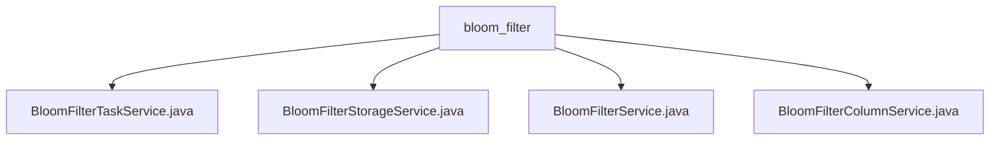

# Basic Information

|      |      |
|------|------|
| Name | bloom_filter |
| Language | .java |
| Code Path | WeFe/board/board-service/src/main/java/com/welab/wefe/board/service/service/data_resource/bloom_filter |
| Package Name | docs.board.board-service.src.main.java.com.welab.wefe.board.service.service.data_resource.bloom_filter |
| Brief Description | BloomFilterTaskService manages Bloom filter task progress and exception handling, BloomFilterStorageService handles data storage operations, BloomFilterService implements Bloom filter functionality, and BloomFilterColumnService manages column data querying and updating. |

# Description

## Overview  
This module is a Bloom filter task management system, with core responsibilities including managing task statuses, data storage, and column configurations, functioning similarly to a distributed task scheduler. The BloomFilterTaskService handles task progress tracking and exception management; the BloomFilterStorageService manages data storage operations; the BloomFilterService coordinates cross-service interactions; and the BloomFilterColumnService manages column attribute configurations.  

Interface specifications include: progress percentage calculation (BloomFilterTaskService), paginated data retrieval (BloomFilterStorageService), federated dataset queries (BloomFilterService), and column index sorting (BloomFilterColumnService). Key data structures include BloomFilterTaskMysqlModel, BloomFilterColumnInputModel, and others.  

External dependencies include database components such as PersistentStorage and BloomFilterTaskRepository. For example, BloomFilterTaskService employs synchronization locks to ensure thread safety, while BloomFilterColumnService optimizes performance through paginated queries.  

## Primary Business Scenarios  
A typical scenario involves the full lifecycle management of Bloom filters: when users upload data, BloomFilterTaskService records progress; BloomFilterStorageService stores raw data; BloomFilterService coordinates cross-node synchronization; and BloomFilterColumnService configures field mappings.  

The business workflow includes: task creation → progress updates → data persistence → federated queries. For instance, estimated time is calculated during progress updates, and table names are dynamically generated during data storage. The interaction model relies on inter-service calls, such as BloomFilterService retrieving task context via JobRepository.  

Functional completeness is reflected in CRUD operations (e.g., column configuration updates), exception handling (e.g., error logging), and performance optimizations (e.g., batch size calculations). API types encompass status queries (GET), data writes (POST), and others, such as paginated data retrieval interfaces supporting JSON format conversion.

### Package Internal Structure View

This flowchart illustrates the service class file structure under the bloom_filter directory in the WeFe project. The bloom_filter serves as the parent node, containing four child nodes: BloomFilterTaskService.java, BloomFilterStorageService.java, BloomFilterService.java, and BloomFilterColumnService.java. These files are all implementation classes related to the Bloom filter service.

# File List

| Name   | Type  | Description |
|-------|------|-------------|
| [BloomFilterTaskService.java](BloomFilterTaskService.md) | file | The BloomFilterTaskService class is used to manage Bloom filter task progress, providing functionalities such as updating progress, completion, and error handling, with synchronization locks ensuring concurrency safety. |
| [BloomFilterStorageService.java](BloomFilterStorageService.md) | file | BloomFilterStorageService provides Bloom filter data storage functionality, including methods for key-value checking, deletion, saving dataset header information, data rows, and paginated queries, utilizing persistent storage operations for data tables. |
| [BloomFilterService.java](BloomFilterService.md) | file | BloomFilterService provides Bloom filter related operations, including query, deletion, update, file retrieval, and SQL testing functionalities. It relies on multiple repositories and services to handle data resources and project member permissions. |
| [BloomFilterColumnService.java](BloomFilterColumnService.md) | file | BloomFilterColumnService provides paginated query and batch update functionalities for dataset fields, supporting operations such as index-based sorting and clearing followed by re-saving. |

