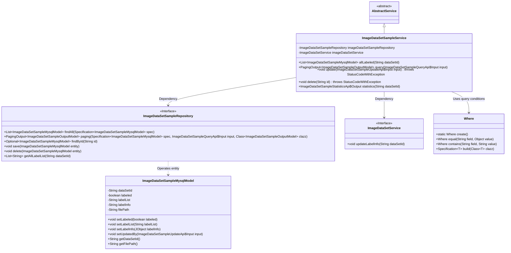
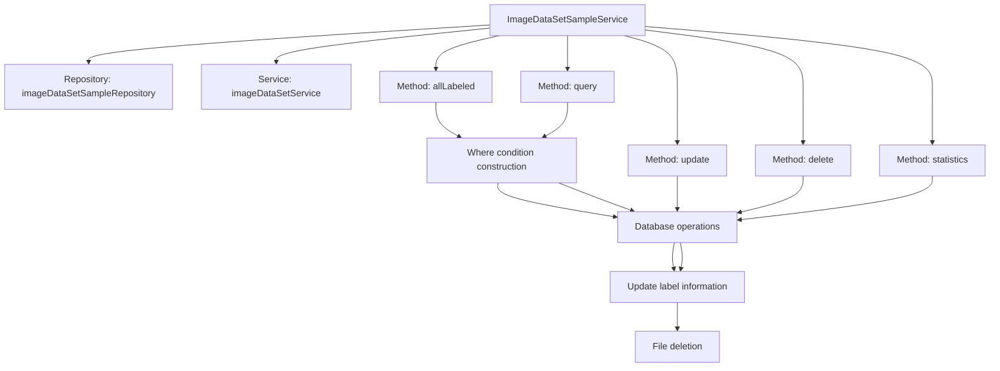
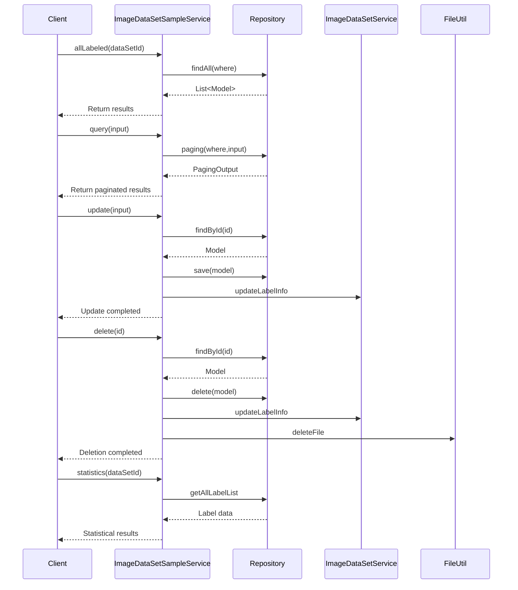

# Basic Information

|      |      |
|------|------|
| Name | ImageDataSetSampleService |
| Language | .java |
| Code Path | WeFe/board/board-service/src/main/java/com/welab/wefe/board/service/service/data_resource/image_data_set/ImageDataSetSampleService.java |
| Package Name | com.welab.wefe.board.service.service.data_resource.image_data_set |
| Dependencies | ['com.welab.wefe.board.service.api.data_resource.image_data_set.sample.ImageDataSetSampleQueryApi', 'com.welab.wefe.board.service.api.data_resource.image_data_set.sample.ImageDataSetSampleStatisticsApi', 'com.welab.wefe.board.service.api.data_resource.image_data_set.sample.ImageDataSetSampleUpdateApi', 'com.welab.wefe.board.service.database.entity.data_set.ImageDataSetSampleMysqlModel', 'com.welab.wefe.board.service.database.repository.ImageDataSetSampleRepository', 'com.welab.wefe.board.service.dto.base.PagingOutput', 'com.welab.wefe.board.service.dto.entity.data_set.ImageDataSetSampleOutputModel', 'com.welab.wefe.board.service.service.AbstractService', 'com.welab.wefe.common.StatusCode', 'com.welab.wefe.common.data.mysql.Where', 'com.welab.wefe.common.exception.StatusCodeWithException', 'com.welab.wefe.common.util.FileUtil', 'com.welab.wefe.common.util.JObject', 'com.welab.wefe.common.util.MapUtil', 'com.welab.wefe.common.util.StringUtil', 'org.springframework.beans.factory.annotation.Autowired', 'org.springframework.data.jpa.domain.Specification', 'org.springframework.stereotype.Service', 'java.util.List', 'java.util.Map', 'java.util.TreeMap', 'java.util.stream.Collectors'] |
| Brief Description | The ImageDataSetSampleService provides image dataset sample management functionalities, including querying annotated samples, paginated queries, updating and deleting samples, and statistical label distribution. It operates the database through the Repository and collaborates with the ImageDataSetService to update label information. |

# Description

This service class is responsible for managing image dataset samples, including query, update, delete, and statistical functions. It operates the database through the Repository, supports filtering samples by dataset ID and annotation status, and enables paginated queries and tag matching. Update operations synchronously modify the sample's annotation status, tag information, and associated dataset statistics. Delete operations remove sample files and update dataset statistics. The statistical function calculates label distribution and sample distribution, returning count results categorized by labels. All operations include parameter validation and exception handling.

# Class Summary

| Name   | Type  | Description |
|-------|------|-------------|
| ImageDataSetSampleService | class | The ImageDataSetSampleService provides image dataset sample management functionalities, including querying annotated samples, paginated queries, updating sample labels, deleting samples, and statistical sample distribution analysis. It operates the database through the Repository and synchronizes updates to the dataset label information. |

## Class ImageDataSetSampleService

|      |      |
|------|------|
| Access Modifier | @Service;public |
| Type | class |
| Name | ImageDataSetSampleService |
| Description | The ImageDataSetSampleService provides image dataset sample management functionalities, including querying annotated samples, paginated queries, updating sample labels, deleting samples, and statistical sample distribution analysis. It operates the database through the Repository and synchronizes updates to the dataset label information. |

### UML Class Diagram

This diagram illustrates the core class structure of the image dataset sample service. ImageDataSetSampleService inherits from AbstractService and relies on two interfaces, ImageDataSetSampleRepository and ImageDataSetService, for data operations. The service class constructs query conditions using the Where utility and primarily operates on the ImageDataSetSampleMysqlModel entity class, providing functionalities such as sample querying, updating, deletion, and statistics. The Repository interface defines CRUD operations, while ImageDataSetService handles label information updates, demonstrating a clear layered architecture and division of responsibilities.

### Internal Method Call Graph

This code implements an image dataset sample service with core functionalities including: querying labeled samples, paginated sample queries, updating sample information, deleting samples, and statistical distribution analysis. The service interacts with databases through Repository and collaborates with ImageDataSetService to maintain label information. Key workflows involve condition construction, database operations, label updates, and file cleanup, with exception handling ensuring data consistency. The statistics feature employs stream processing for label aggregation calculations.

### Field List

| Name  | Type  | Description |
|-------|-------|------|
| imageDataSetService | ImageDataSetService | Automatically inject the ImageDataSetService instance. |
| imageDataSetSampleRepository | ImageDataSetSampleRepository | Using @Autowired to automatically inject an instance of ImageDataSetSampleRepository. |

### Method List

| Name  | Type  | Description |
|-------|-------|------|
| query | PagingOutput<ImageDataSetSampleOutputModel> | This method queries image dataset samples based on input conditions, supporting filtering by dataset ID, annotation status, and labels, and returns paginated results. Label matching allows for exact or fuzzy queries. |
| allLabeled | List<ImageDataSetSampleMysqlModel> | The method `allLabeled` queries the list of labeled `ImageDataSetSampleMysqlModel` based on `dataSetId`, constructs query conditions using the condition builder `Where`, retrieves the results via the `repository`, and returns them. |
| update | void | Update image dataset sample information: Check if the sample exists, update the label status, label information, label list, and updater, then save and synchronize the updated dataset label information. |
| delete | void | Delete the image dataset sample with the specified ID. If the sample does not exist, an error will be reported. After deletion, update the label information and clean up the files. |
| statistics | ImageDataSetSampleStatisticsApi.Output | This method counts the labels and sample quantities for a specified dataset ID. It iterates through the label list in the dataset, calculates the occurrence count of each label and the number of samples containing that label, and finally returns the statistical results. |

