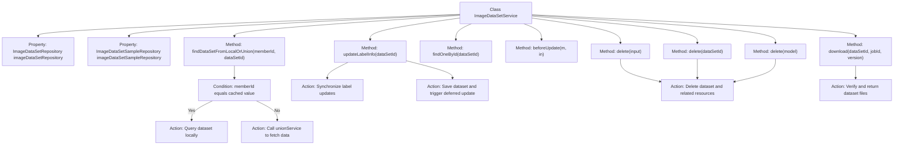

# Basic Information

|      |      |
|------|------|
| Name | ImageDataSetService |
| Language | .java |
| Code Path | WeFe/board/board-service/src/main/java/com/welab/wefe/board/service/service/data_resource/image_data_set/ImageDataSetService.java |
| Package Name | com.welab.wefe.board.service.service.data_resource.image_data_set |
| Dependencies | ['com.welab.wefe.board.service.api.data_resource.image_data_set.ImageDataSetDeleteApi', 'com.welab.wefe.board.service.database.entity.data_resource.DataResourceMysqlModel', 'com.welab.wefe.board.service.database.entity.data_resource.ImageDataSetMysqlModel', 'com.welab.wefe.board.service.database.repository.ImageDataSetSampleRepository', 'com.welab.wefe.board.service.database.repository.data_resource.ImageDataSetRepository', 'com.welab.wefe.board.service.dto.entity.data_resource.output.ImageDataSetOutputModel', 'com.welab.wefe.board.service.dto.vo.data_resource.AbstractDataResourceUpdateInputModel', 'com.welab.wefe.board.service.dto.vo.data_resource.ImageDataSetUpdateInputModel', 'com.welab.wefe.board.service.onlinedemo.OnlineDemoBranchStrategy', 'com.welab.wefe.board.service.service.CacheObjects', 'com.welab.wefe.board.service.service.data_resource.DataResourceService', 'com.welab.wefe.board.service.service.data_resource.image_data_set.data_set_parser.AbstractImageDataSetParser', 'com.welab.wefe.common.StatusCode', 'com.welab.wefe.common.exception.StatusCodeWithException', 'com.welab.wefe.common.util.FileUtil', 'com.welab.wefe.common.util.StringUtil', 'com.welab.wefe.common.web.util.ModelMapper', 'org.springframework.beans.factory.annotation.Autowired', 'org.springframework.stereotype.Service', 'java.io.File', 'java.util.TreeSet'] |
| Brief Description | The ImageDataSetService provides image dataset management functionalities, including querying local/federated data, updating label information, deleting datasets, and downloading files. It supports member ID verification, label statistics, storage cleanup, and federated service synchronization. |

# Description

The ImageDataSetService is a service class that inherits from DataResourceService, primarily used for managing image datasets. It interacts with the database through ImageDataSetRepository and ImageDataSetSampleRepository. Key functionalities include: retrieving dataset information from local or federated services based on member ID and dataset ID; synchronizing updates to dataset label information, including label lists, total data count, and labeled quantity; providing dataset deletion capabilities, which involve removing database records and associated files; and enabling the download of dataset files. This class also implements the abstract methods of its parent class and performs permission checks before deletion operations.

# Class Summary

| Name   | Type  | Description |
|-------|------|-------------|
| ImageDataSetService | class | The ImageDataSetService provides image dataset management functionalities, including querying local or federated data, updating label information, deleting datasets, and downloading dataset files. It operates the database through the Repository, supporting label statistics and federated service synchronization. |


## Class ImageDataSetService

|      |      |
|------|------|
| Access Modifier | @Service;public |
| Type | class |
| Name | ImageDataSetService |
| Description | The ImageDataSetService provides image dataset management functionalities, including querying local or federated data, updating label information, deleting datasets, and downloading dataset files. It operates the database through the Repository, supporting label statistics and federated service synchronization. |


### UML Class Diagram

```mermaid
classDiagram
    class ImageDataSetService {
        -ImageDataSetRepository imageDataSetRepository
        -ImageDataSetSampleRepository imageDataSetSampleRepository
        +findDataSetFromLocalOrUnion(String memberId, String dataSetId) ImageDataSetOutputModel
        +updateLabelInfo(String dataSetId) void
        +findOneById(String dataSetId) ImageDataSetMysqlModel
        +beforeUpdate(DataResourceMysqlModel m, AbstractDataResourceUpdateInputModel in) void
        +delete(ImageDataSetDeleteApi$Input input) void
        +delete(String dataSetId) void
        +delete(ImageDataSetMysqlModel model) void
        +download(String dataSetId, String jobId, String version) File
    }

    class DataResourceService {
        <<Abstract>>
        +beforeUpdate(DataResourceMysqlModel m, AbstractDataResourceUpdateInputModel in) void
    }

    class ImageDataSetRepository {
        <<Interface>>
        +findById(String id) Optional~ImageDataSetMysqlModel~
        +save(ImageDataSetMysqlModel entity) ImageDataSetMysqlModel
        +deleteById(String id) void
    }

    class ImageDataSetSampleRepository {
        <<Interface>>
        +getAllDistinctLabelList(String dataSetId) List~String~
        +getSampleCount(String dataSetId) Integer
        +getLabeledCount(String dataSetId) Integer
        +deleteByDataSetId(String dataSetId) void
    }

    class ImageDataSetMysqlModel {
        +setLabelList(String labels) void
        +setTotalDataCount(Integer count) void
        +setLabeledCount(Integer count) void
        +setLabelCompleted(Boolean completed) void
        +getId() String
        +getStorageNamespace() String
        +getDataResourceType() String
    }

    class ImageDataSetOutputModel {
        <<DataTransferObject>>
    }

    class AbstractDataResourceUpdateInputModel {
        <<Abstract>>
    }

    class ImageDataSetUpdateInputModel {
    }

    class ImageDataSetDeleteApi$Input {
    }

    DataResourceService <|-- ImageDataSetService
    ImageDataSetService --> ImageDataSetRepository : Dependency
    ImageDataSetService --> ImageDataSetSampleRepository : Dependency
    ImageDataSetService --> ImageDataSetMysqlModel : Operates
    ImageDataSetService --> ImageDataSetOutputModel : Returns
    ImageDataSetService --> AbstractDataResourceUpdateInputModel : Parameter
    ImageDataSetService --> ImageDataSetUpdateInputModel : Parameter
    ImageDataSetService --> ImageDataSetDeleteApi$Input : Parameter
```

This code describes an image dataset service class `ImageDataSetService`, which inherits from the abstract class `DataResourceService`. Its main functionalities include finding datasets from local or federated storage, updating label information, deleting datasets, and downloading dataset files. The class interacts with the database through the `ImageDataSetRepository` and `ImageDataSetSampleRepository` interfaces, operates on the `ImageDataSetMysqlModel` entity class, and returns the `ImageDataSetOutputModel` data transfer object. The service also involves various input model classes such as `ImageDataSetUpdateInputModel` and `ImageDataSetDeleteApi$Input` for handling parameter passing in different business scenarios. The overall design reflects a layered architecture approach, separating data access, business logic, and interface definitions.


### Internal Method Call Graph



Flowchart Description: This flowchart illustrates the core functional structure of the ImageDataSetService class, including key methods for data query (local/union), label updates, deletion operations, and file downloads. Conditional branching handles different memberId query logic, synchronization ensures thread-safe label updates, deletion operations cascade-clean storage resources and caches, while the download feature includes file existence verification. Arrows clearly depict method call relationships and data processing flows.

### Field List

| Name  | Type  | Description |
|-------|-------|------|
| imageDataSetSampleRepository | ImageDataSetSampleRepository | Automatically inject the ImageDataSetSampleRepository instance. |
| imageDataSetRepository | ImageDataSetRepository | Automatically inject the ImageDataSetRepository instance. |

### Method List

| Name  | Type  | Description |
|-------|-------|------|
| updateLabelInfo | void | Synchronization method for updating dataset label information: query the dataset, extract and merge labels, count the number of samples and annotated data, mark completion status, save changes, and trigger resource updates. |
| delete | void | This method deletes records based on the dataset ID and returns directly if the record does not exist. |
| delete | void | The method `delete` takes an `Input` parameter, checks whether the dataset corresponding to the ID exists, and returns if it does not. If it exists, it verifies the deletion permission (limited to datasets added by oneself) and finally deletes the dataset. |
| findOneById | ImageDataSetMysqlModel | This method queries the image dataset by ID and returns null if it does not exist. |
| findDataSetFromLocalOrUnion | ImageDataSetOutputModel | This method determines whether it is a local member based on the memberId. If so, it queries and maps the dataset from the local database; otherwise, it retrieves the details of the federated data resource through the unionService. |
| delete | void | Delete image dataset: Remove database records, sample data, storage files, and refresh cache and federated service resources. |
| beforeUpdate | void | The method `beforeUpdate` accepts parameters of type `DataResourceMysqlModel` and `AbstractDataResourceUpdateInputModel`, and converts them into types `ImageDataSetMysqlModel` and `ImageDataSetUpdateInputModel`. |
| download | File | Method to download the dataset file, check whether the dataset ID and version exist, and throw an exception if the file does not exist. Returns the file object. |


