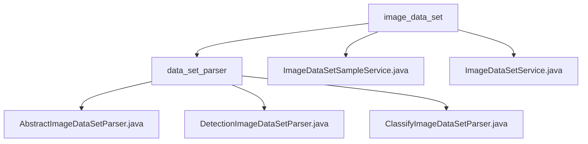

# Basic Information

|      |      |
|------|------|
| Name | image_data_set |
| Language | .java |
| Code Path | WeFe/board/board-service/src/main/java/com/welab/wefe/board/service/service/data_resource/image_data_set |
| Package Name | docs.board.board-service.src.main.java.com.welab.wefe.board.service.service.data_resource.image_data_set |
| Brief Description | This module provides a unified image dataset parsing framework, supporting classification and detection tasks. It includes functionalities such as dataset splitting, version control, and ZIP packaging, with subclasses implementing specific logic. The service class manages dataset samples, supporting query, update, deletion, and statistical functions, while operating databases and handling exceptions. |

# Description

## Overview  
This module is a comprehensive management system for image datasets, with core responsibilities including a unified parsing framework implementation (supporting classification/detection tasks) and full lifecycle data management. The foundational specifications are defined through the `AbstractImageDataSetParser` abstract class, with its subclasses implementing parsing logic for PASCAL VOC format (detection) and ImageFolder structure (classification). Key data structures encompass sample path lists, label mapping tables, and XML annotation objects, relying on filesystem operations, concurrent processing, and database access. For example, detection tasks generate `train.txt` and XML file pairs, while classification tasks build `tgz` archives and label indexes.  

## Core Business Scenarios  
Typical workflows include dataset import/export, sample CRUD operations, and statistical analysis. During export, the factory pattern (`getParser`) generates structured files based on task type, while import involves reverse parsing and memory model updates. Data management services, implemented via `Repository`, handle sample CRUD operations and support label distribution statistics and paginated queries. For instance, detection tasks concurrently process XML generation, while classification services validate file consistency via regex. Integration examples can be found in training preprocessing pipelines, which adopt a microservice-like architecture for access control and federated queries.

### Package Internal Structure View

This flowchart illustrates the hierarchical structure of the image dataset service. The top-level directory image_data_set contains two service class files and a subdirectory data_set_parser. The parser subdirectory includes three specific dataset parser implementation classes: an abstract parser and two concrete implementations for classification/detection types, forming a clear inheritance relationship and service invocation structure.

# File List

| Name   | Type  | Description |
|-------|------|-------------|
| [ImageDataSetSampleService.java](ImageDataSetSampleService.md) | file | The ImageDataSetSampleService provides image dataset sample management functionalities, including querying annotated samples, paginated queries, updating and deleting samples, and statistical label distribution. It operates the database through the Repository and collaborates with the ImageDataSetService to update label information. |
| [ImageDataSetService.java](ImageDataSetService.md) | file | The ImageDataSetService provides image dataset management functionalities, including querying local/federated data, updating label information, deleting datasets, and downloading files. It supports member ID verification, label statistics, storage cleanup, and federated service synchronization. |
| [data_set_parser](data_set_parser/_module.md) | package | AbstractImageDataSetParser is an abstract class for parsing image datasets, supporting classification and detection tasks, and providing functionalities such as sample parsing, segmentation, and packaging. DetectionImageDataSetParser inherits from it to handle data import and export for detection tasks. ClassifyImageDataSetParser inherits from it to handle data import and export for classification tasks. |

