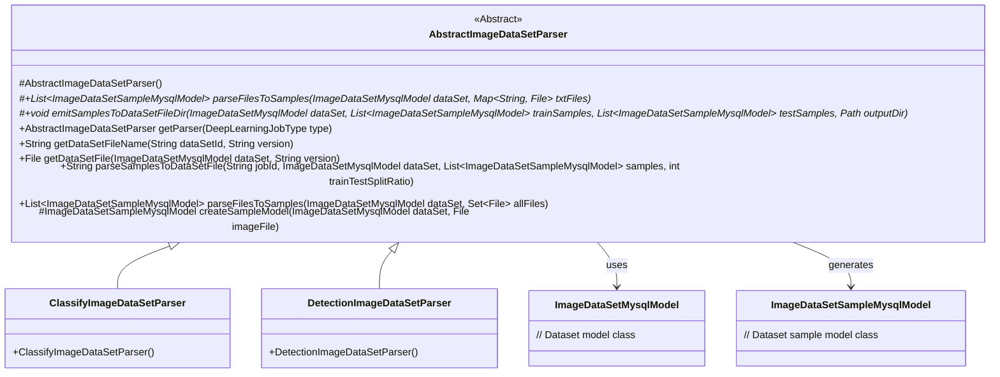
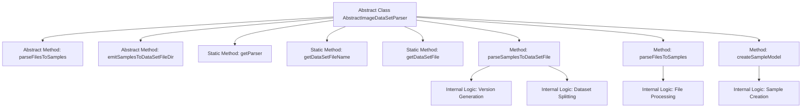

# Basic Information

|      |      |
|------|------|
| Name | AbstractImageDataSetParser |
| Language | .java |
| Code Path | WeFe/board/board-service/src/main/java/com/welab/wefe/board/service/service/data_resource/image_data_set/data_set_parser/AbstractImageDataSetParser.java |
| Package Name | com.welab.wefe.board.service.service.data_resource.image_data_set.data_set_parser |
| Dependencies | ['com.welab.wefe.board.service.database.entity.data_resource.ImageDataSetMysqlModel', 'com.welab.wefe.board.service.database.entity.data_set.ImageDataSetSampleMysqlModel', 'com.welab.wefe.board.service.service.AbstractService', 'com.welab.wefe.common.Convert', 'com.welab.wefe.common.StatusCode', 'com.welab.wefe.common.exception.StatusCodeWithException', 'com.welab.wefe.common.file.compression.impl.Zip', 'com.welab.wefe.common.util.FileUtil', 'com.welab.wefe.common.web.util.CurrentAccountUtil', 'com.welab.wefe.common.wefe.enums.DeepLearningJobType', 'org.apache.commons.io.FileUtils', 'java.io.File', 'java.io.IOException', 'java.nio.file.Path', 'java.nio.file.Paths', 'java.util', 'java.util.stream.Collectors'] |
| Brief Description | The abstract class AbstractImageDataSetParser provides image dataset parsing functionality, including methods for sample parsing, dataset packaging, and file handling, supporting both classification and detection tasks. |

# Description

AbstractImageDataSetParser is an abstract class designed for parsing and packaging image datasets. It provides the following core functionalities: parsing sample information based on file types (images, XML, TXT); splitting samples into training and test sets by specified ratios; generating dataset file version numbers to avoid duplicate generation; and packaging samples into ZIP-format dataset files. This class supports two deep learning task types: classification and detection, with concrete implementations obtained through the factory method getParser. Key features include: automatic filtering of hidden and temporary files, duplicate filename checks, tracking of sample last-update timestamps, and randomized training-test set splitting. Dataset file generation considers three factors: split ratio, sample count, and last annotation time.

# Class Summary

| Name   | Type  | Description |
|-------|------|-------------|
| AbstractImageDataSetParser | class | The abstract class AbstractImageDataSetParser provides image dataset parsing functionality, including sample parsing, dataset packaging, and file processing. It supports classification and detection tasks, generates training and test sets based on split ratios, and avoids repeated generation of identical datasets. |

## Class AbstractImageDataSetParser

|      |      |
|------|------|
| Access Modifier | public abstract |
| Type | class |
| Name | AbstractImageDataSetParser |
| Description | The abstract class AbstractImageDataSetParser provides image dataset parsing functionality, including sample parsing, dataset packaging, and file processing. It supports classification and detection tasks, generates training and test sets based on split ratios, and avoids repeated generation of identical datasets. |

### UML Class Diagram

This code defines an abstract class `AbstractImageDataSetParser` for handling image dataset parsing and packaging operations. The class provides functionalities such as file parsing, sample splitting, and dataset packaging, with two concrete implementations `ClassifyImageDataSetParser` and `DetectionImageDataSetParser` to support different deep learning task types. Key features include categorized file processing, random sample splitting, dataset version control, and compression packaging, ensuring correct regeneration of dataset files when data or parameters change.

### Internal Method Call Graph

This code defines an abstract class `AbstractImageDataSetParser`, primarily used for parsing and packaging image datasets. The flowchart illustrates the main structure of the class, including 2 abstract methods (file parsing and sample output), 3 static utility methods (obtaining the parser, generating filenames, and retrieving file objects), and 3 concrete implementation methods (dataset file generation, file parsing, and sample creation). The core method `parseSamplesToDataSetFile` contains version generation logic (based on sample count and update time) and dataset splitting logic (dividing into training/test sets by ratio), ultimately generating compressed dataset files through file operations.

### Field List

| Name  | Type  | Description |
|-------|-------|------|

### Method List

| Name  | Type  | Description |
|-------|-------|------|
| parseFilesToSamples | List<ImageDataSetSampleMysqlModel> | Abstract method `parseFilesToSamples` parses image, XML, and TXT files into a list of samples. The parameters include the dataset model and mappings of various file types, and it may throw exceptions. |
| getDataSetFile | File | The static method `getDataSetFile` generates a file path based on the dataset object and version number, combining the storage namespace, `output` directory, and dataset filename to return a `File` object. |
| getDataSetFileName | String | This method generates the corresponding compressed file name based on the dataset ID and version number, in the format of "datasetID_versionNumber.zip". |
| getParser | AbstractImageDataSetParser | Returns the corresponding image dataset parser based on the input type, or null if no match is found. |
| parseSamplesToDataSetFile | String | The method generates dataset files from sample data, including version number construction, training-test set splitting, file generation, and compression. If the file already exists, generation is skipped. |
| parseFilesToSamples | List<ImageDataSetSampleMysqlModel> | This method parses a collection of files, filters out hidden and temporary files, checks for duplicate filenames, categorizes and processes image, XML, and TXT files, and ultimately converts them into a list of sample models. |
| createSampleModel | ImageDataSetSampleMysqlModel | Create a sample image dataset model, set ID, filename, path, size, and creator, copy files to the target path, and return the model. |
| emitSamplesToDataSetFileDir | void | Abstract method: Outputs training and test sample data to a specified directory, may throw exceptions. Parameters include dataset model, sample list, and output path. |

