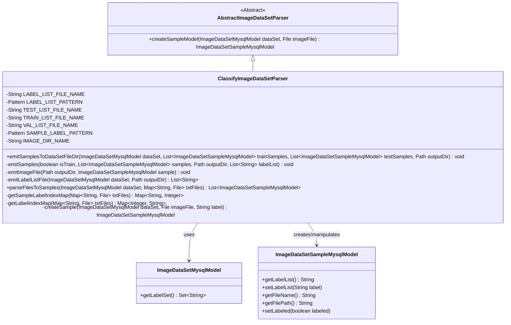
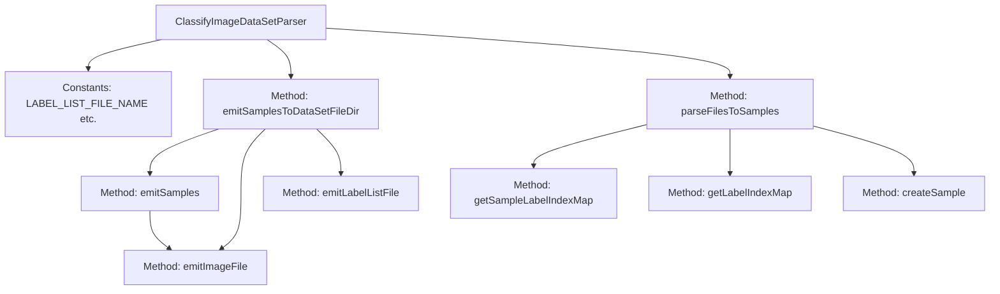

# Basic Information

|      |      |
|------|------|
| Name | ClassifyImageDataSetParser |
| Language | .java |
| Code Path | WeFe/board/board-service/src/main/java/com/welab/wefe/board/service/service/data_resource/image_data_set/data_set_parser/ClassifyImageDataSetParser.java |
| Package Name | com.welab.wefe.board.service.service.data_resource.image_data_set.data_set_parser |
| Dependencies | ['com.welab.wefe.board.service.database.entity.data_resource.ImageDataSetMysqlModel', 'com.welab.wefe.board.service.database.entity.data_set.ImageDataSetSampleMysqlModel', 'com.welab.wefe.common.Convert', 'com.welab.wefe.common.exception.StatusCodeWithException', 'com.welab.wefe.common.file.compression.impl.Tgz', 'com.welab.wefe.common.util.FileUtil', 'com.welab.wefe.common.util.ListUtil', 'com.welab.wefe.common.util.StringUtil', 'java.io.File', 'java.io.IOException', 'java.nio.file.Files', 'java.nio.file.Path', 'java.nio.file.Paths', 'java.util', 'java.util.regex.Matcher', 'java.util.regex.Pattern'] |
| Brief Description | The `ClassifyImageDataSetParser` class processes image datasets, supporting export and import functionalities. During export, it generates label files, training/validation lists, and compresses images into a tgz file. During import, it parses label and sample mappings to create sample models. |

# Description

The ClassifyImageDataSetParser is an image dataset parsing class that inherits from AbstractImageDataSetParser. It handles the import and export of image datasets, with primary functionalities including: generating label files (label_list.txt) and training/validation set files (train_list.txt/val_list.txt) during export, as well as compressing images into image.tgz; during import, it parses these files to establish mapping relationships between images and labels. The class defines multiple constants for filenames and regular expression patterns, implements concurrent processing of image data, and ensures thread safety.

# Class Summary

| Name   | Type  | Description |
|-------|------|-------------|
| ClassifyImageDataSetParser | class | The `ClassifyImageDataSetParser` class processes image datasets, supporting export and import functionalities. During export, it generates label files, training sets, and validation sets, and compresses the image directory. During import, it parses label and sample mappings to create sample models. |


## Class ClassifyImageDataSetParser

|      |      |
|------|------|
| Access Modifier | public |
| Type | class |
| Name | ClassifyImageDataSetParser |
| Description | The `ClassifyImageDataSetParser` class processes image datasets, supporting export and import functionalities. During export, it generates label files, training sets, and validation sets, and compresses the image directory. During import, it parses label and sample mappings to create sample models. |


### UML Class Diagram



This class diagram illustrates the inheritance structure and key relationships of an image dataset parser. ClassifyImageDataSetParser inherits from the abstract class AbstractImageDataSetParser, implementing import/export functionalities for image datasets. It operates on ImageDataSetMysqlModel to obtain dataset metadata and generates/parses ImageDataSetSampleMysqlModel sample objects. Core features include processing label files, sample file mappings, and image file compression/packaging operations. The class utilizes multiple regex patterns to parse different text file formats, demonstrating specialized handling capabilities for image classification dataset formats.


### Internal Method Call Graph



This code represents an image dataset parsing and exporting utility class. Key functionalities include: 1) Exporting dataset samples to a specific directory structure with compression; 2) Parsing dataset samples from files. The core workflow involves label list generation, sample file copying, and compression packaging, employing thread-safe approaches for concurrent tasks while supporting separate storage for training/test sets.

### Field List

| Name  | Type  | Description |
|-------|-------|------|
| TRAIN_LIST_FILE_NAME = "train_list.txt" | String | Define the constant string TRAIN_LIST_FILE_NAME with the value "train_list.txt". |
| LABEL_LIST_PATTERN = Pattern.compile("^\\s*(?<index>\\d+)\\s+(?<label>.+)\\s*$") | Pattern | You are a professional translation assistant. Please accurately translate the following content into the target language.  Please strictly adhere to the following guidelines:  1. Maintain consistency with the original text's semantics, context, and style.  2. Preserve the original hierarchical structure and numbering system in full.  3. Strictly retain all formatting elements from the original text, such as code block identifiers (```text/```, ```mermaid/```), etc.  4. Translate only natural language content, without adjusting formats, adding content, or providing explanatory processing.  5. Output only the translated result of the original text, without any additional prompt information.  Content to be translated:  Java静态正则表达式，匹配以数字开头后跟标签的字符串，捕获索引和标签分组。  Target language code: en  Java static regular expression, matching strings that start with a number followed by a tag, capturing index and tag groups. |
| IMAGE_DIR_NAME = "jpg" | String | Define the constant string IMAGE_DIR_NAME with the value "jpg", representing the name of the image directory. |
| TEST_LIST_FILE_NAME = "test_list.txt" | String | Define a constant string variable TEST_LIST_FILE_NAME with the value "test_list.txt". |
| LABEL_LIST_FILE_NAME = "label_list.txt" | String | Define a constant string variable LABEL_LIST_FILE_NAME with the value "label_list.txt". |
| SAMPLE_LABEL_PATTERN = Pattern.compile("^(?<sample>.+)\\s+(?<index>\\d+)\\s*$") | Pattern | Define a regular expression pattern to match strings ending with a sample name and a number, and capture the sample name and number in groups. |
| VAL_LIST_FILE_NAME = "val_list.txt" | String | Define the constant VAL_LIST_FILE_NAME with the value "val_list.txt". |

### Method List

| Name  | Type  | Description |
|-------|-------|------|
| parseFilesToSamples | List<ImageDataSetSampleMysqlModel> | This method parses image files and generates a sample list. First, it retrieves the label index mapping and sample label index mapping, then processes the image files concurrently, creates sample objects, and adds them to a thread-safe result list. During processing, exceptions are caught and thrown, and finally, the result list is returned. |
| emitImageFile | void | This method copies the image file from the original path to the IMAGE_DIR_NAME subdirectory of the specified output directory while preserving the original filename. |
| emitSamplesToDataSetFileDir | void | The method writes training and test samples into the dataset directory, generates a label file, compresses the image directory into image.tgz, and finally deletes the original image directory. |
| getLabelIndexMap | Map<Integer, String> | This method extracts label files from txtFiles, parses each line to match indices and labels, then generates and returns a mapping from indices to labels. If the file does not exist, it returns an empty mapping. |
| emitLabelListFile | List<String> | This method retrieves a list of labels from the dataset, generates a text file in the format "Serial Number Label", saves it to the specified directory, and finally returns the list of labels. |
| emitSamples | void | The method `emitSamples` processes image samples by copying images to the output directory and generating annotation files. The annotation files contain filenames and corresponding label indices, with the `isTrain` parameter determining whether they are saved as training or validation set files. |
| getSampleLabelIndexMap | Map<String, Integer> | This method reads sample labels and indices from three specified files, constructs and returns a mapping table from sample names to indices. During processing, empty files are skipped, and regular expressions are used to extract sample names and indices, which are ultimately stored with sample names as keys. |
| createSample | ImageDataSetSampleMysqlModel | Methods for Creating Image Dataset Samples: Receive the dataset, image files, and labels, generate a sample model, and set the label list and tagging status. |


