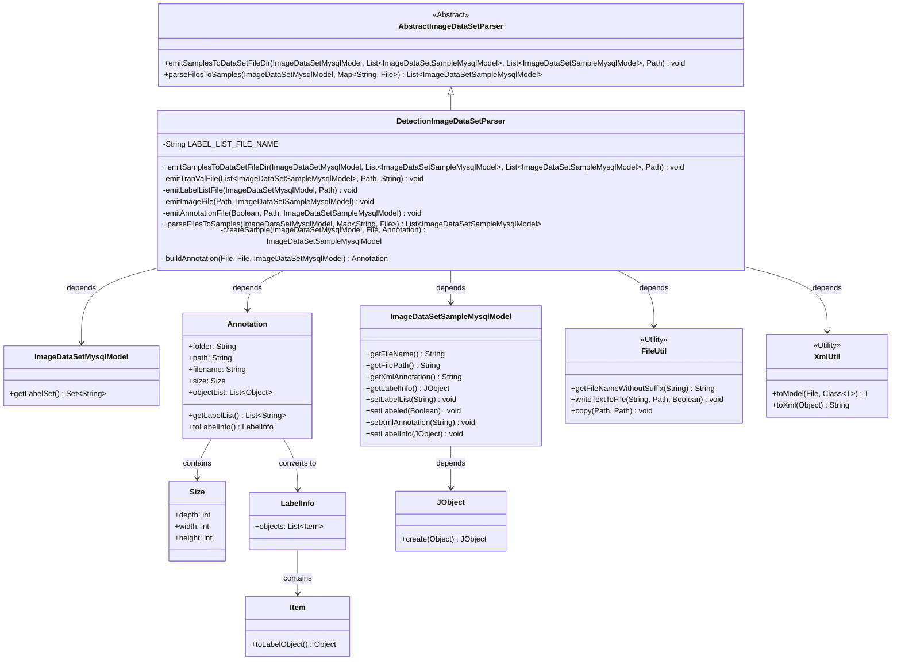
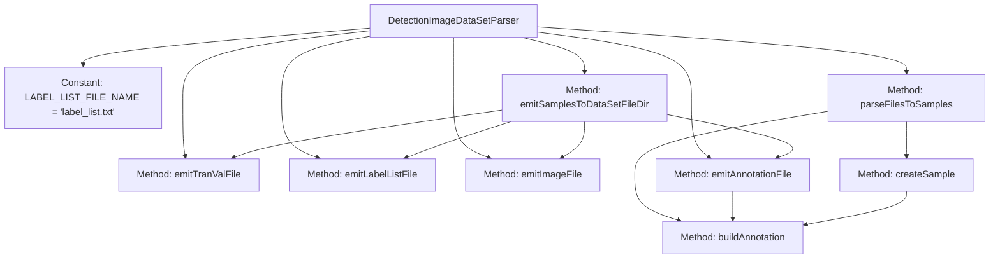

# Basic Information

|      |      |
|------|------|
| Name | DetectionImageDataSetParser |
| Language | .java |
| Code Path | WeFe/board/board-service/src/main/java/com/welab/wefe/board/service/service/data_resource/image_data_set/data_set_parser/DetectionImageDataSetParser.java |
| Package Name | com.welab.wefe.board.service.service.data_resource.image_data_set.data_set_parser |
| Dependencies | ['com.thoughtworks.xstream.io.StreamException', 'com.welab.wefe.board.service.database.entity.data_resource.ImageDataSetMysqlModel', 'com.welab.wefe.board.service.database.entity.data_set.ImageDataSetSampleMysqlModel', 'com.welab.wefe.board.service.dto.vo.data_set.image_data_set.Annotation', 'com.welab.wefe.board.service.dto.vo.data_set.image_data_set.LabelInfo', 'com.welab.wefe.board.service.dto.vo.data_set.image_data_set.Size', 'com.welab.wefe.common.StatusCode', 'com.welab.wefe.common.exception.StatusCodeWithException', 'com.welab.wefe.common.util', 'org.apache.commons.collections4.CollectionUtils', 'javax.imageio.ImageIO', 'java.awt.image.BufferedImage', 'java.io.File', 'java.io.FileInputStream', 'java.io.IOException', 'java.nio.file.Path', 'java.nio.file.Paths', 'java.util.ArrayList', 'java.util.Collections', 'java.util.List', 'java.util.Map', 'java.util.stream.Collectors'] |
| Brief Description | The DetectionImageDataSetParser class handles the import and export of image datasets, including label lists, images, and XML annotation files, supporting the generation of training and validation sets. |

# Description

The `DetectionImageDataSetParser` class is a parser designed for processing image datasets, inheriting from `AbstractImageDataSetParser`. Its primary functionalities include exporting and importing datasets. During export, it saves training and test samples as image and XML annotation files separately, generates `train.txt` and `val.txt` files to record sample paths, and outputs a `label_list.txt` file to store the label list. During import, it parses image and XML files, constructs sample models, and handles concurrent operations. The class defines multiple private methods, such as `emitImageFile` for copying image files, `emitAnnotationFile` for generating XML annotation files, and `emitLabelListFile` for outputting the label list file. Additionally, it includes methods for constructing annotation objects and creating sample models.

# Class Summary

| Name   | Type  | Description |
|-------|------|-------------|
| DetectionImageDataSetParser | class | The `DetectionImageDataSetParser` class is designed to process image datasets, incorporating both export and import functionalities. During export, it generates directories for `images` and `annotations`, along with files such as `train.txt`, `val.txt`, and `label_list.txt`. For import operations, it parses image and XML files to construct sample data. The class supports concurrent processing to ensure thread safety. |

## Class DetectionImageDataSetParser

|      |      |
|------|------|
| Access Modifier | public |
| Type | class |
| Name | DetectionImageDataSetParser |
| Description | The `DetectionImageDataSetParser` class is designed to process image datasets, incorporating both export and import functionalities. During export, it generates directories for `images` and `annotations`, along with files such as `train.txt`, `val.txt`, and `label_list.txt`. For import operations, it parses image and XML files to construct sample data. The class supports concurrent processing to ensure thread safety. |

### UML Class Diagram

This diagram illustrates the DetectionImageDataSetParser class and its related dependencies. DetectionImageDataSetParser inherits from AbstractImageDataSetParser and is responsible for handling the import and export of image datasets. It utilizes the FileUtil and XmlUtil utility classes for file operations and XML processing, interacts with ImageDataSetMysqlModel and ImageDataSetSampleMysqlModel to manage dataset metadata, and processes annotation information through the Annotation class. The diagram clearly presents the inheritance, dependency, and composition relationships between the classes.

### Internal Method Call Graph

This flowchart illustrates the main structure and functional relationships of the DetectionImageDataSetParser class. As an image dataset parser inheriting from AbstractImageDataSetParser, its core functionality is divided into two modules: dataset export and import. The export module includes methods for generating train/validation files, label lists, image files, and XML annotation files. The import module creates sample data by parsing image and XML files. Key methods like emitAnnotationFile invoke buildAnnotation for XML processing, while createSample and parseFilesToSamples collaboratively construct the data sample pipeline. The entire class achieves a complete dataset processing loop through file operations and XML transformations.

### Field List

| Name  | Type  | Description |
|-------|-------|------|
| LABEL_LIST_FILE_NAME = "label_list.txt" | String | Private static constant string storing the label list filename "label_list.txt". |

### Method List

| Name  | Type  | Description |
|-------|-------|------|
| emitAnnotationFile | void | This method generates annotation files based on the training or testing state, converts sample data into XML format, and saves them to a specified directory. Key steps include setting the folder type, path, processing label information, and writing files. |
| createSample | ImageDataSetSampleMysqlModel | Methods for creating image dataset samples: Receive the dataset, image files, and annotations, generate sample models, and set label lists, annotation statuses, XML annotations, and label information. |
| parseFilesToSamples | List<ImageDataSetSampleMysqlModel> | The method parses files to generate a sample list, uses a thread-safe List to store results, processes images and XML files in parallel to construct annotation information, and throws exceptions when errors occur. |
| emitSamplesToDataSetFileDir | void | Output the training and testing sample images along with their annotation files to the specified directory, generate the training set and validation set list files, and finally create the label list file. |
| emitImageFile | void | Copy the image files from the original path to the images subdirectory of the output directory. |
| emitLabelListFile | void | This method writes the dataset label set into a file in the specified directory, connecting the labels using system line breaks without appending. |
| buildAnnotation | Annotation | This method constructs an Annotation object from image files and XML files. If the XML exists, it is parsed into an Annotation; otherwise, a new one is created. The image dimension information is read to populate the size attribute of the Annotation, and the filename and path are set. During processing, file reading or parsing exceptions may be thrown. |
| emitTranValFile | void | This method is used to generate training and validation files by iterating through the sample list and writing the image and annotation file paths of each sample into the specified file. If the file already exists, it will be deleted first. |

