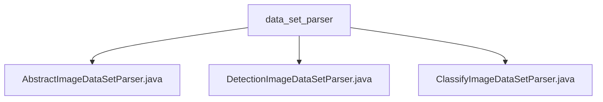

# Basic Information

|      |      |
|------|------|
| Name | data_set_parser |
| Language | .java |
| Code Path | WeFe/board/board-service/src/main/java/com/welab/wefe/board/service/service/data_resource/image_data_set/data_set_parser |
| Package Name | docs.board.board-service.src.main.java.com.welab.wefe.board.service.service.data_resource.image_data_set.data_set_parser |
| Brief Description | AbstractImageDataSetParser is an abstract class for parsing image datasets, supporting classification and detection tasks, and providing functionalities such as sample parsing, segmentation, and packaging. DetectionImageDataSetParser inherits from it to handle data import and export for detection tasks. ClassifyImageDataSetParser inherits from it to handle data import and export for classification tasks. |

# Description

## Overview  
The core responsibility of this module is to provide a unified framework for parsing image datasets, supporting two deep learning tasks: classification and detection. The abstract class `AbstractImageDataSetParser` defines foundational functionalities (e.g., dataset splitting, version control, ZIP packaging), while its subclasses `DetectionImageDataSetParser` and `ClassifyImageDataSetParser` implement task-specific logic for object detection (generating XML annotations and path lists) and image classification (building label mappings and compressing images), respectively.  

Key data structures include sample path lists (`train.txt`/`val.txt`), label files (`label_list.txt`), and XML annotation objects. The module relies on filesystem operations and concurrent processing mechanisms to automatically filter temporary files and track sample update times. For instance, detection tasks generate XML files in a format similar to PASCAL VOC, while classification tasks adopt a directory structure akin to ImageFolder.  

## Primary Business Scenarios  
Typical applications involve dataset export and import workflows: during export, structured files are generated based on task type (e.g., detection tasks output `train.txt` + XML files, classification tasks produce `train_list.txt` + `image.tgz`), while import processes reverse-parse these files to construct in-memory models. The interaction pattern employs a factory method (`getParser`) to decouple concrete implementations, supporting multithreaded processing.  

Full functionality covers sample splitting (random ratios), version control (timestamp-based), and format validation (e.g., label deduplication). For example, detection tasks concurrently handle image copying and XML generation, while classification tasks enforce file consistency via regex matching. API types include file parser interfaces and dataset packaging services, with integration examples visible in training data preprocessing pipelines.

### Package Internal Structure View

This flowchart illustrates the hierarchical structure of an image dataset parser, with the root node being the data_set_parser folder containing three concrete parser implementation classes: an abstract parser, a detection image parser, and a classification image parser. This structure reflects the relationship between an abstract base class and its concrete implementations in object-oriented design, catering to different image dataset processing requirements across various scenarios.

# File List

| Name   | Type  | Description |
|-------|------|-------------|
| [AbstractImageDataSetParser.java](AbstractImageDataSetParser.md) | file | The abstract class AbstractImageDataSetParser provides image dataset parsing functionality, including methods for sample parsing, dataset packaging, and file processing, supporting both classification and detection tasks. |
| [DetectionImageDataSetParser.java](DetectionImageDataSetParser.md) | file | The `DetectionImageDataSetParser` class handles the import and export of image datasets, including label lists, images, and XML annotation files, supporting the generation of training and validation sets. |
| [ClassifyImageDataSetParser.java](ClassifyImageDataSetParser.md) | file | The `ClassifyImageDataSetParser` class processes image datasets, supporting export and import functionalities. During export, it generates label files, training/validation lists, and compresses images into a tgz file. During import, it parses label and sample mappings to create sample models. |

