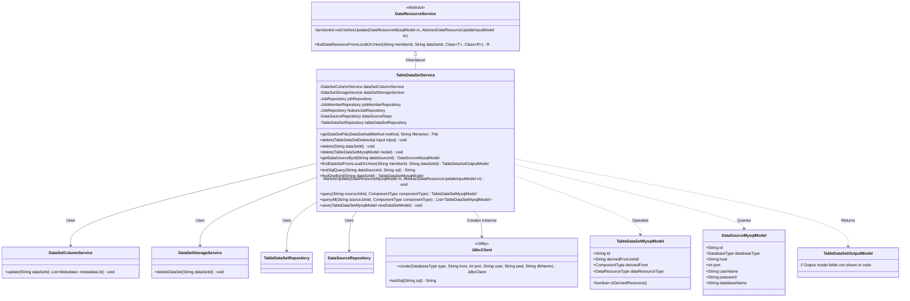

# Basic Information

|      |      |
|------|------|
| Name | TableDataSetService |
| Language | .java |
| Code Path | WeFe/board/board-service/src/main/java/com/welab/wefe/board/service/service/data_resource/table_data_set/TableDataSetService.java |
| Package Name | com.welab.wefe.board.service.service.data_resource.table_data_set |
| Dependencies | ['com.welab.wefe.board.service.api.data_resource.table_data_set.TableDataSetDeleteApi', 'com.welab.wefe.board.service.base.file_system.WeFeFileSystem', 'com.welab.wefe.board.service.constant.DataSetAddMethod', 'com.welab.wefe.board.service.database.entity.DataSourceMysqlModel', 'com.welab.wefe.board.service.database.entity.data_resource.DataResourceMysqlModel', 'com.welab.wefe.board.service.database.entity.data_resource.TableDataSetMysqlModel', 'com.welab.wefe.board.service.database.repository.DataSourceRepository', 'com.welab.wefe.board.service.database.repository.JobMemberRepository', 'com.welab.wefe.board.service.database.repository.JobRepository', 'com.welab.wefe.board.service.database.repository.data_resource.TableDataSetRepository', 'com.welab.wefe.board.service.dto.entity.data_resource.output.TableDataSetOutputModel', 'com.welab.wefe.board.service.dto.vo.data_resource.AbstractDataResourceUpdateInputModel', 'com.welab.wefe.board.service.dto.vo.data_resource.TableDataSetUpdateInputModel', 'com.welab.wefe.board.service.onlinedemo.OnlineDemoBranchStrategy', 'com.welab.wefe.board.service.service.CacheObjects', 'com.welab.wefe.board.service.service.DataSetColumnService', 'com.welab.wefe.board.service.service.DataSetStorageService', 'com.welab.wefe.board.service.service.data_resource.DataResourceService', 'com.welab.wefe.common.StatusCode', 'com.welab.wefe.common.data.mysql.Where', 'com.welab.wefe.common.exception.StatusCodeWithException', 'com.welab.wefe.common.jdbc.JdbcClient', 'com.welab.wefe.common.wefe.enums.ComponentType', 'com.welab.wefe.common.wefe.enums.DataResourceType', 'org.apache.commons.lang3.StringUtils', 'org.springframework.beans.factory.annotation.Autowired', 'org.springframework.data.jpa.domain.Specification', 'org.springframework.stereotype.Service', 'java.io.File', 'java.util.List'] |
| Brief Description | The TableDataSetService class provides dataset management functionalities, including operations such as retrieving files, deleting datasets, testing SQL queries, querying and saving datasets. It implements CRUD and storage management for datasets through multiple Repository and service classes. |

# Description

TableDataSetService is a service class that inherits from DataResourceService, primarily used for managing tabular datasets. It implements its functionality by injecting multiple dependent services (such as DataSetColumnService, DataSetStorageService, etc.) and repositories (such as tableDataSetRepository, dataSourceRepo, etc.). Key features include: retrieving uploaded files (supporting HTTP uploads, local files, and databases), deleting datasets (supporting deletion by ID or model while cleaning up related storage and cache), fetching data sources by ID, querying dataset information from local or federated data sources, validating the effectiveness of SQL query statements, updating dataset column information, and querying/saving dataset models. The class also provides various operations on datasets, such as permission checks during deletion and saving column information before updates.

# Class Summary

| Name   | Type  | Description |
|-------|------|-------------|
| TableDataSetService | class | The TableDataSetService provides dataset management functionalities, including operations such as retrieving files, deleting datasets, testing SQL queries, querying and saving datasets. It supports multiple data sources, such as HTTP uploads, local files, and databases. Deletion operations will simultaneously clean up data in both the database and storage. |

## Class TableDataSetService

|      |      |
|------|------|
| Access Modifier | @Service;public |
| Type | class |
| Name | TableDataSetService |
| Description | The TableDataSetService provides dataset management functionalities, including operations such as retrieving files, deleting datasets, testing SQL queries, querying and saving datasets. It supports multiple data sources, such as HTTP uploads, local files, and databases. Deletion operations will simultaneously clean up data in both the database and storage. |

### UML Class Diagram

This code demonstrates a table dataset service class (TableDataSetService) that inherits from DataResourceService, providing functionalities such as dataset file retrieval, deletion, querying, and SQL testing. The class collaborates with multiple repository interfaces (e.g., TableDataSetRepository) and auxiliary services (e.g., DataSetColumnService) to perform CRUD operations on datasets and handle data source-related operations. The class diagram clearly illustrates the dependencies between services, inheritance hierarchy, and interaction patterns of core model classes, reflecting principles of modular design and separation of responsibilities.

### Internal Method Call Graph

```mermaid
graph TD
    A["Class TableDataSetService"]
    B["Dependency Injection: DataSetColumnService"]
    C["Dependency Injection: DataSetStorageService"]
    D["Dependency Injection: JobRepository"]
    E["Dependency Injection: JobMemberRepository"]
    F["Dependency Injection: featureJobRepository"]
    G["Dependency Injection: DataSourceRepository"]
    H["Dependency Injection: TableDataSetRepository"]
    I["Method: getDataSetFile"]
    J["Method: delete Overload 1"]
    K["Method: delete Overload 2"]
    L["Method: delete Overload 3"]
    M["Method: getDataSourceById"]
    N["Method: findDataSetFromLocalOrUnion"]
    O["Method: testSqlQuery"]
    P["Method: findOneById"]
    Q["Method: beforeUpdate"]
    R["Method: query"]
    S["Method: queryAll"]
    T["Method: save"]

    A --> B
    A --> C
    A --> D
    A --> E
    A --> F
    A --> G
    A --> H
    A --> I
    A --> J
    J --> K
    K --> L
    A --> M
    A --> N
    A --> O
    O --> M
    A --> P
    A --> Q
    A --> R
    A --> S
    A --> T
```

Flowchart Description: This flowchart illustrates the structure and method invocation relationships of the TableDataSetService class. Inheriting from DataResourceService, the class contains 8 dependency injection objects and 10 core methods. The delete method has 3 overloaded versions forming a call chain, while testSqlQuery invokes getDataSourceById. The methods cover core functionalities including dataset file retrieval, deletion operations, data source queries, and SQL testing, demonstrating the service layer's comprehensive capabilities in handling data storage, column information, and job management.

### Field List

| Name  | Type  | Description |
|-------|-------|------|
| featureJobRepository | JobRepository | Using @Autowired to automatically inject the protected JobRepository instance featureJobRepository. |
| dataSourceRepo | DataSourceRepository | Automatically inject data source repository instances. |
| dataSetColumnService | DataSetColumnService | Automatically inject dataset column service instances. |
| dataSetStorageService | DataSetStorageService | Automatically inject the dataset storage service instance. |
| jobRepository | JobRepository | Automatically inject the JobRepository instance. |
| jobMemberRepository | JobMemberRepository | Automatically inject the JobMemberRepository instance. |
| tableDataSetRepository | TableDataSetRepository | Automatically inject the TableDataSetRepository instance. |

### Method List

| Name  | Type  | Description |
|-------|-------|------|
| findDataSetFromLocalOrUnion | TableDataSetOutputModel | Search for local or federated datasets and return the table dataset output model corresponding to the specified member ID and dataset ID. |
| testSqlQuery | String | This method retrieves database configurations based on the dataSourceId, validates parameters, creates a JDBC client, and tests SQL queries. It throws an exception if the data source or SQL is empty. |
| getDataSourceById | DataSourceMysqlModel | Retrieve the MySQL data source model from the data source repository based on the ID, or return null if it does not exist. |
| delete | void | This method deletes the dataset based on the input ID and returns directly if the dataset does not exist. Permission validation is performed before deletion to ensure only self-added datasets can be deleted. |
| delete | void | Delete the dataset in the database and storage. If it is a non-derived resource, refresh the tag cache and notify the federated service to unpublish. |
| delete | void | This method deletes records based on the dataset ID. If the record does not exist, it returns directly; if it exists, it calls the internal deletion method for processing. |
| getDataSetFile | File | The method retrieves files based on the dataset addition method: fetching from a specified path during HTTP upload, directly creating objects for local files, while the database approach is not yet implemented. An exception is thrown if the file does not exist. |
| findOneById | TableDataSetMysqlModel | This method queries the MySQL table dataset by ID and returns null if it does not exist. |
| beforeUpdate | void | The method `beforeUpdate` saves the dataset column information to the database before updating, invoking the `dataSetColumnService.update` method with the ID and metadata list as parameters. |
| query | TableDataSetMysqlModel | Query method: Based on the conditions of sourceJobId and componentType, search and return the matching TableDataSetMysqlModel records from tableDataSetRepository. If none are found, return null. |
| queryAll | List<TableDataSetMysqlModel> | This method queries the database by specifying the source task ID and component type, returning a list of table datasets that meet the criteria. It constructs query conditions using a conditional builder and invokes the repository interface to retrieve the results. |
| save | void | Save the MySQL table dataset model to the database. |

