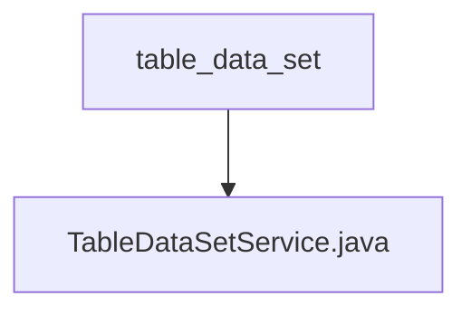

# Basic Information

|      |      |
|------|------|
| Name | table_data_set |
| Language | .java |
| Code Path | WeFe/board/board-service/src/main/java/com/welab/wefe/board/service/service/data_resource/table_data_set |
| Package Name | docs.board.board-service.src.main.java.com.welab.wefe.board.service.service.data_resource.table_data_set |
| Brief Description | The TableDataSetService class provides dataset management functionalities, including operations such as retrieving files, deleting datasets, testing SQL queries, querying and saving datasets. It implements CRUD operations and storage management for datasets through multiple Repository and service classes. |

# Description

TableDataSetService is a service class that inherits from DataResourceService, primarily used for managing tabular datasets. It implements its functionality by injecting multiple dependent services (such as DataSetColumnService, DataSetStorageService, etc.) and repositories (such as tableDataSetRepository, dataSourceRepo, etc.). Key features include: retrieving uploaded files (supporting HTTP uploads, local files, and databases), deleting datasets (supporting deletion by ID or model, with cleanup of related storage and cache), fetching data sources by ID, querying dataset information from local or federated data sources, validating the effectiveness of SQL query statements, updating dataset column information, and querying/saving dataset models. The class also provides various operations on datasets, such as permission checks during deletion and saving column information before updates.

### Package Internal Structure View

This flowchart illustrates the hierarchical relationship between the table_data_set directory and its contained file TableDataSetService.java. table_data_set serves as the parent directory, with TableDataSetService.java being its direct child file, forming a simple single-layer file structure relationship.

# File List

| Name   | Type  | Description |
|-------|------|-------------|
| [TableDataSetService.java](TableDataSetService.md) | file | The TableDataSetService class provides dataset management functionalities, including retrieving files, deleting datasets, testing SQL queries, querying and saving datasets, among other operations. It implements CRUD and storage management for datasets through multiple Repository and service classes. |

