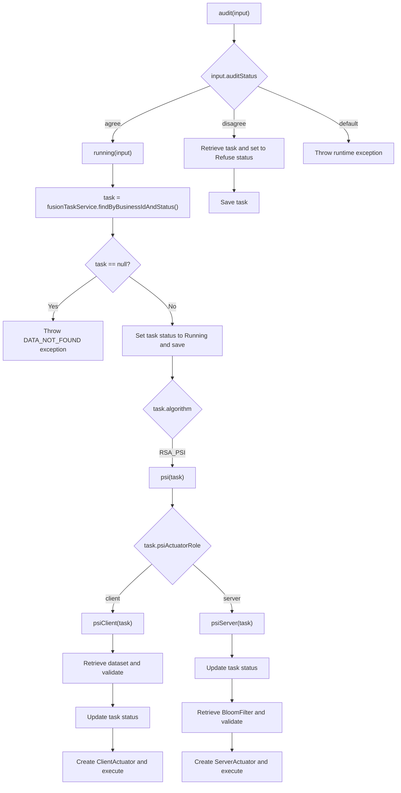
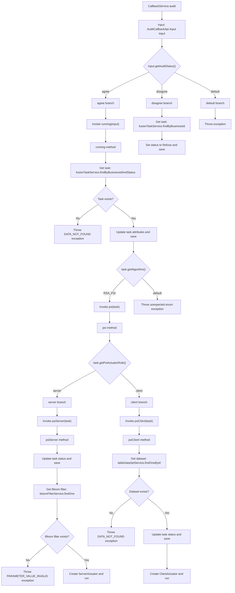

# Basic Information

|      |      |
|------|------|
| Name | CallbackService |
| Language | .java |
| Code Path | WeFe/board/board-service/src/main/java/com/welab/wefe/board/service/service/fusion/CallbackService.java |
| Package Name | com.welab.wefe.board.service.service.fusion |
| Dependencies | ['com.welab.wefe.board.service.api.project.fusion.task.AuditCallbackApi', 'com.welab.wefe.board.service.database.entity.data_resource.BloomFilterMysqlModel', 'com.welab.wefe.board.service.database.entity.data_resource.TableDataSetMysqlModel', 'com.welab.wefe.board.service.database.entity.fusion.FusionTaskMySqlModel', 'com.welab.wefe.board.service.database.repository.fusion.FusionTaskRepository', 'com.welab.wefe.board.service.fusion.actuator.ClientActuator', 'com.welab.wefe.board.service.fusion.actuator.psi.ServerActuator', 'com.welab.wefe.board.service.service.data_resource.bloom_filter.BloomFilterService', 'com.welab.wefe.board.service.service.data_resource.table_data_set.TableDataSetService', 'com.welab.wefe.common.StatusCode', 'com.welab.wefe.common.exception.StatusCodeWithException', 'com.welab.wefe.common.util.StringUtil', 'com.welab.wefe.common.wefe.enums.DataResourceType', 'com.welab.wefe.fusion.core.enums.FusionTaskStatus', 'com.welab.wefe.fusion.core.utils.bf.BloomFilterUtils', 'org.springframework.beans.factory.annotation.Autowired', 'org.springframework.stereotype.Service', 'org.springframework.transaction.annotation.Transactional', 'java.math.BigInteger', 'java.nio.file.Paths', 'java.util.Date', 'com.welab.wefe.common.StatusCode.DATA_NOT_FOUND'] |
| Brief Description | The CallbackService handles audit callbacks, approving or rejecting task status updates based on the state. When approved, it initiates the RSA-PSI algorithm, with the client and server executing their respective logic. |

# Description

The CallbackService is a service class that handles callback logic, primarily encompassing audit and RSA-PSI algorithm-related functionalities. The audit method determines the operation to execute based on the input state: it invokes the running method to initiate the task when approved, or updates the task status to "rejected" and saves it when denied. The running method checks the task status, updates it to "running," and invokes the corresponding processing logic based on the algorithm type. The RSA-PSI algorithm involves two roles: client and server. The client processes the dataset and launches the ClientActuator, while the server handles Bloom filter data and initiates the ServerActuator. The entire process involves task status updates, data validation, and algorithm execution.

# Class Summary

| Name   | Type  | Description |
|-------|------|-------------|
| CallbackService | class | The CallbackService handles audit callbacks, approving or rejecting task status updates based on their state. When approved, it initiates the RSA-PSI algorithm, with the client and server executing distinct logic respectively. |

## Class CallbackService

|      |      |
|------|------|
| Access Modifier | @Service;public |
| Type | class |
| Name | CallbackService |
| Description | The CallbackService handles audit callbacks, approving or rejecting task status updates based on their state. When approved, it initiates the RSA-PSI algorithm, with the client and server executing distinct logic respectively. |

### UML Class Diagram

```mermaid
classDiagram
    class CallbackService {
        -FusionTaskService fusionTaskService
        -FusionTaskRepository fusionTaskRepository
        -BloomFilterService bloomFilterService
        -TableDataSetService tableDataSetService
        +audit(AuditCallbackApi~Input~ input) void
        -running(AuditCallbackApi~Input~ input) void
        -psi(FusionTaskMySqlModel task) void
        -psiClient(FusionTaskMySqlModel task) void
        -psiServer(FusionTaskMySqlModel task) void
    }

    class FusionTaskService {
        +findByBusinessId(String businessId) FusionTaskMySqlModel
        +findByBusinessIdAndStatus(String businessId, FusionTaskStatus status) FusionTaskMySqlModel
    }

    class FusionTaskRepository {
        +save(FusionTaskMySqlModel entity) FusionTaskMySqlModel
    }

    class BloomFilterService {
        +findOne(String id) BloomFilterMysqlModel
    }

    class TableDataSetService {
        +findOneById(String id) TableDataSetMysqlModel
    }

    class AuditCallbackApi {
        <<Interface>>
    }

    class FusionTaskMySqlModel {
        -String businessId
        -FusionTaskStatus status
        -String comment
        -String partnerHashFunction
        -Algorithm algorithm
        -PsiActuatorRole psiActuatorRole
        -String dataResourceId
        -boolean trace
        -String traceColumn
        -String dstMemberId
        -DataResourceType dataResourceType
        -long rowCount
        -long partnerRowCount
        -Date updatedTime
        +setStatus(FusionTaskStatus status) void
        +setComment(String comment) void
        +setPartnerHashFunction(String function) void
        +setUpdatedTime(Date time) void
    }

    class BloomFilterMysqlModel {
        -String storageNamespace
        -String storageResourceName
        -String rsaN
        -String rsaE
        -String rsaD
        -String rsaP
        -String rsaQ
    }

    class TableDataSetMysqlModel {
        -String id
    }

    class ClientActuator {
        +ClientActuator(String businessId, String dataResourceId, boolean trace, String traceColumn, String dstMemberId, long rowCount)
        +run() void
    }

    class ServerActuator {
        +ServerActuator(String businessId, BloomFilter bloomFilter, BigInteger rsaN, BigInteger rsaE, BigInteger rsaD, BigInteger rsaP, BigInteger rsaQ, long rowCount)
        +run() void
    }

    CallbackService --> FusionTaskService : Dependency
    CallbackService --> FusionTaskRepository : Dependency
    CallbackService --> BloomFilterService : Dependency
    CallbackService --> TableDataSetService : Dependency
    CallbackService --> AuditCallbackApi : Dependency
    CallbackService --> ClientActuator : Create
    CallbackService --> ServerActuator : Create
    FusionTaskService --> FusionTaskMySqlModel : Return
    BloomFilterService --> BloomFilterMysqlModel : Return
    TableDataSetService --> TableDataSetMysqlModel : Return
```

This code implements a callback service (CallbackService) primarily handling audit callback logic. It utilizes multiple services (FusionTaskService, BloomFilterService, etc.) through dependency injection, executing different operations based on audit status (input.auditStatus): initiating task execution flow when approved, updating task status when rejected. During execution, it creates different actuators (ClientActuator/ServerActuator) based on algorithm type (RSA_PSI) and role (server/client) to handle specific business logic. The entire process includes state management, data validation, and task execution, with transactions ensuring atomicity of operations.

### Internal Method Call Graph

This code flowchart illustrates the complete audit callback processing logic in the CallbackService class. Starting from the entry method audit, it branches based on audit status (agree/disagree/default). The agree status triggers the running method to execute the task, while disagree status updates the task status to Refuse. The running method further invokes the psi method based on algorithm type (currently only handling RSA_PSI), which then executes psiServer or psiClient logic according to the role (server/client). Both role methods update the task status and ultimately create corresponding actuators (Actuator) to run the actual business logic. The entire process includes multi-level conditional judgments and exception handling, demonstrating a complete business state transition flow.

### Field List

| Name  | Type  | Description |
|-------|-------|------|
| bloomFilterService | BloomFilterService | The code snippet uses the @Autowired annotation to automatically inject an instance of BloomFilterService. |
| fusionTaskRepository | FusionTaskRepository | Automatically inject the FusionTaskRepository instance. |
| fusionTaskService | FusionTaskService | The code snippet uses the @Autowired annotation to automatically inject an instance of FusionTaskService. |
| tableDataSetService | TableDataSetService | Automatically inject the TableDataSetService instance. |

### Method List

| Name  | Type  | Description |
|-------|-------|------|
| psiServer | void | This method handles PSI server tasks: updates the task status to running and saves it; checks whether the Bloom filter exists; creates a task processor using the Bloom filter data and RSA parameters, and executes it. |
| audit | void | This method is used for review processing, performing different operations based on the review status: calling the `running` method when approved, updating the task status to `Refuse` and saving when rejected, and throwing an exception in other cases. |
| psi | void | Execute PSI server or client logic based on the task role, otherwise skip. |
| running | void | The method `running` processes audit callback inputs, checks the task status and updates it to "running," then performs corresponding operations based on the algorithm type (e.g., RSA_PSI), otherwise throws an exception. |
| psiClient | void | The method psiClient handles tasks: checks if the dataset exists, updates the task status to running, and finally starts the ClientActuator to execute the task. If the dataset does not exist, an exception is thrown. |

