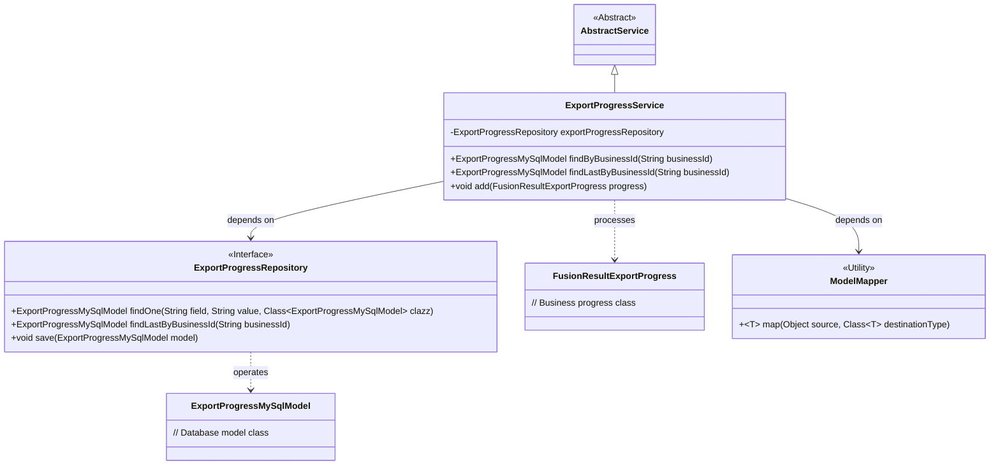
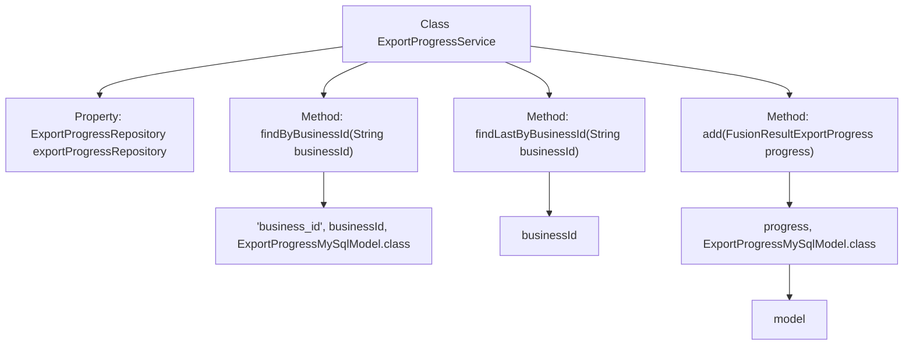

# Basic Information

|      |      |
|------|------|
| Name | ExportProgressService |
| Language | .java |
| Code Path | WeFe/board/board-service/src/main/java/com/welab/wefe/board/service/service/fusion/ExportProgressService.java |
| Package Name | com.welab.wefe.board.service.service.fusion |
| Dependencies | ['com.welab.wefe.board.service.database.entity.fusion.ExportProgressMySqlModel', 'com.welab.wefe.board.service.database.repository.fusion.ExportProgressRepository', 'com.welab.wefe.board.service.dto.fusion.FusionResultExportProgress', 'com.welab.wefe.board.service.service.AbstractService', 'com.welab.wefe.common.web.util.ModelMapper', 'org.springframework.beans.factory.annotation.Autowired', 'org.springframework.stereotype.Service'] |
| Brief Description | The ExportProgressService is a service class that provides functionalities for querying export progress records by business ID, retrieving the latest record, and adding new records. It relies on the ExportProgressRepository to interact with the database. |

# Description

The ExportProgressService is a service class that inherits from AbstractService and is used to manage export progress. It interacts with the database through the automatically injected ExportProgressRepository. Key functionalities include querying a single export progress record by business ID, retrieving the last record for a specified business ID, and mapping the FusionResultExportProgress object to an ExportProgressMySqlModel for storage in the database. This class encapsulates data access operations related to export progress.

# Class Summary

| Name   | Type  | Description |
|-------|------|-------------|
| ExportProgressService | class | The ExportProgressService provides the functionality to query export progress by business ID, supporting the retrieval of the latest records and the addition of new progress entries, utilizing the ExportProgressRepository for database operations. |

## Class ExportProgressService

|      |      |
|------|------|
| Access Modifier | @Service;public |
| Type | class |
| Name | ExportProgressService |
| Description | The ExportProgressService provides the functionality to query export progress by business ID, supporting the retrieval of the latest records and the addition of new progress entries, utilizing the ExportProgressRepository for database operations. |

### UML Class Diagram

This code demonstrates the implementation of an export progress service (ExportProgressService), which inherits from AbstractService and relies on ExportProgressRepository for database operations. The service provides three main methods: querying progress records by business ID, retrieving the last progress record, and adding new progress records. The class diagram clearly illustrates the interaction between the service layer and the database layer, as well as the usage of model conversion utilities. ExportProgressRepository, as an interface, defines data access methods, while ExportProgressMySqlModel and FusionResultExportProgress represent the database entity and business object respectively.

### Internal Method Call Graph

This code illustrates a Spring service class ExportProgressService, primarily handling database operations related to export progress. The class contains three core methods: querying records by business ID (findByBusinessId), retrieving the last record by business ID (findLastByBusinessId), and adding new progress records (add). Each method interacts with the database through the auto-injected ExportProgressRepository, with the add method additionally involving model conversion operations. The overall structure clearly demonstrates the interaction between the service layer and persistence layer.

### Field List

| Name  | Type  | Description |
|-------|-------|------|
| exportProgressRepository | ExportProgressRepository | Automatically inject export progress repository instance. |

### Method List

| Name  | Type  | Description |
|-------|-------|------|
| findByBusinessId | ExportProgressMySqlModel | Query the export progress based on the business ID and return the corresponding MySQL model object. |
| findLastByBusinessId | ExportProgressMySqlModel | This method queries and returns the latest ExportProgressMySqlModel record by businessId. |
| add | void | This method maps the FusionResultExportProgress object to ExportProgressMySqlModel and saves it to the database. |

