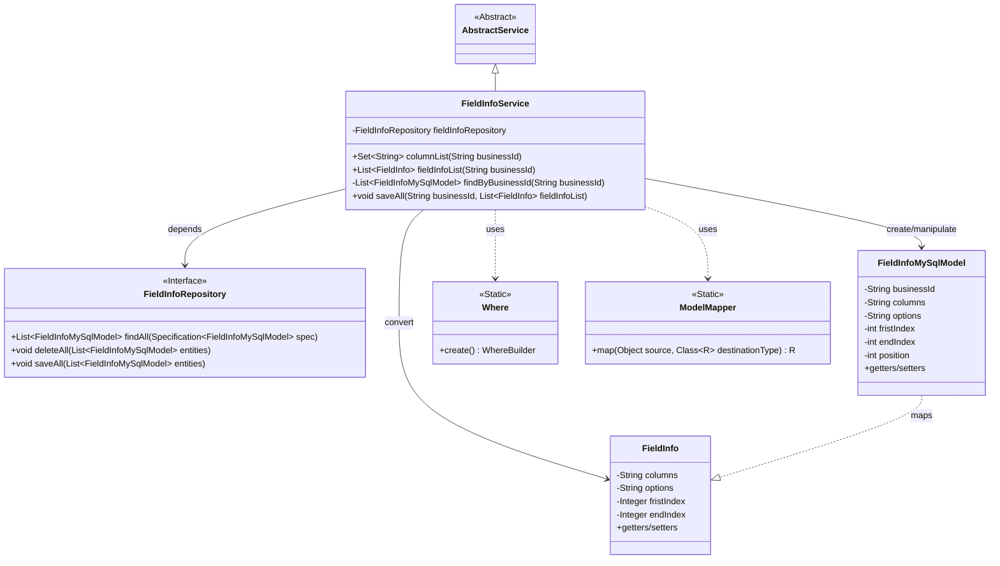
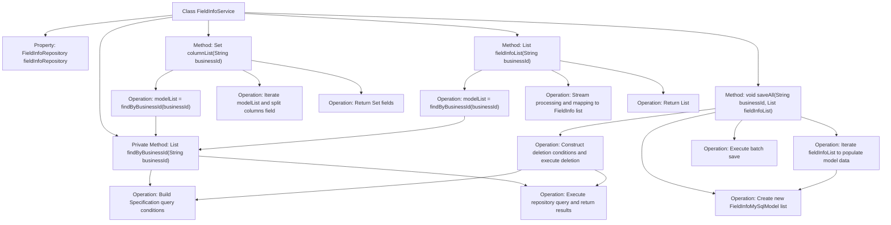

# Basic Information

|      |      |
|------|------|
| Name | FieldInfoService |
| Language | .java |
| Code Path | WeFe/board/board-service/src/main/java/com/welab/wefe/board/service/service/fusion/FieldInfoService.java |
| Package Name | com.welab.wefe.board.service.service.fusion |
| Dependencies | ['com.welab.wefe.board.service.database.entity.fusion.FieldInfoMySqlModel', 'com.welab.wefe.board.service.database.repository.fusion.FieldInfoRepository', 'com.welab.wefe.board.service.service.AbstractService', 'com.welab.wefe.board.service.util.primarykey.FieldInfo', 'com.welab.wefe.common.data.mysql.Where', 'com.welab.wefe.common.data.mysql.enums.OrderBy', 'com.welab.wefe.common.web.util.ModelMapper', 'org.springframework.beans.factory.annotation.Autowired', 'org.springframework.data.jpa.domain.Specification', 'org.springframework.stereotype.Service', 'org.springframework.transaction.annotation.Transactional', 'java.util', 'java.util.stream.Collectors'] |
| Brief Description | The FieldInfoService provides field information management functionalities, including querying field lists, field information lists, and batch saving field information. It supports operations by businessId and ensures data consistency through transactions. |

# Description

The code defines a service class named `FieldInfoService`, which inherits from `AbstractService`. It interacts with the database through `FieldInfoRepository` and provides three core functionalities: the `columnList` method retrieves a set of column names based on a business ID; the `fieldInfoList` method returns a mapped list of field information; and the `saveAll` method saves a list of field information in a transactional manner, first deleting old data before inserting new data. The private method `findByBusinessId` constructs query conditions to fetch data sorted by business ID and position. The class utilizes Spring's dependency injection and transaction management annotations.

# Class Summary

| Name   | Type  | Description |
|-------|------|-------------|
| FieldInfoService | class | The FieldInfoService class provides field information management functionalities, including querying field lists, retrieving field information by business ID, and batch saving field data. It operates the database through the Repository and supports transaction rollback. |

## Class FieldInfoService

|      |      |
|------|------|
| Access Modifier | @Service;public |
| Type | class |
| Name | FieldInfoService |
| Description | The FieldInfoService class provides field information management functionalities, including querying field lists, retrieving field information by business ID, and batch saving field data. It operates the database through the Repository and supports transaction rollback. |

### UML Class Diagram

This class diagram illustrates the core structure and relationships of FieldInfoService. As a business service class inheriting from AbstractService, it interacts with the database through FieldInfoRepository, handling conversions between FieldInfoMySqlModel entities and FieldInfo data transfer objects. Leveraging Where for query condition construction and ModelMapper for model mapping, it primarily provides column list querying, field information retrieval, and batch saving functionalities, embodying a typical Spring data access layer design pattern.

### Internal Method Call Graph

This flowchart illustrates the complete structure and method invocation relationships of the FieldInfoService class. The class contains the core fieldInfoRepository property and four main methods: columnList for retrieving column sets, fieldInfoList for obtaining field information lists, the private method findByBusinessId implementing common query logic, and the saveAll method handling transactional batch save operations. The flow clearly demonstrates internal processing steps and inter-method call relationships, particularly showing the complete transactional flow of the saveAll method that includes deleting old data and saving new data. All methods reuse query logic through findByBusinessId, demonstrating excellent code reusability.

### Field List

| Name  | Type  | Description |
|-------|-------|------|
| fieldInfoRepository | FieldInfoRepository | Automatically inject the FieldInfoRepository instance. |

### Method List

| Name  | Type  | Description |
|-------|-------|------|
| columnList | Set<String> | This method queries field information based on the business ID, splits the column names of each model by commas and merges them into a set, ultimately returning a unique set of all column names. |
| findByBusinessId | List<FieldInfoMySqlModel> | Query field information based on the business ID, sort by position in ascending order, and return the list. |
| saveAll | void | Transactional method saveAll: Deletes old data based on businessId, converts and saves the new FieldInfo list to the database, with rollback on exception. |
| fieldInfoList | List<FieldInfo> | This method queries a list of FieldInfoMySqlModel based on the businessId, maps it to a list of FieldInfo through stream operations, and then returns the result. |

