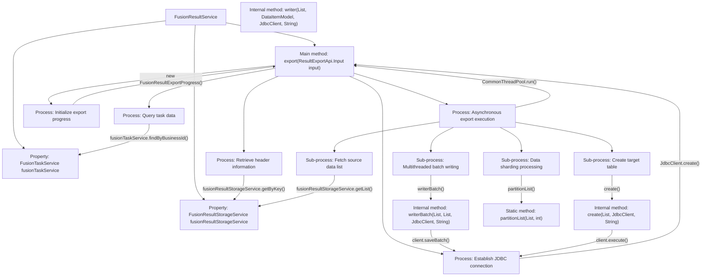

# Basic Information

|      |      |
|------|------|
| Name | FusionResultService |
| Language | .java |
| Code Path | WeFe/board/board-service/src/main/java/com/welab/wefe/board/service/service/fusion/FusionResultService.java |
| Package Name | com.welab.wefe.board.service.service.fusion |
| Dependencies | ['java.util.ArrayList', 'java.util.Date', 'java.util.Iterator', 'java.util.List', 'java.util.concurrent.ExecutorService', 'java.util.concurrent.Executors', 'org.springframework.beans.factory.annotation.Autowired', 'org.springframework.stereotype.Service', 'com.google.common.collect.Lists', 'com.welab.wefe.board.service.api.project.fusion.result.ResultExportApi', 'com.welab.wefe.board.service.database.entity.fusion.FusionTaskMySqlModel', 'com.welab.wefe.board.service.dto.fusion.FusionResultExportProgress', 'com.welab.wefe.board.service.fusion.enums.ExportStatus', 'com.welab.wefe.board.service.fusion.manager.ExportManager', 'com.welab.wefe.board.service.service.AbstractService', 'com.welab.wefe.common.CommonThreadPool', 'com.welab.wefe.common.StatusCode', 'com.welab.wefe.common.data.storage.common.Constant', 'com.welab.wefe.common.data.storage.model.DataItemModel', 'com.welab.wefe.common.exception.StatusCodeWithException', 'com.welab.wefe.common.jdbc.JdbcClient', 'com.welab.wefe.common.util.DateUtil', 'com.welab.wefe.common.util.StringUtil'] |
| Brief Description | The FusionResultService handles data export tasks, including querying tasks, creating tables, and batch writing data to the database, supporting multi-threaded concurrent processing. |

# Description

FusionResultService is a Spring service class that extends AbstractService and provides data export functionality. It primarily relies on FusionTaskService and FusionResultStorageService. The export method accepts input parameters, validates the business ID's validity, retrieves header information from the storage service, and creates a JDBC client to connect to the target database. Using a multi-threaded approach, it processes data in batches, exporting data from the source storage to newly created tables in the target database while maintaining export progress. It includes helper methods such as table creation, single-record writing, batch writing, and list partitioning to ensure efficient large-scale data export. The entire process logs operations and handles exceptions.

# Class Summary

| Name   | Type  | Description |
|-------|------|-------------|
| FusionResultService | class | FusionResultService provides data export functionality, creating tables via JDBC and performing batch data writes. It supports multi-threaded sharding processing, including error handling and progress tracking. |


## Class FusionResultService

|      |      |
|------|------|
| Access Modifier | @Service;public |
| Type | class |
| Name | FusionResultService |
| Description | FusionResultService provides data export functionality, creating tables via JDBC and performing batch data writes. It supports multi-threaded sharding processing, including error handling and progress tracking. |


### UML Class Diagram

```mermaid
classDiagram
    class AbstractService {
        <<Abstract>>
    }

    class FusionResultService {
        -FusionTaskService fusionTaskService
        -FusionResultStorageService fusionResultStorageService
        +export(ResultExportApi$Input input) String
        -create(List~String~ headers, JdbcClient client, String tableName) void
        -writer(List~String~ headers, DataItemModel model, JdbcClient client, String tableName) void
        -writerBatch(List~String~ headers, List~DataItemModel~ models, JdbcClient client, String tableName) void
        +partitionList~T~(List~T~ list, int numPartitions) List~List~T~~
    }

    class FusionTaskService {
        <<Service>>
        +findByBusinessId(String businessId) FusionTaskMySqlModel
    }

    class FusionResultStorageService {
        <<Service>>
        +getByKey(String dbName, String tableName, String key) DataItemModel
        +getList(String tableName) List~DataItemModel~
        +createRawDataSetTableName(String businessId) String
    }

    class JdbcClient {
        <<Utility>>
        +execute(String sql) void
        +saveBatch(String sql, List~DataItemModel~ models, Function~DataItemModel, Object[]~ mapper) void
    }

    class DataItemModel {
        -Object k
        -Object v
        +getK() Object
        +getV() Object
    }

    class ResultExportApi$Input {
        -String businessId
        -String databaseType
        -String host
        -int port
        -String userName
        -String password
        -String databaseName
        +getBusinessId() String
        // ...other getter methods
    }

    AbstractService <|-- FusionResultService
    FusionResultService --> FusionTaskService : dependency
    FusionResultService --> FusionResultStorageService : dependency
    FusionResultService --> JdbcClient : dependency
    FusionResultService --> DataItemModel : uses
    FusionResultService --> ResultExportApi$Input : uses
```

This code demonstrates a data export service `FusionResultService` that inherits from `AbstractService`. Its primary function is to export fused result data stored in ClickHouse to a target database. The service validates business ID validity through `FusionTaskService`, retrieves raw data using `FusionResultStorageService`, and utilizes `JdbcClient` to create table structures and perform batch data insertion in the target database. The entire process employs multi-threaded partitioning for handling large data volumes and tracks export status through a progress object `FusionResultExportProgress`. The class diagram clearly illustrates the dependency relationships between services and the data flow path.


### Internal Method Call Graph



This flowchart illustrates the core data export workflow of FusionResultService. The service first validates business ID effectiveness, then retrieves header information and establishes a database connection. Through an asynchronous thread pool, it executes multi-step export operations: creating target table structure, batch-fetching source data, intelligently sharding large datasets, and finally performing parallel writes to the target database via multithreading. The entire process incorporates comprehensive progress tracking mechanisms with exception handling capabilities at each step, achieving efficient and stable mass data migration functionality.

### Field List

| Name  | Type  | Description |
|-------|-------|------|
| fusionResultStorageService | FusionResultStorageService | Automatically inject the FusionResultStorageService service instance. |
| fusionTaskService | FusionTaskService | Use @Autowired to automatically inject an instance of the FusionTaskService. |

### Method List

| Name  | Type  | Description |
|-------|-------|------|
| export | String | This method is used to export the fused task result data. It first checks whether the task exists, retrieves the header information, and connects to the database. After creating a temporary table, it reads data in batches from the storage service, writes it to the database using multi-threading, and simultaneously updates the export progress. Finally, it returns the generated table name. |
| create | void | Method to create a table, which takes a list of headers, a database client, and a table name, generates an SQL statement and executes it, throwing an exception if an error occurs. |
| writer | void | This method constructs and executes an SQL INSERT statement to insert the data from DataItemModel into a specified table. It concatenates the table headers and data values, and finally executes the SQL via JdbcClient. |
| writerBatch | void | The method `writerBatch` generates batch insert SQL statements, concatenates table names and fields, uses placeholders, executes batch saves via JdbcClient, and converts the data model into a parameter array. |
| partitionList | List<List<T>> | Split the list evenly into specified partitions with non-empty validation, partition count must be greater than 0, and return the partitioned list collection. |


