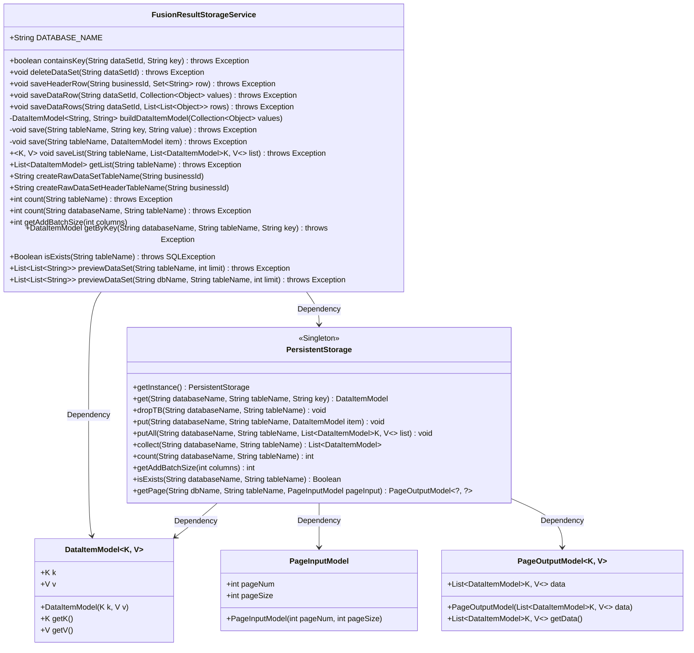

# Basic Information

|      |      |
|------|------|
| Name | FusionResultStorageService |
| Language | .java |
| Code Path | WeFe/board/board-service/src/main/java/com/welab/wefe/board/service/service/fusion/FusionResultStorageService.java |
| Package Name | com.welab.wefe.board.service.service.fusion |
| Dependencies | ['java.sql.SQLException', 'java.util.ArrayList', 'java.util.Collection', 'java.util.List', 'java.util.Set', 'java.util.stream.Collectors', 'org.springframework.stereotype.Service', 'com.alibaba.fastjson.JSON', 'com.welab.wefe.board.service.service.AbstractService', 'com.welab.wefe.common.data.storage.common.Constant', 'com.welab.wefe.common.data.storage.model.DataItemModel', 'com.welab.wefe.common.data.storage.model.PageInputModel', 'com.welab.wefe.common.data.storage.model.PageOutputModel', 'com.welab.wefe.common.data.storage.service.persistent.PersistentStorage', 'com.welab.wefe.common.util.StringUtil'] |
| Brief Description | The FusionResultStorageService provides dataset storage management functionalities, including checking key existence, deleting datasets, saving headers and data rows, batch operations, and data preview. It utilizes PersistentStorage for persistence operations and supports table name generation and batch size calculation. |

# Description

The FusionResultStorageService is a service class that inherits from AbstractService, primarily used for managing storage operations of datasets. It utilizes a PersistentStorage instance for database interactions, with the database named WEFE_DATA. Key functionalities include checking key existence, deleting datasets, saving dataset header information and data rows, batch-saving data rows, reading records, obtaining table row counts, calculating batch sizes, and previewing datasets. The methods involve creating table names, converting data models, processing JSON strings, supporting both single and batch data operations, and providing paginated preview capabilities.

# Class Summary

| Name   | Type  | Description |
|-------|------|-------------|
| FusionResultStorageService | class | The FusionResultStorageService provides dataset storage management functionalities, including checking key existence, deleting datasets, saving headers and data rows, batch operations, data preview, etc., and implements persistent operations based on PersistentStorage. |

## Class FusionResultStorageService

|      |      |
|------|------|
| Access Modifier | @Service;public |
| Type | class |
| Name | FusionResultStorageService |
| Description | The FusionResultStorageService provides dataset storage management functionalities, including checking key existence, deleting datasets, saving headers and data rows, batch operations, data preview, etc., and implements persistent operations based on PersistentStorage. |

### UML Class Diagram

Class Diagram Description:
FusionResultStorageService is a data storage service class that provides CRUD operations for datasets, relying on the PersistentStorage singleton class for underlying storage operations. Core functionalities include checking key existence, deleting datasets, saving header rows and data rows, and previewing datasets. DataItemModel encapsulates key-value pair data, while PageInputModel and PageOutputModel are used for paginated queries. The service interacts with the storage system by constructing table names and handles data conversion logic such as JSON serialization and string concatenation.

### Internal Method Call Graph

```mermaid
graph TD
    A["Class FusionResultStorageService"]
    B["Constant: DATABASE_NAME = Constant.DBName.WEFE_DATA"]
    C["Method: boolean containsKey(dataSetId, key)"]
    D["Method: void deleteDataSet(dataSetId)"]
    E["Method: void saveHeaderRow(businessId, row)"]
    F["Method: void saveDataRow(dataSetId, values)"]
    G["Method: void saveDataRows(dataSetId, rows)"]
    H["Private Method: DataItemModel buildDataItemModel(values)"]
    I["Private Method: void save(tableName, key, value)"]
    J["Private Method: void save(tableName, item)"]
    K["Method: void saveList(tableName, list)"]
    L["Method: List getList(tableName)"]
    M["Method: String createRawDataSetTableName(businessId)"]
    N["Method: String createRawDataSetHeaderTableName(businessId)"]
    O["Method: int count(tableName)"]
    P["Method: int count(databaseName, tableName)"]
    Q["Method: int getAddBatchSize(columns)"]
    R["Method: DataItemModel getByKey(databaseName, tableName, key)"]
    S["Method: Boolean isExists(tableName)"]
    T["Method: List previewDataSet(tableName, limit)"]
    U["Method: List previewDataSet(dbName, tableName, limit)"]

    A --> B
    A --> C
    A --> D
    A --> E
    A --> F
    A --> G
    A --> H
    A --> I
    A --> J
    A --> K
    A --> L
    A --> M
    A --> N
    A --> O
    A --> P
    A --> Q
    A --> R
    A --> S
    A --> T
    A --> U

    E --> H
    F --> H
    G --> H
    E --> I
    F --> J
    G --> K
    T --> U
```

This flowchart illustrates the complete structure of the FusionResultStorageService class, comprising 19 primary methods and their invocation relationships. Core functionalities revolve around dataset storage operations, including existence checks (containsKey), deletion (deleteDataSet), various saving methods (saveHeaderRow/saveDataRow/saveDataRows), data conversion (buildDataItemModel), and data preview (previewDataSet). All storage operations are ultimately executed through a PersistentStorage instance, demonstrating clear responsibility segregation. Private methods are restricted to internal class usage, while public methods provide comprehensive CRUD functional interfaces.

### Field List

| Name  | Type  | Description |
|-------|-------|------|
| DATABASE_NAME = Constant.DBName.WEFE_DATA | String | The static constant DATABASE_NAME, with a value of WEFE_DATA, is used for database name definition. |

### Method List

| Name  | Type  | Description |
|-------|-------|------|
| saveDataRows | void | Java Method: Convert a two-dimensional data list into DataItemModel and save it to the specified table. Parameters: dataset ID and row data list. Exceptions may be thrown. |
| saveDataRow | void | Save dataset row data to the specified table, with parameters being the dataset ID and value collection, may throw exceptions. |
| save | void | Save data items to the specified database table. |
| isExists | Boolean | Check if the specified table exists by calling the `isExists` method of the persistent storage instance, passing the database name and table name parameters, and returning a boolean result. |
| containsKey | boolean | Check if a specified key-value exists in the dataset table. Return true if it exists, otherwise false. Throw an Exception in case of an error. |
| deleteDataSet | void | Delete the specified dataset, generate table names based on dataset IDs, and invoke persistent storage to delete the corresponding database tables. |
| previewDataSet | List<List<String>> | This method previews the dataset, retrieves paginated data from the specified database and table, converts key-value pairs into a list of strings with keys as separate items and values split into multiple items by commas, and returns a list of all data. |
| count | int | This method is used to count the number of records in a specified database table by invoking the count method of the persistence storage instance. It requires passing the database name and table name as parameters and may throw exceptions. |
| count | int | This method counts the number of records in a specified database table through a PersistentStorage instance, with parameters being the database name and table name, and may throw exceptions. |
| getAddBatchSize | int | This method returns the batch addition size corresponding to the specified number of columns, implemented by calling the singleton instance of PersistentStorage. |
| saveHeaderRow | void | The method `saveHeaderRow` receives a business ID and a collection of row data, converts the row data into a comma-separated JSON string, and saves it to a table named with the business ID followed by `.meta`, using `header` as the key. The processing related to `sid` is omitted. |
| createRawDataSetHeaderTableName | String | Method generates the original dataset header table name containing the business ID, in the format "fusion_result_[business ID].meta". |
| getList | List<DataItemModel> | This method retrieves the data list of a specified table through persistent storage instances and returns a collection of DataItemModel. The parameter is the table name, and exceptions may be thrown. |
| buildDataItemModel | DataItemModel<String, String> | Method for constructing DataItemModel: Iterate through the collection, using the first element as the key and converting the remaining elements into a comma-separated string list. Returns a DataItemModel object containing the key and the concatenated string. |
| getByKey | DataItemModel | The method retrieves data items from a specified database and table via key-value pairs, invoking a persistent storage instance to complete the operation, which may throw exceptions. |
| save | void | This method is used to save data by invoking a persistent storage instance to store key-value pairs into a specified database table. |
| createRawDataSetTableName | String | This method generates the original dataset table name based on the business ID, with the format being "fusion_result_" followed by the business ID. |
| saveList | void | Java Method: Save a list of data to the specified database table. Parameters: table name and a list of data items, with generic types K and V. Calls the putAll method of persistent storage. May throw exceptions. |
| previewDataSet | List<List<String>> | This is a Java method designed to preview the dataset of a specified table, returning a list of string lists. The method accepts parameters for the table name and row limit, invokes an internal method, and may throw exceptions. |

