# Basic Information

|      |      |
|------|------|
| Name | FusionTaskService |
| Language | .java |
| Code Path | WeFe/board/board-service/src/main/java/com/welab/wefe/board/service/service/fusion/FusionTaskService.java |
| Package Name | com.welab.wefe.board.service.service.fusion |
| Dependencies | ['com.alibaba.fastjson.JSONObject', 'com.welab.wefe.board.service.api.project.fusion.task', 'com.welab.wefe.board.service.database.entity.data_resource.BloomFilterMysqlModel', 'com.welab.wefe.board.service.database.entity.data_resource.TableDataSetMysqlModel', 'com.welab.wefe.board.service.database.entity.fusion.FusionTaskMySqlModel', 'com.welab.wefe.board.service.database.entity.job.ProjectMySqlModel', 'com.welab.wefe.board.service.database.repository.fusion.FusionTaskRepository', 'com.welab.wefe.board.service.dto.base.PagingOutput', 'com.welab.wefe.board.service.dto.fusion.FusionMemberInfo', 'com.welab.wefe.board.service.dto.fusion.FusionResultExportProgress', 'com.welab.wefe.board.service.dto.fusion.FusionTaskOutput', 'com.welab.wefe.board.service.fusion.actuator.ClientActuator', 'com.welab.wefe.board.service.fusion.actuator.psi.ServerActuator', 'com.welab.wefe.board.service.fusion.manager.ActuatorManager', 'com.welab.wefe.board.service.fusion.manager.ExportManager', 'com.welab.wefe.board.service.onlinedemo.OnlineDemoBranchStrategy', 'com.welab.wefe.board.service.service.AbstractService', 'com.welab.wefe.board.service.service.CacheObjects', 'com.welab.wefe.board.service.service.ProjectService', 'com.welab.wefe.board.service.service.TaskResultService', 'com.welab.wefe.board.service.service.data_resource.DataResourceService', 'com.welab.wefe.board.service.service.data_resource.bloom_filter.BloomFilterService', 'com.welab.wefe.board.service.service.data_resource.table_data_set.TableDataSetService', 'com.welab.wefe.board.service.util.primarykey.PrimaryKeyUtils', 'com.welab.wefe.common.StatusCode', 'com.welab.wefe.common.data.mysql.Where', 'com.welab.wefe.common.exception.StatusCodeWithException', 'com.welab.wefe.common.web.util.CurrentAccountUtil', 'com.welab.wefe.common.web.util.ModelMapper', 'com.welab.wefe.common.wefe.enums.AuditStatus', 'com.welab.wefe.common.wefe.enums.DataResourceType', 'com.welab.wefe.common.wefe.enums.JobMemberRole', 'com.welab.wefe.fusion.core.enums.AlgorithmType', 'com.welab.wefe.fusion.core.enums.FusionTaskStatus', 'com.welab.wefe.fusion.core.enums.PSIActuatorRole', 'com.welab.wefe.fusion.core.utils.bf.BloomFilterUtils', 'org.springframework.beans.factory.annotation.Autowired', 'org.springframework.data.jpa.domain.Specification', 'org.springframework.stereotype.Service', 'org.springframework.transaction.annotation.Transactional', 'java.math.BigInteger', 'java.nio.file.Paths', 'java.util.Date', 'java.util.List', 'java.util.UUID', 'java.util.stream.Collectors', 'com.welab.wefe.common.StatusCode.DATA_NOT_FOUND'] |
| Brief Description | FusionTaskService is a service class responsible for managing fusion tasks, including task creation, querying, updating, deletion, and processing. It relies on multiple services such as data resources and Bloom filters, supports the RSA_PSI algorithm, and handles task status changes and callbacks. |

# Description

FusionTaskService is a service class for managing fusion tasks, inheriting from AbstractService. It implements functionalities such as task CRUD operations, status updates, and data resource processing through multiple auto-injected services (e.g., FusionTaskRepository, TableDataSetService). Key methods include: querying tasks by ID or business ID, updating task status and error information, adding new tasks (supporting RSA_PSI algorithm), processing task approvals (approve or reject), restarting tasks, handling PSI algorithm tasks (client and server logic), receiving partner alignment requests, paginated task detail queries, deleting tasks, and callback processing. The service also involves handling data resource types (e.g., BloomFilter, TableDataSet) and role permission validation (e.g., only initiators can create tasks).

# Class Summary

| Name   | Type  | Description |
|-------|------|-------------|
| FusionTaskService | class | FusionTaskService is a service class designed for managing fusion tasks. It provides functionalities such as task querying, updating, adding, processing, and deletion, supports the RSA_PSI algorithm, handles task status changes, and interacts with third-party services. |

## Class FusionTaskService

|      |      |
|------|------|
| Access Modifier | @Service;public |
| Type | class |
| Name | FusionTaskService |
| Description | FusionTaskService is a service class designed for managing fusion tasks. It provides functionalities such as task querying, updating, adding, processing, and deletion, supports the RSA_PSI algorithm, handles task status changes, and interacts with third-party services. |

### UML Class Diagram

```mermaid
classDiagram
    class FusionTaskService {
        -FusionTaskRepository fusionTaskRepository
        -TableDataSetService tableDataSetService
        -DataResourceService dataResourceService
        -ThirdPartyService thirdPartyService
        -BloomFilterService bloomFilterService
        -TaskResultService taskResultService
        -FieldInfoService fieldInfoService
        -ProjectService projectService
        +find(String id) FusionTaskMySqlModel
        +findByBusinessId(String businessId) FusionTaskMySqlModel
        +findByBusinessIdAndStatus(String businessId, FusionTaskStatus status) FusionTaskMySqlModel
        +updateErrorByBusinessId(String businessId, FusionTaskStatus status, Long dataCount, Long fusionCount, Long processedCount, long spend, String error) void
        +updateByBusinessId(String businessId, FusionTaskStatus status, Long dataCount, Long fusionCount, Long processedCount, long spend) void
        +add(AddApi.Input input) void
        +update(UpdateApi.Input input) void
        +handle(AuditApi.Input input) void
        +restart(AuditApi.Input input) void
        +alignByPartner(ReceiveApi.Input input) void
        +paging(PagingApi.Input input) PagingOutput~FusionTaskOutput~
        +detail(String taskId) FusionTaskOutput
        +delete(DeleteApi.Input input) void
        +deleteCallback(DeleteCallbackApi.Input input) void
        -AddPsiTask(AddApi.Input input, String businessId) void
        -disAgree(FusionTaskMySqlModel task, AuditApi.Input input) void
        -psi(AuditApi.Input input, FusionTaskMySqlModel task) void
        -psiClient(AuditApi.Input input, FusionTaskMySqlModel task) void
        -psiServer(FusionTaskMySqlModel task) void
        -setMemberInfo(FusionTaskOutput model) void
    }

    class FusionTaskRepository {
        +findOne(String field, String value, Class~T~ clazz) T
        +findOne(Specification~T~ where) Optional~T~
        +save(T entity) T
        +paging(Specification~T~ where, PagingApi.Input input) PagingOutput~T~
    }

    class TableDataSetService {
        +findOneById(String id) TableDataSetMysqlModel
    }

    class DataResourceService {
        +usageCountInJobIncrement(String resourceId) void
    }

    class ThirdPartyService {
        +alignApply(FusionTaskMySqlModel task) void
        +callback(String memberId, String businessId, AuditStatus status, String comment) void
        +delete(FusionTaskMySqlModel task) void
    }

    class BloomFilterService {
        +findOne(String id) BloomFilterMysqlModel
    }

    class FieldInfoService {
        +saveAll(String businessId, List~FieldInfo~ fieldInfoList) void
        +fieldInfoList(String businessId) List~FieldInfo~
    }

    class ProjectService {
        +findByProjectId(String projectId) ProjectMySqlModel
    }

    class FusionTaskMySqlModel {
        -String id
        -String businessId
        -FusionTaskStatus status
        -Date updatedTime
        -Long fusionCount
        -Long dataCount
        -Long processedCount
        -long spend
        -String error
        -String name
        -String dataResourceId
        -DataResourceType dataResourceType
        -String dstMemberId
        -PSIActuatorRole psiActuatorRole
        -Long rowCount
        -String hashFunction
        -String partnerHashFunction
        -Long partnerRowCount
        -String partnerDataResourceId
        -DataResourceType partnerDataResourceType
        -JobMemberRole myRole
        -String createdBy
        -boolean deleted
        +setStatus(FusionTaskStatus status) void
        +setUpdatedTime(Date date) void
        +setFusionCount(Long count) void
        +setDataCount(Long count) void
        +setProcessedCount(Long count) void
        +setSpend(long spend) void
        +setError(String error) void
        +setName(String name) void
        +setDataResourceId(String id) void
        +setDataResourceType(DataResourceType type) void
        +setDstMemberId(String id) void
        +setPsiActuatorRole(PSIActuatorRole role) void
        +setRowCount(Long count) void
        +setHashFunction(String function) void
        +setPartnerHashFunction(String function) void
        +setPartnerRowCount(Long count) void
        +setPartnerDataResourceId(String id) void
        +setPartnerDataResourceType(DataResourceType type) void
        +setMyRole(JobMemberRole role) void
        +setDeleted(boolean deleted) void
        +setUpdatedBy(DeleteApi.Input input) void
    }

    class FusionTaskOutput {
        -String id
        -String businessId
        -FusionTaskStatus status
        -String name
        -String dataResourceId
        -DataResourceType dataResourceType
        -String dstMemberId
        -PSIActuatorRole psiActuatorRole
        -Long rowCount
        -String hashFunction
        -String partnerHashFunction
        -Long partnerRowCount
        -String partnerDataResourceId
        -DataResourceType partnerDataResourceType
        -JobMemberRole myRole
        -ExportStatus exportStatus
        -FusionMemberInfo promoter
        -FusionMemberInfo provider
        +setExportStatus(ExportStatus status) void
        +setPromoter(FusionMemberInfo info) void
        +setProvider(FusionMemberInfo info) void
    }

    class FusionMemberInfo {
        -String memberId
        -String memberName
        -JobMemberRole role
        -String hashFunction
        -String dataResourceId
        -DataResourceType dataResourceType
        -String dataResourceName
        -Long rowCount
        -List~String~ columnNameList
        -List~FieldInfo~ fieldInfoList
    }

    class BloomFilterMysqlModel {
        -String id
        -String storageNamespace
        -String storageResourceName
        -String hashFunction
        -Long totalDataCount
        -String rsaN
        -String rsaE
        -String rsaD
        -String rsaP
        -String rsaQ
        -String name
        +getHashFunction() String
        +getTotalDataCount() Long
        +getStorageNamespace() String
        +getStorageResourceName() String
        +getRsaN() String
        +getRsaE() String
        +getRsaD() String
        +getRsaP() String
        +getRsaQ() String
        +getName() String
    }

    class TableDataSetMysqlModel {
        -String id
        -String name
        -Long totalDataCount
        -List~String~ featureNameList
        +getTotalDataCount() Long
        +getName() String
        +getFeatureNameList() List~String~
    }

    class ProjectMySqlModel {
        -String projectId
        -JobMemberRole myRole
        +getMyRole() JobMemberRole
    }

    FusionTaskService --> FusionTaskRepository : Dependency
    FusionTaskService --> TableDataSetService : Dependency
    FusionTaskService --> DataResourceService : Dependency
    FusionTaskService --> ThirdPartyService : Dependency
    FusionTaskService --> BloomFilterService : Dependency
    FusionTaskService --> FieldInfoService : Dependency
    FusionTaskService --> ProjectService : Dependency
    FusionTaskService --> FusionTaskMySqlModel : Dependency
    FusionTaskService --> FusionTaskOutput : Dependency
    FusionTaskService --> FusionMemberInfo : Dependency
    FusionTaskService --> BloomFilterMysqlModel : Dependency
    FusionTaskService --> TableDataSetMysqlModel : Dependency
    FusionTaskService --> ProjectMySqlModel : Dependency
```

This class diagram illustrates the structure of FusionTaskService and its related dependencies. FusionTaskService is a core service class responsible for handling operations such as creation, update, query, and deletion of fusion tasks. It depends on multiple service classes (e.g., FusionTaskRepository, TableDataSetService, etc.) and data model classes (e.g., FusionTaskMySqlModel, FusionTaskOutput, etc.). The diagram clearly shows the relationships between these classes and their main methods, aiding in understanding the overall system architecture and functional modules.

### Internal Method Call Graph

```mermaid
graph TD
    A["Class FusionTaskService"]
    B["Property: FusionTaskRepository fusionTaskRepository"]
    C["Property: TableDataSetService tableDataSetService"]
    D["Property: DataResourceService dataResourceService"]
    E["Property: ThirdPartyService thirdPartyService"]
    F["Property: BloomFilterService bloomFilterService"]
    G["Property: TaskResultService taskResultService"]
    H["Property: FieldInfoService fieldInfoService"]
    I["Property: ProjectService projectService"]
    J["Method: find(String id)"]
    K["Method: findByBusinessId(String businessId)"]
    L["Method: findByBusinessIdAndStatus(String businessId, FusionTaskStatus status)"]
    M["Method: updateErrorByBusinessId(...)"]
    N["Method: updateByBusinessId(...)"]
    O["Method: add(AddApi.Input input)"]
    P["Method: AddPsiTask(AddApi.Input input, String businessId)"]
    Q["Method: update(UpdateApi.Input input)"]
    R["Method: handle(AuditApi.Input input)"]
    S["Method: disAgree(FusionTaskMySqlModel task, AuditApi.Input input)"]
    T["Method: restart(AuditApi.Input input)"]
    U["Method: psi(AuditApi.Input input, FusionTaskMySqlModel task)"]
    V["Method: psiClient(AuditApi.Input input, FusionTaskMySqlModel task)"]
    W["Method: psiServer(FusionTaskMySqlModel task)"]
    X["Method: alignByPartner(ReceiveApi.Input input)"]
    Y["Method: paging(PagingApi.Input input)"]
    Z["Method: detail(String taskId)"]
    AA["Method: setMemberInfo(FusionTaskOutput model)"]
    AB["Method: delete(DeleteApi.Input input)"]
    AC["Method: deleteCallback(DeleteCallbackApi.Input input)"]

    A --> B
    A --> C
    A --> D
    A --> E
    A --> F
    A --> G
    A --> H
    A --> I
    A --> J
    A --> K
    A --> L
    A --> M
    A --> N
    A --> O
    O --> P
    A --> Q
    A --> R
    R --> S
    A --> T
    T --> U
    U --> V
    U --> W
    A --> X
    A --> Y
    A --> Z
    Z --> AA
    A --> AB
    A --> AC
```

This code represents a service class named `FusionTaskService`, primarily responsible for handling operations related to data fusion tasks. The class inherits from `AbstractService` and utilizes multiple auto-injected service classes (such as `FusionTaskRepository`, `TableDataSetService`, etc.) to implement various functionalities. Key features include task CRUD operations, status updates, task processing (e.g., PSI algorithm handling), task auditing, and task restarting. The code also incorporates logic for handling different data resource types (such as `BloomFilter` and `TableDataSet`), as well as functionalities like paginated task queries and detailed task queries. The overall design is complex, involving collaboration among multiple services, making it suitable for managing and executing large-scale data fusion tasks.

### Field List

| Name  | Type  | Description |
|-------|-------|------|
| dataResourceService | DataResourceService | Automatically inject the DataResourceService service instance. |
| bloomFilterService | BloomFilterService | Automatically inject the Bloom filter service instance. |
| fieldInfoService | FieldInfoService | Using @Autowired to automatically inject an instance of FieldInfoService. |
| tableDataSetService | TableDataSetService | Using @Autowired to automatically inject an instance of TableDataSetService. |
| fusionTaskRepository | FusionTaskRepository | Use @Autowired to automatically inject an instance of FusionTaskRepository. |
| taskResultService | TaskResultService | Automatically inject the TaskResultService service instance. |
| thirdPartyService | ThirdPartyService | Automatically inject third-party service instances. |
| projectService | ProjectService | Using @Autowired to automatically inject an instance of ProjectService. |

### Method List

| Name  | Type  | Description |
|-------|-------|------|
| delete | void | Transaction method deletion process: verify permissions and status, mark as deleted, and invoke third-party services. |
| disAgree | void | The method uses transactional annotations to ensure rollback in case of exceptions, updates the task status to rejected and saves it, and finally invokes a third-party service callback. |
| findByBusinessIdAndStatus | FusionTaskMySqlModel | Query FusionTaskMySqlModel by business ID and status, returning matching records or null. |
| update | void | A method annotated with transaction updates task data, checks if the task exists and sets related attributes, processes PSI execution roles based on the algorithm type, and finally saves the updates. |
| handle | void | Process audit input, check task status, call disAgree if rejected, execute corresponding operations based on algorithm type (e.g., RSA_PSI) if approved, otherwise report an error. |
| find | FusionTaskMySqlModel | Search for the FusionTaskMySqlModel record with the specified ID, and throw an exception if it does not exist. |
| AddPsiTask | void | The method `AddPsiTask` is used to add tasks, processing different logic based on the input data type. If the data type is `BloomFilter`, it checks the data existence, sets task attributes, and saves them; otherwise, it checks the dataset, sets relevant attributes, and saves them. In both cases, it updates the data resource usage count and invokes a third-party service. Status code errors are thrown in case of exceptions. |
| psiServer | void | The method `psiServer` processes the `FusionTaskMySqlModel` task: sets the task status to running and saves it; checks whether the business ID exists; looks up the Bloom filter and reports an error if it does not exist; creates a new thread to execute the `ServerActuator` task, using the Bloom filter data and RSA parameters. |
| add | void | The method `add` is used to create a fusion task and can only be operated by the initiator. After checking the project role, it generates a business ID, saves field information, and processes the task according to the algorithm type (e.g., calling `AddPsiTask` for RSA_PSI). In case of exceptions, it rolls back. |
| updateByBusinessId | void | Method for Updating Task Status: Updates task status, data count, processing count, and time consumption based on business ID. Calls internal method when there are no error messages. |
| alignByPartner | void | The method `alignByPartner` is used to initiate a fusion task and can only be operated by the initiating party. After verifying the project role, it creates a task, sets the number of rows based on the data type and saves it, and finally increments the resource usage count. Rolls back in case of exceptions. |
| psi | void | The private method `psi` executes either `psiServer` or `psiClient` operations based on the task role. Upon completion, it invokes a third-party service callback, transmitting the task status, comments, and hashed field information (if the data type is not BloomFilter). |
| paging | PagingOutput<FusionTaskOutput> | This method paginates and queries task data based on input conditions, constructs a query object from the conditions, invokes the repository pagination method to retrieve results, and returns the paginated output after model conversion. |
| findByBusinessId | FusionTaskMySqlModel | Query the FusionTaskMySqlModel based on the business ID, and throw an exception if it does not exist. |
| setMemberInfo | void | The method `setMemberInfo` sets member information, including ID, name, role, hash function, etc. It processes table datasets or Bloom filters based on data types and configures partner information. Finally, it assigns the initiator or provider role according to the specified role. |
| detail | FusionTaskOutput | The method retrieves the details of a fusion task based on the taskId, throwing an exception if it does not exist. The mapping model serves as the output object, sets member information, and returns the result after checking the export status. |
| psiClient | void | The method psiClient processes input and task data, saves field information, updates task status and attributes, and finally executes the ClientActuator to run the task. |
| restart | void | Transaction method `restart` handles audit input: checks if the task exists, rejects and calls back if not in the approved state; if approved, executes operations based on the algorithm type (e.g., RSA_PSI), then calls back the third-party service upon completion. Rolls back on exceptions. |
| deleteCallback | void | Transactional deletion callback method: Look up the task by business ID, mark it as deleted and update the modification time if it exists, with rollback on exception. |
| updateErrorByBusinessId | void | Update task error information based on the business ID, including status, data volume, time consumption, and error details. If the task does not exist, an exception will be thrown. |

