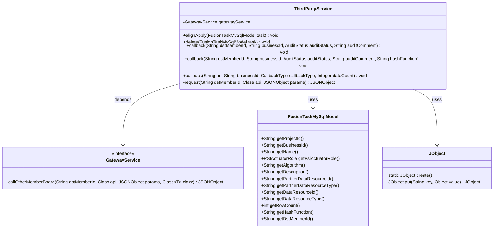
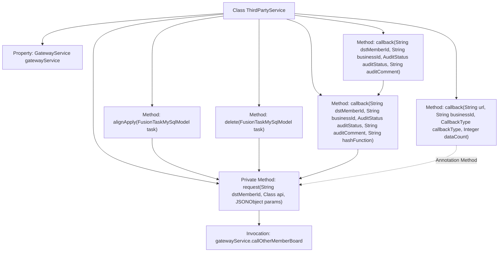
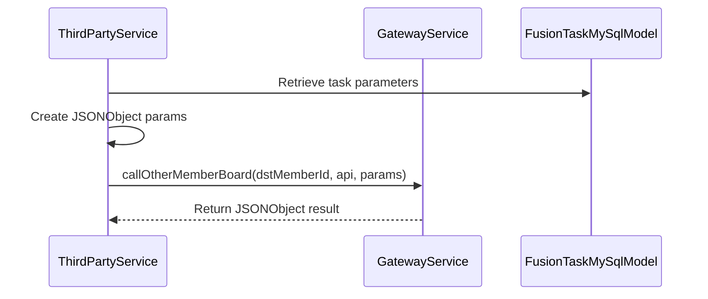

# Basic Information

|      |      |
|------|------|
| Name | ThirdPartyService |
| Language | .java |
| Code Path | WeFe/board/board-service/src/main/java/com/welab/wefe/board/service/service/fusion/ThirdPartyService.java |
| Package Name | com.welab.wefe.board.service.service.fusion |
| Dependencies | ['com.alibaba.fastjson.JSONObject', 'com.welab.wefe.board.service.api.project.fusion.task.AuditCallbackApi', 'com.welab.wefe.board.service.api.project.fusion.task.DeleteCallbackApi', 'com.welab.wefe.board.service.api.project.fusion.task.ReceiveApi', 'com.welab.wefe.board.service.database.entity.fusion.FusionTaskMySqlModel', 'com.welab.wefe.board.service.service.CacheObjects', 'com.welab.wefe.board.service.service.GatewayService', 'com.welab.wefe.common.exception.StatusCodeWithException', 'com.welab.wefe.common.util.JObject', 'com.welab.wefe.common.wefe.enums.AuditStatus', 'com.welab.wefe.fusion.core.enums.CallbackType', 'com.welab.wefe.fusion.core.enums.PSIActuatorRole', 'org.springframework.beans.factory.annotation.Autowired', 'org.springframework.stereotype.Service'] |
| Brief Description | The ThirdPartyService class provides request alignment, task deletion, and callback functionalities. It invokes other member interfaces through gatewayService to handle task parameters and status. |

# Description

ThirdPartyService is a service class that interacts with other member boards through GatewayService. Its main functionalities include the alignApply method, which aligns requests by constructing a JSON object containing parameters such as project ID, member ID, business ID, name, PSI execution role, algorithm, description, and data resource information, and then sending the request. The delete method is used to delete tasks by constructing a JSON object with the business ID and sending the request. The callback method has three overloaded versions for handling callback requests, with parameters including target member ID, business ID, approval status, approval comments, hash function, URL, callback type, and data count, among others. It constructs the corresponding JSON object and sends the request. The internal request method encapsulates the logic for calling other member boards, ensuring consistent parameter order to avoid validation failures.

# Class Summary

| Name   | Type  | Description |
|-------|------|-------------|
| ThirdPartyService | class | The ThirdPartyService class provides request alignment and callback functionalities, including alignApply, delete, and multiple callback methods. It invokes interfaces of other members via gatewayService to handle task parameters and status. |

## Class ThirdPartyService

|      |      |
|------|------|
| Access Modifier | @Service;public |
| Type | class |
| Name | ThirdPartyService |
| Description | The ThirdPartyService class provides request alignment and callback functionalities, including alignApply, delete, and multiple callback methods. It invokes interfaces of other members via gatewayService to handle task parameters and status. |

### UML Class Diagram

This code describes a third-party service class `ThirdPartyService` that interacts with external systems through the `GatewayService` interface, primarily handling three types of callback operations: alignment application (`alignApply`), task deletion (`delete`), and status callbacks (`callback`). The class uses `FusionTaskMySqlModel` as its data model and constructs request parameters via `JObject`. The core private method `request` uniformly processes gateway calls, ensuring parameter order consistency. The overall design encapsulates business logic related to the PSI (Private Set Intersection) protocol, providing flexible callback interfaces through method overloading.

### Internal Method Call Graph

This flowchart illustrates the structure and method invocation relationships of the ThirdPartyService class, containing 6 public methods and 1 private method. The core private method request() is invoked by alignApply(), delete(), and overloaded callback() methods, ultimately achieving cross-member communication through gatewayService.callOtherMemberBoard. The sequence diagram specifically depicts the execution flow of the alignApply() method: retrieving parameters from the task object, constructing the request parameter object, initiating remote calls via the gateway service, and returning results. The class design employs the Facade pattern to encapsulate various third-party service callback operations.

### Field List

| Name  | Type  | Description |
|-------|-------|------|
| gatewayService | GatewayService | Automatically inject the GatewayService instance. |

### Method List

| Name  | Type  | Description |
|-------|-------|------|
| callback | void | The method implements an audit callback function, which receives the target member ID, business ID, audit status, audit comments, and hash function parameters, constructs a JSON request, and invokes the audit callback API. |
| callback | void | Java callback method that accepts target member ID, business ID, review status, and review comment parameters, may throw exceptions, internally calls an overloaded method and passes null values. |
| callback | void | Define callback methods to receive URL, business ID, callback type, and data volume parameters, construct a JSON object, and comment out the code for requesting third-party callbacks. |
| request | JSONObject | The private method `request` invokes other member boards via `gatewayService`, passing in the target member ID, API class, and ordered parameters, and returns a `JSONObject`. It may throw a `StatusCodeWithException` exception. |
| alignApply | void | This method is used to handle task alignment requests, constructing a JSON object containing parameters such as project ID, member ID, and business ID. It adjusts the PSI execution role based on the task role and finally sends the request to the target member. |
| delete | void | This method deletes a specified task by constructing parameters with the business ID and sending a deletion callback request to the target member ID. |

