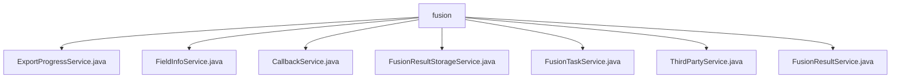

# Basic Information

|      |      |
|------|------|
| Name | fusion |
| Language | .java |
| Code Path | WeFe/board/board-service/src/main/java/com/welab/wefe/board/service/service/fusion |
| Package Name | docs.board.board-service.src.main.java.com.welab.wefe.board.service.service.fusion |
| Brief Description | The ExportProgressService manages export progress and interacts with the database. The FieldInfoService handles field information, providing query and save functionalities. The CallbackService processes callback logic, supporting auditing and the RSA-PSI algorithm. The FusionResultStorageService manages dataset storage, supporting CRUD operations. The FusionTaskService oversees fusion tasks, handling status updates and algorithm logic. The ThirdPartyService interacts with other members via a gateway. The FusionResultService offers data export capabilities, supporting multi-threaded processing. |

# Description

## Overview  
This module serves as the core service component of the data fusion processing platform, primarily responsible for managing the full lifecycle of fusion tasks (creation, review, execution, callback) and the storage/export of result data. Adopting a workflow-engine-like pattern, it enables RSA-PSI algorithm task scheduling and cross-node communication through multi-service collaboration. Key interfaces include task status updates (e.g., `running`/`callback`), data resource operations (e.g., `saveAll`/`export`), and third-party alignment requests (e.g., `alignApply`).  

The core data structures comprise the `FusionResultExportProgress` progress model, `TableDataSet` data resource object, and `BloomFilter` algorithm intermediate data. It relies on Spring transaction management, GatewayService for cross-node communication, JDBC data export, and the PersistentStorage component. For example, `ExportProgressService` maps progress objects to MySQL, while `FusionResultStorageService` manages datasets using the WEFE_DATA database.  

## Key Business Scenarios  
A typical scenario involves multi-party secure computation task processing: 1) The initiator creates an RSA_PSI task via `FusionTaskService` and submits it for review; 2) `CallbackService` processes the review outcome, triggering algorithm execution (clients generate Bloom filters, servers align data); 3) `ThirdPartyService` coordinates data alignment among member nodes via Gateway; 4) Result data is sharded and stored by `FusionResultStorageService`, ultimately exported via `FusionResultService` with multi-threading.  

The module supports a complete task control chain, such as `FieldInfoService` maintaining field metadata and `FusionTaskService` providing task restart capabilities. Integration modes include API calls (e.g., `delete` task) and asynchronous callbacks (e.g., `callback` status notifications). All operations adhere to the business ID association principle to ensure data consistency.

### Package Internal Structure View

This flowchart illustrates the file structure of the fusion service under the board-service module in the WeFe project. The root node is the fusion directory, which contains seven service class files: ExportProgressService, FieldInfoService, etc. These classes are directly part of the fusion service layer and are responsible for handling business logic related to data fusion, including task management, result storage, and third-party interactions.

# File List

| Name   | Type  | Description |
|-------|------|-------------|
| [ExportProgressService.java](ExportProgressService.md) | file | The ExportProgressService is a service class that provides functionalities for querying export progress records by business ID, retrieving the latest record, and adding new records. It relies on the ExportProgressRepository to interact with the database. |
| [FieldInfoService.java](FieldInfoService.md) | file | The FieldInfoService provides field information management functionalities, including querying field lists, field information lists, and batch-saving field information. It supports operations by businessId and ensures data consistency through transactions. |
| [CallbackService.java](CallbackService.md) | file | The CallbackService handles audit callbacks, approving or rejecting task status updates based on their state. When approved, it initiates the RSA-PSI algorithm, with the client and server executing their respective logic. |
| [FusionResultStorageService.java](FusionResultStorageService.md) | file | The FusionResultStorageService provides dataset storage management functionalities, including checking key existence, deleting datasets, saving headers and data rows, batch operations, and data preview. It utilizes PersistentStorage for persistence operations and supports table name generation and batch size calculation. |
| [FusionTaskService.java](FusionTaskService.md) | file | FusionTaskService is a service class responsible for managing fusion tasks, including task creation, querying, updating, deletion, and processing. It relies on multiple services such as data resources and Bloom filters, supports the RSA_PSI algorithm, and handles task status changes and callbacks. |
| [ThirdPartyService.java](ThirdPartyService.md) | file | The ThirdPartyService class provides request alignment, task deletion, and callback functionalities. It invokes other member interfaces through gatewayService to handle task parameters and statuses. |
| [FusionResultService.java](FusionResultService.md) | file | FusionResultService handles data export tasks, including querying tasks, creating tables, batch writing data to the database, and supports multi-threaded concurrent processing. |

