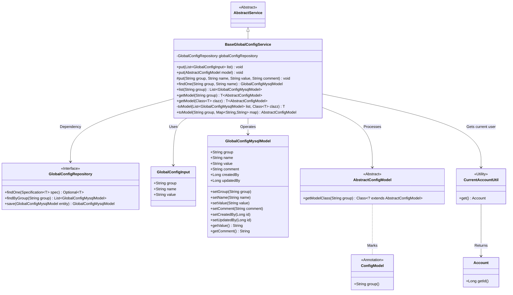
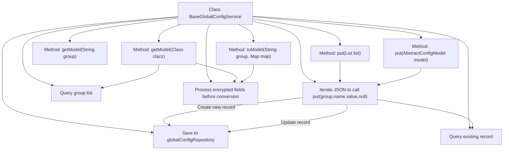

# Basic Information

|      |      |
|------|------|
| Name | BaseGlobalConfigService |
| Language | .java |
| Code Path | WeFe/board/board-service/src/main/java/com/welab/wefe/board/service/service/globalconfig/BaseGlobalConfigService.java |
| Package Name | com.welab.wefe.board.service.service.globalconfig |
| Dependencies | ['com.alibaba.fastjson.JSON', 'com.alibaba.fastjson.JSONObject', 'com.alibaba.fastjson.PropertyNamingStrategy', 'com.alibaba.fastjson.serializer.SerializeConfig', 'com.alibaba.fastjson.serializer.SerializerFeature', 'com.welab.wefe.board.service.database.entity.GlobalConfigMysqlModel', 'com.welab.wefe.board.service.database.repository.GlobalConfigRepository', 'com.welab.wefe.board.service.service.AbstractService', 'com.welab.wefe.common.StatusCode', 'com.welab.wefe.common.data.mysql.Where', 'com.welab.wefe.common.exception.StatusCodeWithException', 'com.welab.wefe.common.fieldvalidate.secret.Secret', 'com.welab.wefe.common.fieldvalidate.secret.SecretUtil', 'com.welab.wefe.common.util.JObject', 'com.welab.wefe.common.util.StringUtil', 'com.welab.wefe.common.web.TempRsaCache', 'com.welab.wefe.common.web.util.CurrentAccountUtil', 'com.welab.wefe.common.wefe.dto.global_config.base.AbstractConfigModel', 'com.welab.wefe.common.wefe.dto.global_config.base.ConfigModel', 'com.welab.wefe.common.wefe.dto.global_config.base.GlobalConfigInput', 'org.springframework.beans.factory.annotation.Autowired', 'org.springframework.data.jpa.domain.Specification', 'java.util.List', 'java.util.Map', 'java.util.Objects'] |
| Brief Description | The BaseGlobalConfigService class provides global configuration management functionality, supporting CRUD operations including batch processing, model conversion, and encrypted field decryption. |

# Description

BaseGlobalConfigService is a configuration management service class that inherits from AbstractService, primarily used for CRUD operations on global configurations. It interacts with the database through GlobalConfigRepository and provides various configuration operation methods: supports batch addition or updating of configuration records (via lists or AbstractConfigModel objects), single-record addition or updating (supporting group, name, value, and comment), querying configuration lists by group, and converting configuration lists into entity objects of specified types. It specifically handles logic such as underscore conversion for field names, skipping null values, and non-null value overwrite protection, while also supporting automatic decryption for fields annotated with @Secret. All update operations record the current user ID to ensure traceability.

# Class Summary

| Name   | Type  | Description |
|-------|------|-------------|
| BaseGlobalConfigService | class | The BaseGlobalConfigService class provides global configuration management functionality, supporting batch addition/modification of configuration items, single-record operations, group-based queries, and model conversion. It includes data validation, null value handling, and field encryption/decryption logic. |

## Class BaseGlobalConfigService

|      |      |
|------|------|
| Access Modifier | public |
| Type | class |
| Name | BaseGlobalConfigService |
| Description | The BaseGlobalConfigService class provides global configuration management functionality, supporting batch addition/modification of configuration items, single-record operations, group-based queries, and model conversion. It includes data validation, null value handling, and field encryption/decryption logic. |

### UML Class Diagram

This class diagram illustrates BaseGlobalConfigService as the core configuration service, inheriting from AbstractService, which interacts with the database through GlobalConfigRepository. It provides various configuration operation methods including batch updates, model conversion, and encrypted field handling, while relying on the utility class CurrentAccountUtil to retrieve current user information. GlobalConfigMysqlModel represents the database entity, and AbstractConfigModel serves as the base class for configuration models, marked with group information via the ConfigModel annotation. The overall structure clearly demonstrates the layered architecture of configuration management and key interaction relationships.

### Internal Method Call Graph

Flowchart description: This flowchart illustrates the core method invocation relationships of the BaseGlobalConfigService class. The class interacts with the database through globalConfigRepository to provide CRUD operations for configuration items. It primarily includes three types of operations: batch configuration processing (chained put method calls), model conversion (getModel/toModel method combinations), and encrypted data handling (decrypting fields annotated with @Secret). All write operations ultimately ensure thread safety via synchronized put methods and uniformly call Repository to persist data. Query operations support single-record retrieval, grouped lists, and model-based returns.

### Field List

| Name  | Type  | Description |
|-------|-------|------|
| globalConfigRepository | GlobalConfigRepository | Automatically inject global configuration repository instances. |

### Method List

| Name  | Type  | Description |
|-------|-------|------|
| toModel | T | Convert the MySQL configuration list into a model object of the specified type. Returns null if the list is empty; otherwise, transforms the key-value pairs into a JSON object and converts it into an instance of the target class. |
| put | void | The method stores the configuration model in the database, uniformly uses underscore naming, retains null value fields, and skips null value fields not specified by the frontend. |
| getModel | T | This method retrieves configuration group information through annotations, queries the database list, and converts it into a configuration model of the specified type. |
| findOne | GlobalConfigMysqlModel | Search for the global configuration with the specified group and name, and return null if no result is found. |
| put | void | The synchronous method `put` is used to update or create configuration items. It checks whether a configuration with the same name exists. If it exists, the method verifies that the updated value is non-empty and differs from the original value before proceeding with the update; otherwise, it creates a new item. Finally, it saves the configuration and logs the operator ID. A status code error is thrown in case of exceptions. |
| put | void | Java Method: Iterate through the configuration list, call the put method one by one to store the group, name, and value, ignoring the fourth parameter. Exceptions may be thrown. |
| list | List<GlobalConfigMysqlModel> | This method queries and returns the corresponding list of global configuration MySQL models by group name through the global configuration repository. |
| getModel | T | Java Method: Retrieve configuration model instance by group name, throws an exception if not found. |
| toModel | AbstractConfigModel | Convert a Map to an AbstractConfigModel object of the specified group, decrypt encrypted fields, and then map it to a model instance via JObject. |

