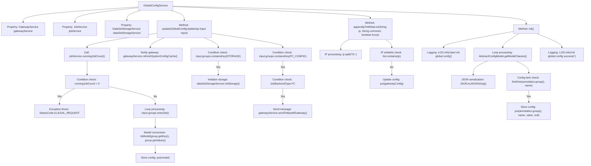

# Basic Information

|      |      |
|------|------|
| Name | GlobalConfigService |
| Language | .java |
| Code Path | WeFe/board/board-service/src/main/java/com/welab/wefe/board/service/service/globalconfig/GlobalConfigService.java |
| Package Name | com.welab.wefe.board.service.service.globalconfig |
| Dependencies | ['com.alibaba.fastjson.JSON', 'com.alibaba.fastjson.JSONObject', 'com.alibaba.fastjson.PropertyNamingStrategy', 'com.alibaba.fastjson.serializer.SerializeConfig', 'com.alibaba.fastjson.serializer.SerializerFeature', 'com.welab.wefe.board.service.api.global_config.GlobalConfigUpdateApi', 'com.welab.wefe.board.service.dto.kernel.machine_learning.Env', 'com.welab.wefe.board.service.service.DataSetStorageService', 'com.welab.wefe.board.service.service.GatewayService', 'com.welab.wefe.board.service.service.JobService', 'com.welab.wefe.common.StatusCode', 'com.welab.wefe.common.exception.StatusCodeWithException', 'com.welab.wefe.common.util.IpAddressUtil', 'com.welab.wefe.common.util.StringUtil', 'com.welab.wefe.common.wefe.dto.global_config.GatewayConfigModel', 'com.welab.wefe.common.wefe.dto.global_config.base.AbstractConfigModel', 'com.welab.wefe.common.wefe.dto.global_config.base.ConfigGroupConstant', 'com.welab.wefe.common.wefe.dto.global_config.base.ConfigModel', 'com.welab.wefe.common.wefe.enums.GatewayProcessorType', 'com.welab.wefe.common.wefe.enums.JobBackendType', 'org.springframework.beans.factory.annotation.Autowired', 'org.springframework.stereotype.Service', 'java.util.List', 'java.util.Map'] |
| Brief Description | The GlobalConfigService class inherits from BaseGlobalConfigService, providing functionalities for configuration updates, IP whitelist additions, and initialization. During configuration updates, it checks the number of running tasks, notifies the gateway to refresh the cache, and handles storage configurations. The IP whitelist supports fuzzy matching. During initialization, it iterates through configuration models and stores unregistered configuration items in the database. |

# Description

The `GlobalConfigService` is a service class that inherits from `BaseGlobalConfigService` and is used to manage system-wide configurations. It depends on `GatewayService`, `JobService`, and `DataSetStorageService`. Its primary functions include updating configurations, adding IPs to the gateway whitelist, and initializing configuration items.  

When updating configurations, it checks the number of running tasks and prohibits configuration modifications while tasks are active. It notifies the gateway to refresh the system configuration cache and refreshes either persistent storage or function computation storage based on the configuration group type.  

Adding an IP to the whitelist supports fuzzy matching to avoid duplicate entries. During configuration initialization, it iterates through all configuration models and adds any configuration items that do not already exist in the database.

# Class Summary

| Name   | Type  | Description |
|-------|------|-------------|
| GlobalConfigService | class | The `GlobalConfigService` class provides global configuration management capabilities, including updating configurations, IP whitelist management, and initializing configuration items. When updating configurations, it checks the number of running tasks, notifies the gateway to refresh the cache, and initializes storage objects. The IP whitelist supports fuzzy matching and deduplication. During initialization, it traverses the configuration model and stores non-existent configuration items in the database. |


## Class GlobalConfigService

|      |      |
|------|------|
| Access Modifier | @Service;public |
| Type | class |
| Name | GlobalConfigService |
| Description | The `GlobalConfigService` class provides global configuration management capabilities, including updating configurations, IP whitelist management, and initializing configuration items. When updating configurations, it checks the number of running tasks, notifies the gateway to refresh the cache, and initializes storage objects. The IP whitelist supports fuzzy matching and deduplication. During initialization, it traverses the configuration model and stores non-existent configuration items in the database. |


### UML Class Diagram

```mermaid
classDiagram
    class BaseGlobalConfigService {
        <<abstract>>
    }
    
    class GlobalConfigService {
        -GatewayService gatewayService
        -JobService jobService
        -DataSetStorageService dataSetStorageService
        +update(GlobalConfigUpdateApi$Input input) void
        +appendIpToWhiteList(String ip, String comment, boolean fuzzy) void
        +init() void
    }
    
    class GatewayService {
        <<Interface>>
        +refreshSystemConfigCache() void
        +sendToMyselfGateway(String arg0, GatewayProcessorType arg1) void
    }
    
    class JobService {
        <<Interface>>
        +runningJobCount() int
    }
    
    class DataSetStorageService {
        <<Interface>>
        +initStorage() void
    }
    
    class AbstractConfigModel {
        <<abstract>>
    }
    
    class GlobalConfigUpdateApi$Input {
        -Map~String, Map~String, String~~ groups
    }
    
    class GatewayConfigModel {
        -String ipWhiteList
    }
    
    BaseGlobalConfigService <|-- GlobalConfigService
    GlobalConfigService --> GatewayService : depends
    GlobalConfigService --> JobService : depends
    GlobalConfigService --> DataSetStorageService : depends
    GlobalConfigService --> AbstractConfigModel : creates
    GlobalConfigService --> GlobalConfigUpdateApi$Input : processes input
    GlobalConfigService --> GatewayConfigModel : manages config
```

This class diagram illustrates GlobalConfigService as the core configuration management service, inheriting from BaseGlobalConfigService and depending on three interface services: GatewayService, JobService, and DataSetStorageService. Its primary functionalities include updating global configurations, managing gateway IP whitelists, and initializing configuration items. It handles configuration models through AbstractConfigModel, manages gateway-specific configurations with GatewayConfigModel, and uses GlobalConfigUpdateApi$Input as the encapsulated input parameter class for update operations. By composing multiple interfaces, the service implements various configuration management features, demonstrating clear responsibility division and modular design.


### Internal Method Call Graph



The flowchart depicts the core functional flow of the GlobalConfigService class. This service primarily handles global configuration management, including configuration updates, IP whitelist maintenance, and system initialization. The update method checks running job status, batch updates configuration groups, and triggers cache refresh for related services; appendIpToWhiteList implements intelligent IP whitelist addition logic; the init method initializes all configuration models through reflection mechanisms. The process incorporates multiple conditional checks, loop processing, exception throwing, and other critical control logic, demonstrating the complete lifecycle of configuration management.

### Field List

| Name  | Type  | Description |
|-------|-------|------|
| jobService | JobService | Using @Autowired to automatically inject an instance of JobService. |
| dataSetStorageService | DataSetStorageService | Use @Autowired to automatically inject an instance of DataSetStorageService. |
| gatewayService | GatewayService | Automatically inject the GatewayService instance. |

### Method List

| Name  | Type  | Description |
|-------|-------|------|
| update | void | The method `update` checks the number of running tasks and reports an error if it is greater than 0. It iterates through the input configuration groups, updates the model, and notifies the gateway to refresh the cache. If storage configuration is included, it initializes the storage. If function computation configuration is included and the backend is of type FC, it notifies the gateway to refresh the FC storage. |
| appendIpToWhiteList | void | The synchronization method adds an IP to the whitelist, supports fuzzy matching (replacing the last segment with *), checks for duplicates, and then appends the annotated IP to the configuration before saving. |
| init | void | This is a synchronous initialization method used to traverse all configured model classes and store the configuration items in the database in JSON format. If a configuration item does not exist in the database, it will be added using the snake_case naming strategy, and a log will be recorded upon completion. |


