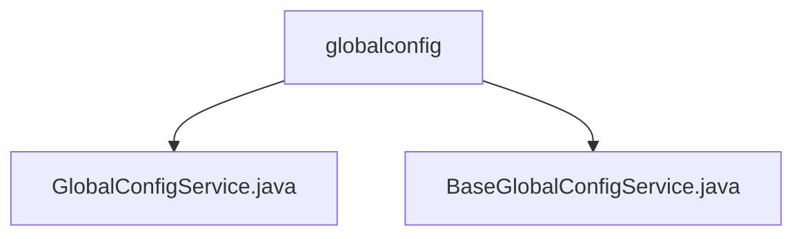

# Basic Information

|      |      |
|------|------|
| Name | globalconfig |
| Language | .java |
| Code Path | WeFe/board/board-service/src/main/java/com/welab/wefe/board/service/service/globalconfig |
| Package Name | docs.board.board-service.src.main.java.com.welab.wefe.board.service.service.globalconfig |
| Brief Description | The GlobalConfigService inherits from BaseGlobalConfigService, manages global configurations, depends on multiple services, and includes functionalities such as updating configurations, IP whitelist management, and configuration initialization. The BaseGlobalConfigService provides CRUD operations for configurations, supports batch operations, type conversion, and field encryption, ensuring traceability of operations. |

# Description

## Overview  
This module serves as a global configuration management system, with its core responsibility being the unified management of platform configuration items and ensuring operational security. The interface specifications cover configuration CRUD, whitelist management, and initialization processes, supporting batch operations and type conversion. Key data structures include the AbstractConfigModel base class and sensitive fields marked with the @Secret annotation. External dependencies involve third-party services such as GatewayService and JobService. For example, when updating configurations, it validates task status and triggers gateway cache refreshes, adopting a central hub pattern similar to configuration centers.  

## Key Business Scenarios  
Typical scenarios include initializing configuration items during system startup and dynamically updating global parameters during runtime. The interaction model follows a "pre-operation validation + transactional persistence" mechanism, such as checking task execution status before modifying configurations. Complete functionality covers the entire configuration lifecycle management, with automatic handling of encrypted fields. API types include RESTful interfaces and JNI calls, such as querying configuration lists by group name or batch-updating model data.

### Package Internal Structure View

This flowchart illustrates two Java service class files under the globalconfig directory: GlobalConfigService.java and BaseGlobalConfigService.java. Both files reside at the same level, directly subordinate to the globalconfig directory without deeper nesting structures. The diagram clearly reflects the peer relationship between these two service class files.

# File List

| Name   | Type  | Description |
|-------|------|-------------|
| [GlobalConfigService.java](GlobalConfigService.md) | file | The GlobalConfigService class inherits from BaseGlobalConfigService, providing configuration update, IP whitelist addition, and initialization functions. During configuration updates, it checks the number of running tasks, notifies the gateway to refresh the cache, and handles storage configuration. The IP whitelist supports fuzzy matching. During initialization, it traverses the configuration model and stores unrecorded configuration items in the database. |
| [BaseGlobalConfigService.java](BaseGlobalConfigService.md) | file | The BaseGlobalConfigService class provides global configuration management functionality, supporting CRUD operations, including batch processing, model conversion, and encrypted field decryption. |

