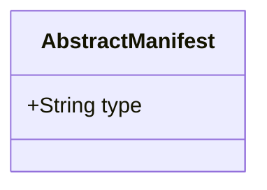
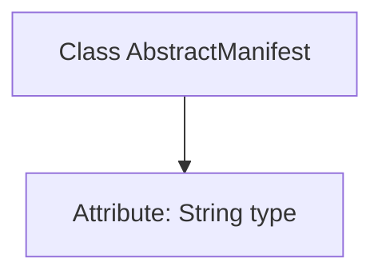

# Basic Information

|      |      |
|------|------|
| Name | AbstractManifest |
| Language | .java |
| Code Path | WeFe/board/board-service/src/main/java/com/welab/wefe/board/service/service/init/AbstractManifest.java |
| Package Name | com.welab.wefe.board.service.service.init |
| Dependencies | [] |
| Brief Description | Abstract list class, containing type attributes. |

# Description

AbstractManifest is a public Java class containing a public string-type field named type. The class has a simple structure, defining only a type identifier field, and may serve as a base class for other concrete manifest classes.

# Class Summary

| Name   | Type  | Description |
|-------|------|-------------|
| AbstractManifest | class | Abstract list class, containing type attributes. |

## Class AbstractManifest

|      |      |
|------|------|
| Access Modifier | public |
| Type | class |
| Name | AbstractManifest |
| Description | Abstract list class, containing type attributes. |

### UML Class Diagram

This class diagram depicts a simple abstract manifest class `AbstractManifest`, which contains a public string field `type`. The design of this class is extremely basic, defining no methods and only utilizing a public field to store manifest type information. Such structure typically serves as a base class for more complex manifest classes, with specific functionalities extendable through inheritance. The diagram clearly presents the class's sole public member variable, conforming to modeling standards for simple base classes in object-oriented design.

### Internal Method Call Graph

This code defines a simple class named `AbstractManifest` containing a public string-type attribute `type`. The flowchart clearly illustrates the hierarchical relationship between the class and its attribute, with the class as the parent node and the attribute as the child node. This structure can be used to store basic information such as manifest types, with functionality extendable through inheritance. The entire design adheres to the fundamental encapsulation principle of object-oriented programming.

### Field List

| Name  | Type  | Description |
|-------|-------|------|
| type | String | Declare a public string variable named type. |

### Method List

| Name  | Type  | Description |
|-------|-------|------|

