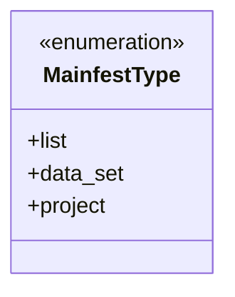
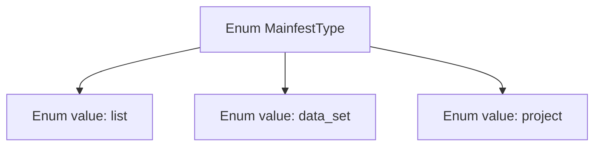

# Basic Information

|      |      |
|------|------|
| Name | MainfestType |
| Language | .java |
| Code Path | WeFe/board/board-service/src/main/java/com/welab/wefe/board/service/service/init/MainfestType.java |
| Package Name | com.welab.wefe.board.service.service.init |
| Dependencies | [] |
| Brief Description | The ManifestType enumeration defines three types: list, dataset, and item. |

# Description

The content defines a public enumeration type named `MainfestType`, which includes three enumeration values: `list` representing the list type, `data_set` representing the dataset type, and `project` representing the project type. The enumeration is used to denote different manifest or configuration types and is suitable for programming environments that require distinguishing between multiple manifest scenarios.

# Class Summary

| Name   | Type  | Description |
|-------|------|-------------|
| MainfestType | enum | The MainfestType enumeration defines three types: list, data_set, and project. |

## Class MainfestType

|      |      |
|------|------|
| Access Modifier | public |
| Type | enum |
| Name | MainfestType |
| Description | The MainfestType enumeration defines three types: list, data_set, and project. |

### UML Class Diagram

This code defines an enumeration type named `MainfestType`, containing three enum constants: `list`, `data_set`, and `project`. Enumerations are used to represent a fixed set of constant values, commonly employed for state identification or type classification. This particular enumeration does not define additional methods or attributes, serving solely as a simple type marker. It is suitable for scenarios requiring explicitly limited option ranges, such as configuration file parsing or type differentiation.

### Internal Method Call Graph

This flowchart illustrates the structure of the MainfestType enum, which contains three enum values: list, data_set, and project. The enum type MainfestType serves as the parent node, with arrows pointing to each specific enum value, clearly presenting the simple hierarchical relationship of the enum. This structure is commonly used to represent fixed sets of constants and is suitable for scenarios such as type identification.

### Field List

| Name  | Type  | Description |
|-------|-------|------|

### Method List

| Name  | Type  | Description |
|-------|-------|------|

