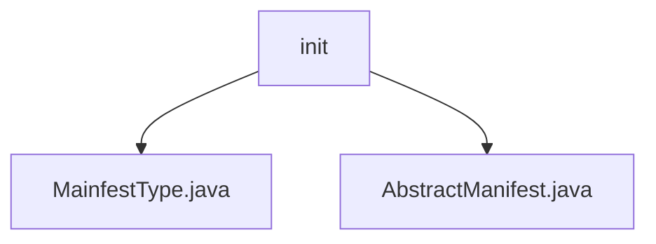

# Basic Information

|      |      |
|------|------|
| Name | init |
| Language | .java |
| Code Path | WeFe/board/board-service/src/main/java/com/welab/wefe/board/service/service/init |
| Package Name | docs.board.board-service.src.main.java.com.welab.wefe.board.service.service.init |
| Brief Description | The ManifestType enum defines three types: list, data_set, and project. AbstractManifest is the base class containing a type field, used to distinguish manifest types. |

# Description

## Overview  
The core responsibility of this module is to provide foundational definitions and abstract structures for manifest types, used to distinguish and manage different categories of manifest configurations. It defines a public enum `MainfestType` containing three types: `list`, `data_set`, and `project`, while also providing an abstract base class `AbstractManifest` as the parent class for type identification.  

Key data structures include the enum type `MainfestType` and the abstract class `AbstractManifest` with a `type` field. The module has no external dependencies and supports multi-scenario manifest management through foundational type abstraction, such as distinguishing between dataset or project configuration types.  

## Primary Business Scenarios  
The module is suitable for scenarios requiring categorized processing of manifest configurations, similar to the resource classifier pattern. The enum clarifies type boundaries, while the abstract class provides unified type identification and extension capabilities. For example, during project initialization, the `type` field can quickly identify the manifest category, or differentiated logic can be implemented based on enum values. The interaction pattern involves subclasses inheriting `AbstractManifest` and associating with enum types, forming a type-safe configuration system.

### Package Internal Structure View

This flowchart illustrates the initialization service file structure under the board-service module of the WeFe project. The init directory contains two Java files: MainfestType.java and AbstractManifest.java, both of which are service class files related to project initialization. This structure clearly reflects the code organization of the initialization service, where the abstract base class and specific type definition files are stored side by side.

# File List

| Name   | Type  | Description |
|-------|------|-------------|
| [MainfestType.java](MainfestType.md) | file | The MainfestType enumeration defines three types: list, dataset, and item. |
| [AbstractManifest.java](AbstractManifest.md) | file | Abstract list class, containing type attributes. |

