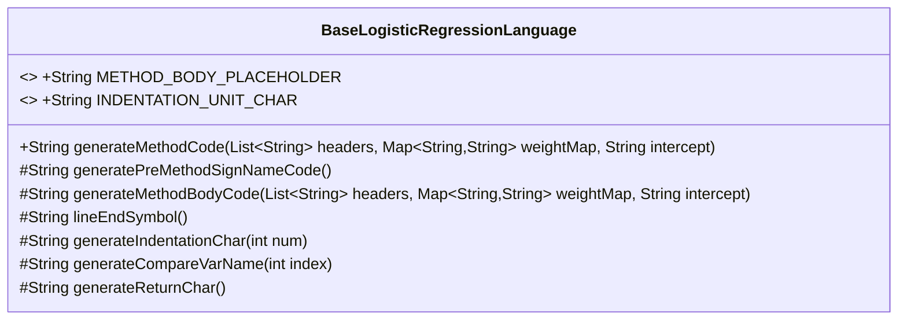
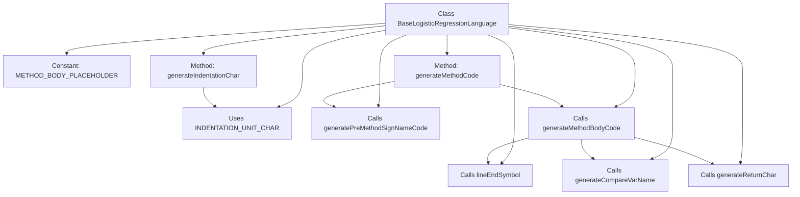

# Basic Information

|      |      |
|------|------|
| Name | BaseLogisticRegressionLanguage |
| Language | .java |
| Code Path | WeFe/board/board-service/src/main/java/com/welab/wefe/board/service/service/modelexport/BaseLogisticRegressionLanguage.java |
| Package Name | com.welab.wefe.board.service.service.modelexport |
| Dependencies | ['org.apache.commons.collections4.CollectionUtils', 'java.util.List', 'java.util.Map'] |
| Brief Description | The BaseLogisticRegressionLanguage class is used to generate logistic regression model code, including functionalities such as method placeholders, indentation units, generating method signatures, and body code. |

# Description

The code defines a base class named `BaseLogisticRegressionLanguage` for generating Java code of logistic regression models. The class contains two main methods: `generatePreMethodSignNameCode` generates the method signature framework, while `generateMethodBodyCode` generates the method body content. These components are combined into complete code through a placeholder substitution mechanism. The class provides auxiliary methods for indentation control, variable naming, return statement generation, etc., supporting dynamic generation of scoring method code by inputting feature header information, weight mappings, and intercept values. All generated content adheres to standard Java syntax formatting, ultimately outputting a `Model` class containing a `score` method.

# Class Summary

| Name   | Type  | Description |
|-------|------|-------------|
| BaseLogisticRegressionLanguage | class | The `BaseLogisticRegressionLanguage` class is used to generate logistic regression model code, including method signatures and body code generation functionality, with support for custom indentation and variable names. |

## Class BaseLogisticRegressionLanguage

|      |      |
|------|------|
| Access Modifier | public |
| Type | class |
| Name | BaseLogisticRegressionLanguage |
| Description | The `BaseLogisticRegressionLanguage` class is used to generate logistic regression model code, including method signatures and body code generation functionality, with support for custom indentation and variable names. |

### UML Class Diagram

Class Diagram Description:
BaseLogisticRegressionLanguage is a base class for generating logistic regression model code, containing multiple protected methods for constructing different parts of the code. The core method generateMethodCode combines pre-generated method signatures and method bodies to produce complete model code. The class defines constant placeholders and indentation units, and provides helper methods for generating variable names, return statements, line terminators, etc. It follows the Template Method pattern, allowing subclasses to override specific step implementations.

### Internal Method Call Graph

This code implements a code generator for logistic regression models, with the primary function of generating executable Java scoring methods based on input feature headers, weights, and intercepts. The flowchart illustrates the class structure and method invocation relationships, where the core process involves generateMethodCode assembling complete code by combining pre-generated method signatures and method bodies. The method body generation utilizes multiple helper methods for constructing return statements, variable names, and format control. All methods work collaboratively towards the central goal of producing model scoring code that complies with Java syntax specifications.

### Field List

| Name  | Type  | Description |
|-------|-------|------|
| INDENTATION_UNIT_CHAR = "    " | String | Define the string constant INDENTATION_UNIT_CHAR with a value of four spaces, used as the indentation unit. |
| METHOD_BODY_PLACEHOLDER = "#body#" | String | The code defines a static constant string placeholder "#body#" to indicate the position of the method body. |

### Method List

| Name  | Type  | Description |
|-------|-------|------|
| generateReturnChar | String | Method generates the return string "return ". |
| generateIndentationChar | String | Method to generate a specified number of indentation characters, which loops to add indentation unit characters and returns the resulting string. |
| lineEndSymbol | String | The method returns a line terminator semicolon. |
| generatePreMethodSignNameCode | String | Generate Java method skeleton code, including class definition and a placeholder for the score method. |
| generateMethodCode | String | This method generates method code based on input parameters, first calling the generation of method signature preamble code, then generating the method body code, and finally inserting the method body into the signature placeholder to return the complete code. |
| generateCompareVarName | String | Generate a method to compare variable names: Returns a string in the format "input[index]" based on the index. |
| generateMethodBodyCode | String | This method generates method body code by concatenating the sum of the intercept and the product of weights. If there is no header information, it returns empty; otherwise, it combines variable names, weights, and operators in the specified format, and finally appends a line terminator. |

