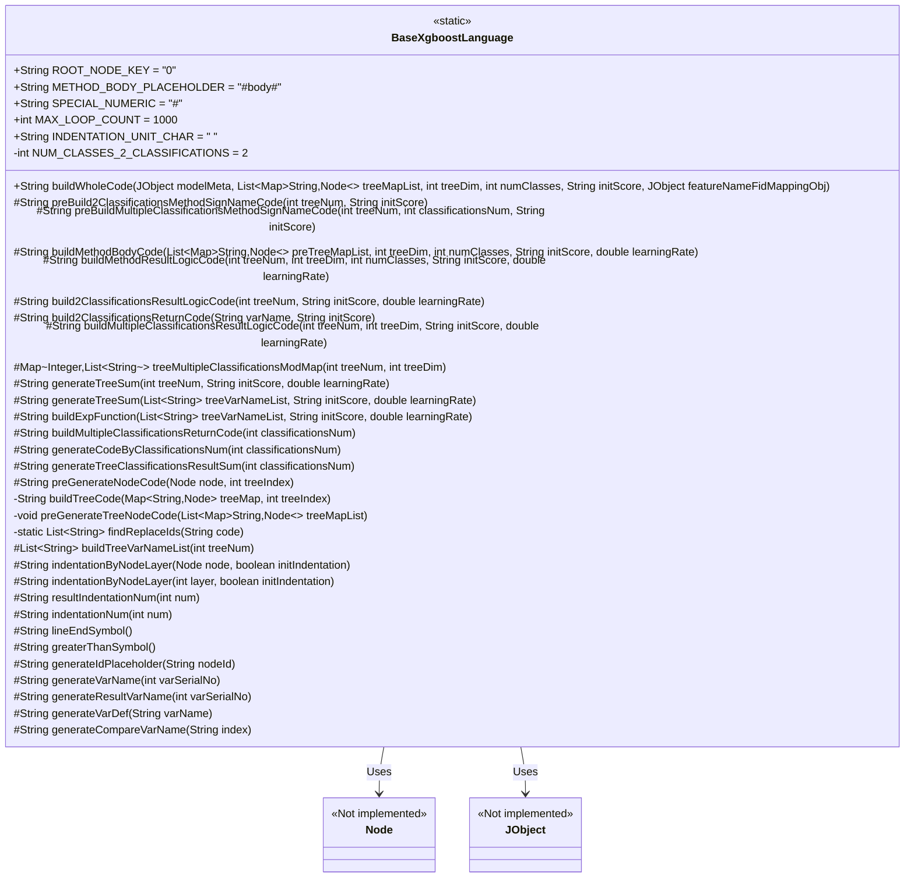
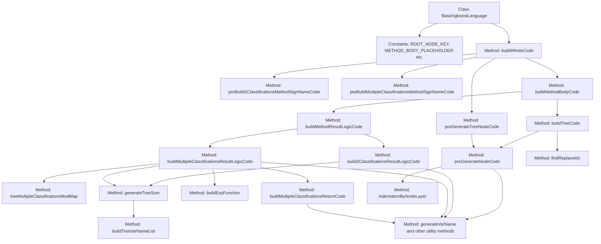

# Basic Information

|      |      |
|------|------|
| Name | BaseXgboostLanguage |
| Language | .java |
| Code Path | WeFe/board/board-service/src/main/java/com/welab/wefe/board/service/service/modelexport/BaseXgboostLanguage.java |
| Package Name | com.welab.wefe.board.service.service.modelexport |
| Dependencies | ['com.welab.wefe.common.util.JObject', 'org.apache.commons.collections4.CollectionUtils', 'java.util.ArrayList', 'java.util.LinkedHashMap', 'java.util.List', 'java.util.Map', 'java.util.regex.Matcher', 'java.util.regex.Pattern'] |
| Brief Description | The `BaseXgboostLanguage` class is designed to generate Java code for XGBoost models, supporting both binary and multi-class classification tasks. It includes functionalities such as constant definitions, tree node code generation, method signature construction, and result logic processing. The core method `buildWholeCode` integrates the preprocessing, method signature, and main code generation workflow. |

# Description

The `BaseXgboostLanguage` class is a Java utility designed for generating prediction code for XGBoost models. It contains multiple static constants, such as root node keys, method body placeholders, and maximum iteration counts. The core method `buildWholeCode` is responsible for constructing complete code, generating different method signatures and logic code based on the number of classification categories (binary or multi-class). The class implements functionalities like tree node code preprocessing, method body generation, and result logic computation, supporting template-based substitution to generate conditional judgments and leaf node assignment code. The code generation process adheres to indentation formatting and variable naming conventions while providing various helper methods, such as generating variable names, comparison expressions, and summation formulas. The final output produces prediction model code that complies with Java syntax.

# Class Summary

| Name   | Type  | Description |
|-------|------|-------------|
| BaseXgboostLanguage | class | The BaseXgboostLanguage class is used to generate XGBoost model code, including constant definitions, tree structure processing, classification logic generation, and code formatting functions. It supports binary and multiclass classification by preprocessing node code, constructing method signatures and result logic, ultimately producing complete executable code. |

## Class BaseXgboostLanguage

|      |      |
|------|------|
| Access Modifier | public |
| Type | class |
| Name | BaseXgboostLanguage |
| Description | The BaseXgboostLanguage class is used to generate XGBoost model code, including constant definitions, tree structure processing, classification logic generation, and code formatting functions. It supports binary and multiclass classification by preprocessing node code, constructing method signatures and result logic, ultimately producing complete executable code. |

### UML Class Diagram

Class Diagram Description:
BaseXgboostLanguage is a core class for generating XGBoost model code, containing various methods for handling binary tree and multi-classification problems. It defines key parameters through static constants, provides the buildWholeCode method for constructing complete code, and includes auxiliary methods such as preprocessing, method signature generation, and method body construction. This class has dependencies with Node and JObject, where the former represents tree node structures and the latter provides JSON data access functionality. The methods in the class are categorized by functionality into code generation, string processing, mathematical calculations, etc., supporting code generation for both binary classification and multi-classification scenarios.

### Internal Method Call Graph

This code represents the core implementation of an XGBoost model code generator, primarily converting XGBoost models into executable Java code. The process starts from the buildWholeCode entry point, branching into two main paths: method signature generation and code body construction. Through steps like preprocessing tree node code, building classification logic, and generating variable names, it ultimately assembles complete model scoring code. Special handling is given to binary and multi-class classification scenarios, incorporating robust designs such as cyclic placeholder replacement.

### Field List

| Name  | Type  | Description |
|-------|-------|------|
| METHOD_BODY_PLACEHOLDER = "#body#" | String | The code defines a static constant string placeholder "#body#" to mark the position of the method body. |
| SPECIAL_NUMERIC = "#" | String | Define the special numeric symbol constant "#" |
| INDENTATION_UNIT_CHAR = "    " | String | Define a static constant string for the indentation unit, with a value of four spaces. |
| ROOT_NODE_KEY = "0" | String | Define the constant ROOT_NODE_KEY with the value of string "0". |
| NUM_CLASSES_2_CLASSIFICATIONS = 2 | int | The static constant NUM_CLASSES_2_CLASSIFICATIONS has a value of 2, used for binary classification. |
| MAX_LOOP_COUNT = 1000 | int | Define a static constant MAX_LOOP_COUNT with a value of 1000. |

### Method List

| Name  | Type  | Description |
|-------|-------|------|
| generateTreeSum | String | Spanning Tree Model Scoring Formula: Initial score plus the sum of each tree variable multiplied by the learning rate. |
| generateResultVarName | String | Generation Method: Return the variable name "s" followed by the sequence number based on the input. For example, input 1 returns "s1". |
| buildExpFunction | String | Construct an exponential function string with parameters being a variable list, initial score, and learning rate, returning an expression in the form of Math.exp(0-(summation result)). |
| generateCodeByClassificationsNum | String | This method generates a code string based on the number of categories, concatenates variable names with the ratio of category sums in a loop, and separates different classification results with commas. |
| build2ClassificationsResultLogicCode | String | This method generates binary logistic regression code, calculates the s1 variable as 1/(1+e^-(sum of tree models)), and returns the result. Parameters include the number of trees, initial score, and learning rate. |
| indentationByNodeLayer | String | Generate an indented string based on node hierarchy, with optional initial indentation. |
| generateTreeClassificationsResultSum | String | Generate a summary string of spanning tree classification results, concatenate variable names in a loop and connect them with plus signs. |
| resultIndentationNum | String | The method returns an indentation string generated based on the input number. |
| preGenerateNodeCode | String | This method generates code based on node types: leaf nodes produce variable assignments, while non-leaf nodes generate conditional judgment structures. |
| buildMethodBodyCode | String | The method constructs the method body code based on the input parameters. If the input list is empty, it returns an empty string; otherwise, it iterates through the list to generate code for each tree and concatenates them, then appends the result logic code before returning the complete string. |
| preBuildMultipleClassificationsMethodSignNameCode | String | The method returns a dual-classification method signature code generated based on the number of trees and the initial score. |
| buildTreeCode | String | This method generates code through a tree structure, handles variable substitution, and prevents infinite loops. Starting from the root node, it constructs the code by iteratively replacing special markers with child node code, executing a maximum of MAX_LOOP_COUNT times to ensure safety. |
| buildMultipleClassificationsReturnCode | String | Construct code that returns multi-classification results, generating a return statement with a double array containing the specified number of classifications. |
| lineEndSymbol | String | The method returns a line terminator semicolon. |
| buildMethodResultLogicCode | String | This method constructs binary classification or multi-class logic code based on the number of categories and returns the resulting logic code string. Parameters include the number of trees, tree dimension, number of classes, initial score, and learning rate. |
| findReplaceIds | List<String> | This method uses regular expressions to find all IDs in the string that follow the pattern #number# and returns a list of matching results. |
| generateVarName | String | Method for generating variable names, converting the input sequence number into a string with "var" followed by the sequence number. |
| generateVarDef | String | Generate a string defining a double-precision variable in the format "double variable_name line_terminator". |
| generateCompareVarName | String | Generate a method to compare variable names, returning the format as "input[index]". |
| buildWholeCode | String | Construct a complete code method, preprocess tree nodes, generate method signatures based on the number of classifications, and finally combine the method signatures with the method body code. |
| build2ClassificationsReturnCode | String | Generate code that returns a binary classification result, forming an array with the variable varName and 1-varName and returning it. |
| buildTreeVarNameList | List<String> | Generate a specified number of variable names in a list, iteratively calling `generateVarName` to create each variable name and store it in the list, then return the final list. |
| treeMultipleClassificationsModMap | Map<Integer, List<String>> | The method generates a tree classification map, grouping and storing variable name lists by tree index modulus. It takes the number of trees and dimensions as input, and outputs a map with modulus as keys and variable name lists as values. |
| buildMultipleClassificationsResultLogicCode | String | This method constructs multi-classification logic code, generates classification variables and computation logic, and ultimately returns each classification result. By iterating through the classification mapping, it creates variables for each class and calculates probability values, then integrates and returns the code. |
| preGenerateTreeNodeCode | void | This method traverses the list of tree nodes, pre-generates and sets code for each node. The parameter is a list of tree node mappings, which processes each node through a double loop by calling preGenerateNodeCode to generate and assign the code. |
| indentationByNodeLayer | String | Generate an indented string based on node hierarchy, with optional initial indentation, and append indentation unit characters layer by layer. |
| generateIdPlaceholder | String | Method for generating ID placeholder: Input a node ID and return a string in the format of #nodeID#. |
| indentationNum | String | This method generates a corresponding number of indentation characters based on the input number and returns them as a string. |
| preBuild2ClassificationsMethodSignNameCode | String | This method generates a Java class framework code containing a static score method for calculating the score of an input array. The method returns a class definition string, reserving a method body placeholder and using indentation to format the code structure. |
| generateTreeSum | String | Generate a tree summation function that takes parameters for the number of trees, initial score, and learning rate, and calls internal methods to return the result. |
| greaterThanSymbol | String | The method returns the greater-than symbol ">". |

