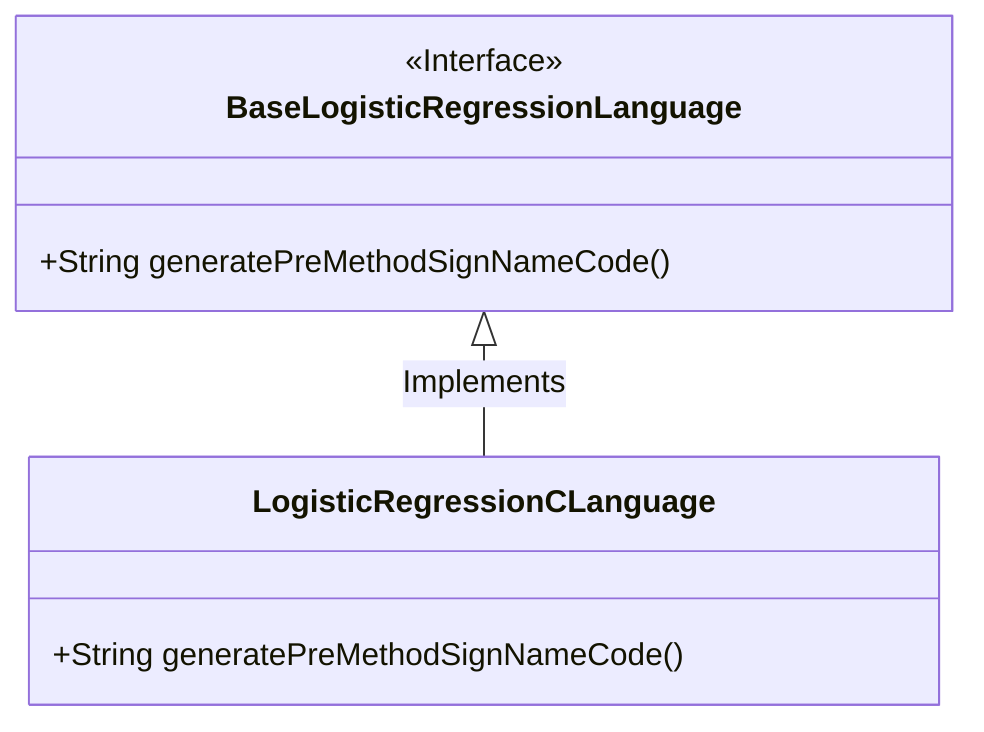
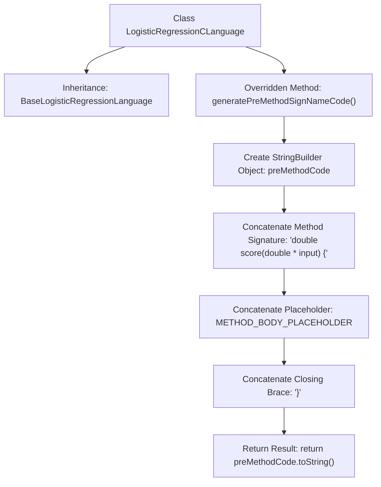

# Basic Information

|      |      |
|------|------|
| Name | LogisticRegressionCLanguage |
| Language | .java |
| Code Path | WeFe/board/board-service/src/main/java/com/welab/wefe/board/service/service/modelexport/LogisticRegressionCLanguage.java |
| Package Name | com.welab.wefe.board.service.service.modelexport |
| Dependencies | [] |
| Brief Description | The `LogisticRegressionCLanguage` class inherits from `BaseLogisticRegressionLanguage` and overrides the `generatePreMethodSignNameCode` method to generate a C language scoring function template. |

# Description

The code defines a class named `LogisticRegressionCLanguage`, which inherits from `BaseLogisticRegressionLanguage`. It overrides the `generatePreMethodSignNameCode` method to generate predefined method signatures in C language format. The method returns a string containing a function declaration named `score`, which takes a double pointer type input parameter and returns a double type result. The function body is represented by the placeholder `METHOD_BODY_PLACEHOLDER`, and the overall code structure follows C language syntax specifications.

# Class Summary

| Name   | Type  | Description |
|-------|------|-------------|
| LogisticRegressionCLanguage | class | The `LogisticRegressionCLanguage` class inherits from `BaseLogisticRegressionLanguage` and overrides the `generatePreMethodSignNameCode` method to generate a C language scoring function template. |

## Class LogisticRegressionCLanguage

|      |      |
|------|------|
| Access Modifier | public |
| Type | class |
| Name | LogisticRegressionCLanguage |
| Description | The `LogisticRegressionCLanguage` class inherits from `BaseLogisticRegressionLanguage` and overrides the `generatePreMethodSignNameCode` method to generate a C language scoring function template. |

### UML Class Diagram

This class diagram illustrates that the LogisticRegressionCLanguage class inherits and implements the BaseLogisticRegressionLanguage interface. BaseLogisticRegressionLanguage is an interface (marked with <<Interface>>) that defines the generatePreMethodSignNameCode() method. LogisticRegressionCLanguage, as a concrete implementation class, overrides this method to generate the signature and structure of the logistic regression scoring function in C language format. The inheritance relationship is represented by a solid line with a hollow arrowhead, conforming to UML standards.

### Internal Method Call Graph

This flowchart illustrates the execution flow of the generatePreMethodSignNameCode method within the LogisticRegressionCLanguage class. The method constructs a C-style function signature using StringBuilder, including the function header, placeholder, and closing brace, ultimately returning the complete string. The process demonstrates the steps from object creation to string assembly, showcasing the core logic of the code generator.

### Field List

| Name  | Type  | Description |
|-------|-------|------|

### Method List

| Name  | Type  | Description |
|-------|-------|------|
| generatePreMethodSignNameCode | String | Generate a string that returns a C language function signature, including a method body placeholder and indentation. |

