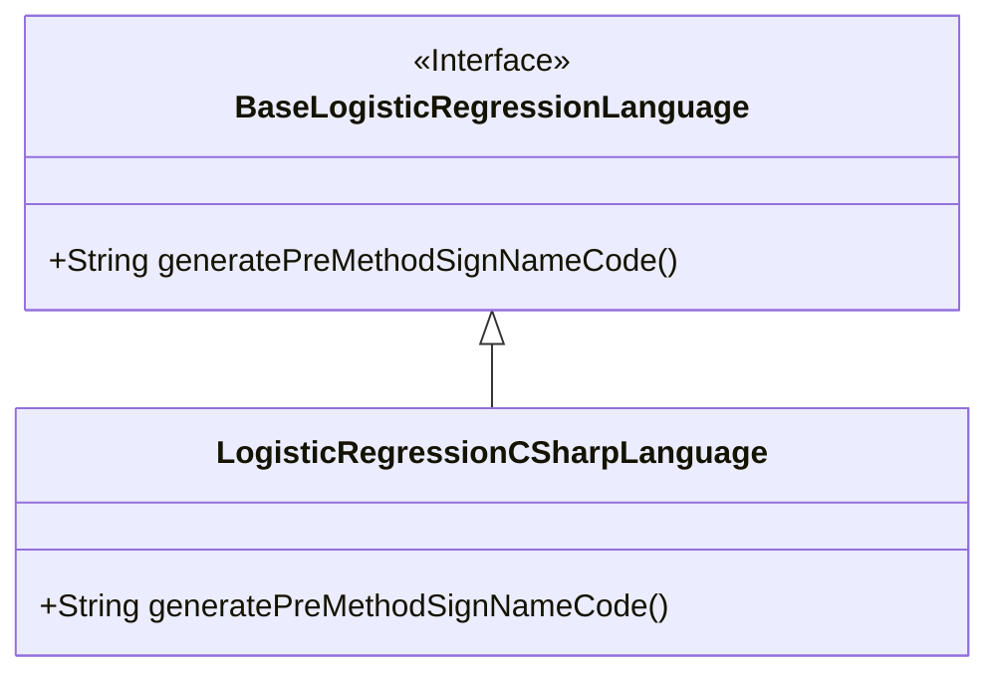
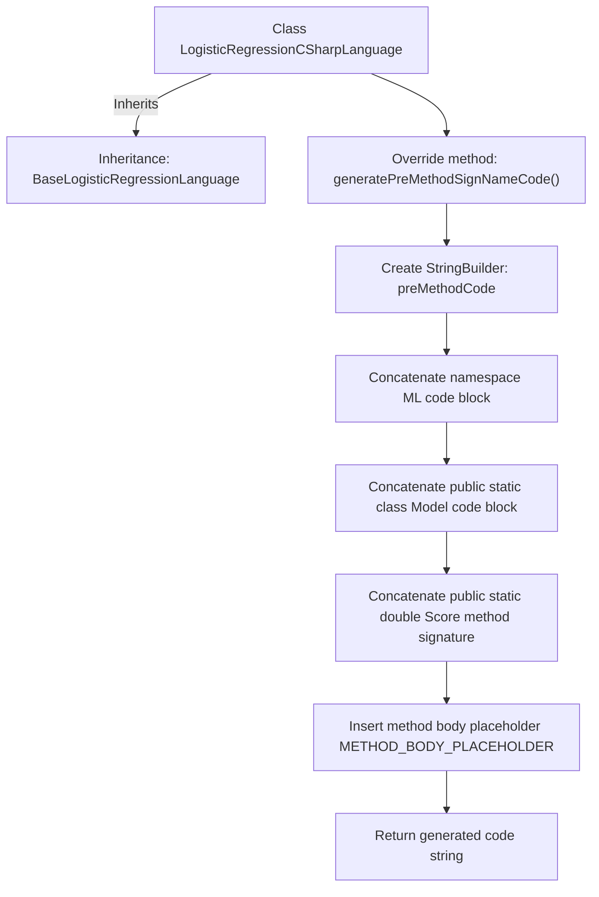

# Basic Information

|      |      |
|------|------|
| Name | LogisticRegressionCSharpLanguage |
| Language | .java |
| Code Path | WeFe/board/board-service/src/main/java/com/welab/wefe/board/service/service/modelexport/LogisticRegressionCSharpLanguage.java |
| Package Name | com.welab.wefe.board.service.service.modelexport |
| Dependencies | [] |
| Brief Description | C# Logistic Regression Class Generation Pre-Method Signature Code, Including Namespace, Static Class, and Scoring Method Framework. |

# Description

The content describes a C# logistic regression language implementation class that inherits from a base logistic regression language class. Its primary function is to generate the code structure preceding method signatures, including the namespace ML, the static class Model, and the framework of the static method Score. The method returns a concatenated string containing multiple levels of indentation and a placeholder METHOD_BODY_PLACEHOLDER for subsequent filling. The overall structure is clear and strictly adheres to C# syntax conventions.

# Class Summary

| Name   | Type  | Description |
|-------|------|-------------|
| LogisticRegressionCSharpLanguage | class | C# Logistic Regression Class Generation Pre-Method Signature Code, Including Namespace, Static Class, and Score Method Framework. |

## Class LogisticRegressionCSharpLanguage

|      |      |
|------|------|
| Access Modifier | public |
| Type | class |
| Name | LogisticRegressionCSharpLanguage |
| Description | C# Logistic Regression Class Generation Pre-Method Signature Code, Including Namespace, Static Class, and Score Method Framework. |

### UML Class Diagram

This class diagram illustrates the inheritance relationship where the LogisticRegressionCSharpLanguage class extends the BaseLogisticRegressionLanguage interface. BaseLogisticRegressionLanguage is an interface that defines an abstract method for generating method signature code; LogisticRegressionCSharpLanguage, as a concrete implementation class, overrides this method to generate a machine learning model scoring method framework in C# syntax. The diagram clearly demonstrates the inheritance between the interface and its implementing class, along with the specific implementation details of the method.

### Internal Method Call Graph

This code is an implementation of a C# language logistic regression model code generator, inheriting from the base logistic regression language class. Its primary function is to generate a C# code framework containing namespace, static class, and scoring method, with the method body portion reserved using a placeholder. The flowchart clearly illustrates the complete generation process from class inheritance to code string concatenation, ultimately outputting a template code structure that complies with C# syntax.

### Field List

| Name  | Type  | Description |
|-------|-------|------|

### Method List

| Name  | Type  | Description |
|-------|-------|------|
| generatePreMethodSignNameCode | String | Generate a C# ML model scoring method framework code, including namespace, class definition, and placeholders. |

