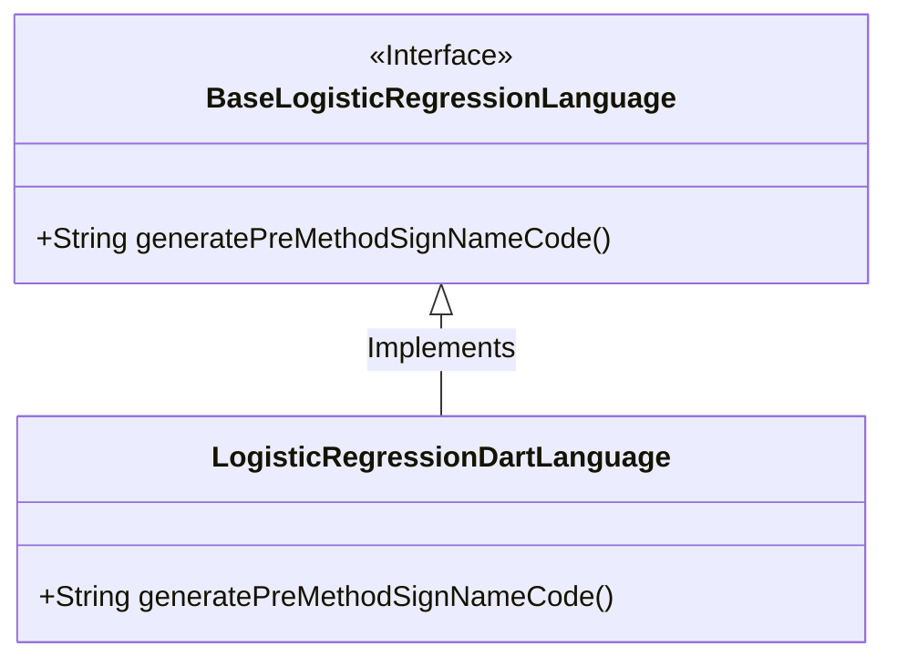
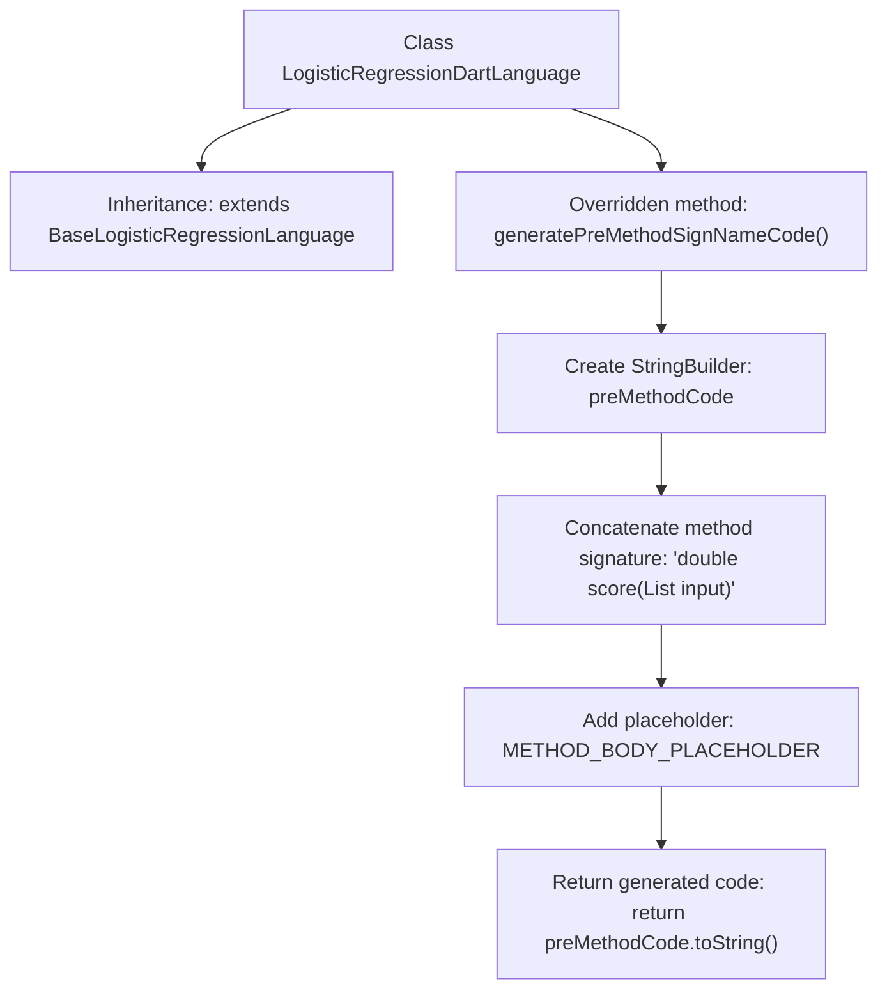

# Basic Information

|      |      |
|------|------|
| Name | LogisticRegressionDartLanguage |
| Language | .java |
| Code Path | WeFe/board/board-service/src/main/java/com/welab/wefe/board/service/service/modelexport/LogisticRegressionDartLanguage.java |
| Package Name | com.welab.wefe.board.service.service.modelexport |
| Dependencies | [] |
| Brief Description | Dart language logistic regression class, override the method signature code generation method to return a method template string containing placeholders. |

# Description

The content describes a class named LogisticRegressionDartLanguage, which inherits from BaseLogisticRegressionLanguage. This class overrides the generatePreMethodSignNameCode method to generate predefined method signature code in Dart language format. Internally, the method uses StringBuilder to construct a score method that returns a double type and accepts a parameter input of type List<double>. The method body includes a placeholder METHOD_BODY_PLACEHOLDER and is formatted using the indentation unit character INDENTATION_UNIT_CHAR. Finally, it returns the complete method signature string, including braces and line breaks.

# Class Summary

| Name   | Type  | Description |
|-------|------|-------------|
| LogisticRegressionDartLanguage | class | Dart language logistic regression class, rewrite the method signature generation code to return a method string containing placeholders. |

## Class LogisticRegressionDartLanguage

|      |      |
|------|------|
| Access Modifier | public |
| Type | class |
| Name | LogisticRegressionDartLanguage |
| Description | Dart language logistic regression class, rewrite the method signature generation code to return a method string containing placeholders. |

### UML Class Diagram

This class diagram illustrates that LogisticRegressionDartLanguage inherits from the BaseLogisticRegressionLanguage interface and implements its abstract method. BaseLogisticRegressionLanguage, as an interface, defines the specification for generating method signature code, while LogisticRegressionDartLanguage, as a concrete implementation class, overrides the generatePreMethodSignNameCode() method to generate a logistic regression scoring method template in Dart language format. The inheritance relationship is represented by a hollow triangular arrow, reflecting the hierarchical relationship between the Dart language implementation and the generic interface.

### Internal Method Call Graph

This flowchart illustrates the structure of the LogisticRegressionDartLanguage class and its core method logic. The class inherits from BaseLogisticRegressionLanguage and overrides the generatePreMethodSignNameCode method. This method constructs a Dart-format method signature using StringBuilder, including the return type, parameter list, and placeholder, ultimately returning the concatenated string. The entire process demonstrates the template construction workflow of a code generator, reflecting the standardized encapsulation mechanism for method signatures.

### Field List

| Name  | Type  | Description |
|-------|-------|------|

### Method List

| Name  | Type  | Description |
|-------|-------|------|
| generatePreMethodSignNameCode | String | Generate a method that returns a string, containing the definition of the score method signature and a placeholder for later filling in the method body. |

