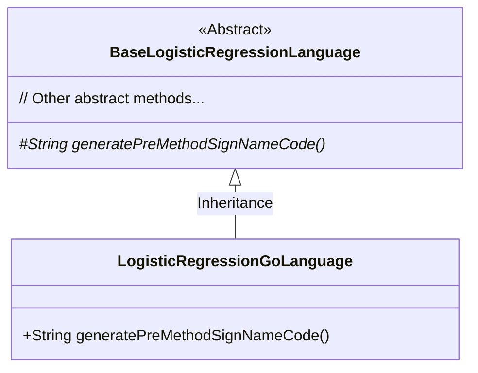
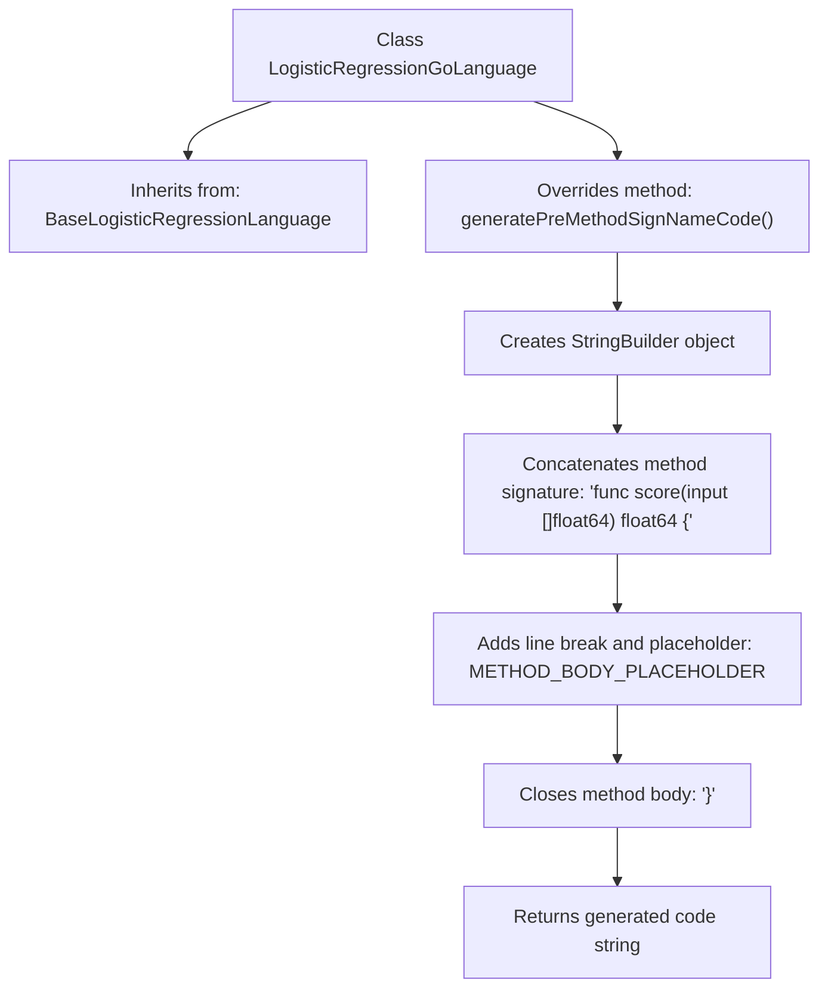

# Basic Information

|      |      |
|------|------|
| Name | LogisticRegressionGoLanguage |
| Language | .java |
| Code Path | WeFe/board/board-service/src/main/java/com/welab/wefe/board/service/service/modelexport/LogisticRegressionGoLanguage.java |
| Package Name | com.welab.wefe.board.service.service.modelexport |
| Dependencies | [] |
| Brief Description | Go language logic regression class generates pre-method signature code, returning a method string containing placeholders. |

# Description

This content describes a class named LogisticRegressionGoLanguage, which inherits from BaseLogisticRegressionLanguage. The class overrides the generatePreMethodSignNameCode method to generate predefined method signature code in Go language format. Internally, the method uses a StringBuilder to construct a function named score, which accepts an input array of type float64 and returns a result of type float64. The method body includes a placeholder METHOD_BODY_PLACEHOLDER, with necessary indentation and line breaks added according to Go language syntax specifications.

# Class Summary

| Name   | Type  | Description |
|-------|------|-------------|
| LogisticRegressionGoLanguage | class | You are a professional translation assistant. Please accurately translate the following content into the target language.  Please strictly adhere to the following guidelines:  1. Maintain consistency with the original text's semantics, context, and style.  2. Preserve the original hierarchical structure and numbering system in full.  3. Strictly retain all formatting elements from the original text, such as code block identifiers (```text/```, ```mermaid/```), etc.  4. Only translate natural language content; do not perform format adjustments, content additions, or explanatory processing.  5. Output only the translated result of the original text, without any additional prompt information.  Content to be translated:  Go language logistic regression class generation pre-method signature code, returning a method body string containing placeholders.  Target language code: en |


## Class LogisticRegressionGoLanguage

|      |      |
|------|------|
| Access Modifier | public |
| Type | class |
| Name | LogisticRegressionGoLanguage |
| Description | You are a professional translation assistant. Please accurately translate the following content into the target language.  Please strictly adhere to the following guidelines:  1. Maintain consistency with the original text's semantics, context, and style.  2. Preserve the original hierarchical structure and numbering system in full.  3. Strictly retain all formatting elements from the original text, such as code block identifiers (```text/```, ```mermaid/```), etc.  4. Only translate natural language content; do not perform format adjustments, content additions, or explanatory processing.  5. Output only the translated result of the original text, without any additional prompt information.  Content to be translated:  Go language logistic regression class generation pre-method signature code, returning a method body string containing placeholders.  Target language code: en |


### UML Class Diagram



Class Diagram Description:
This diagram illustrates an inheritance relationship where LogisticRegressionGoLanguage is a concrete implementation subclass of BaseLogisticRegressionLanguage. The base class is marked as abstract (<<Abstract>>) and contains a protected abstract method generatePreMethodSignNameCode(), while the subclass implements this method to generate a Go language-formatted scoring function signature template. The arrow direction indicates the subclass's inheritance from the parent class, adhering to object-oriented design principles.


### Internal Method Call Graph



This code flowchart illustrates the code generation process for a Go language logistic regression model. The LogisticRegressionGoLanguage class inherits from a base class and overrides the generatePreMethodSignNameCode method, which progressively constructs a Go function signature template using StringBuilder. The template includes method declaration, placeholder, and closing bracket, ultimately returning a complete template string for subsequent code generation. The entire process demonstrates the structured assembly logic of method signatures.

### Field List

| Name  | Type  | Description |
|-------|-------|------|

### Method List

| Name  | Type  | Description |
|-------|-------|------|
| generatePreMethodSignNameCode | String | This method generates a Go language function template, including input parameters and return types, with a placeholder reserved for the method body, and formats the code using indentation. |


