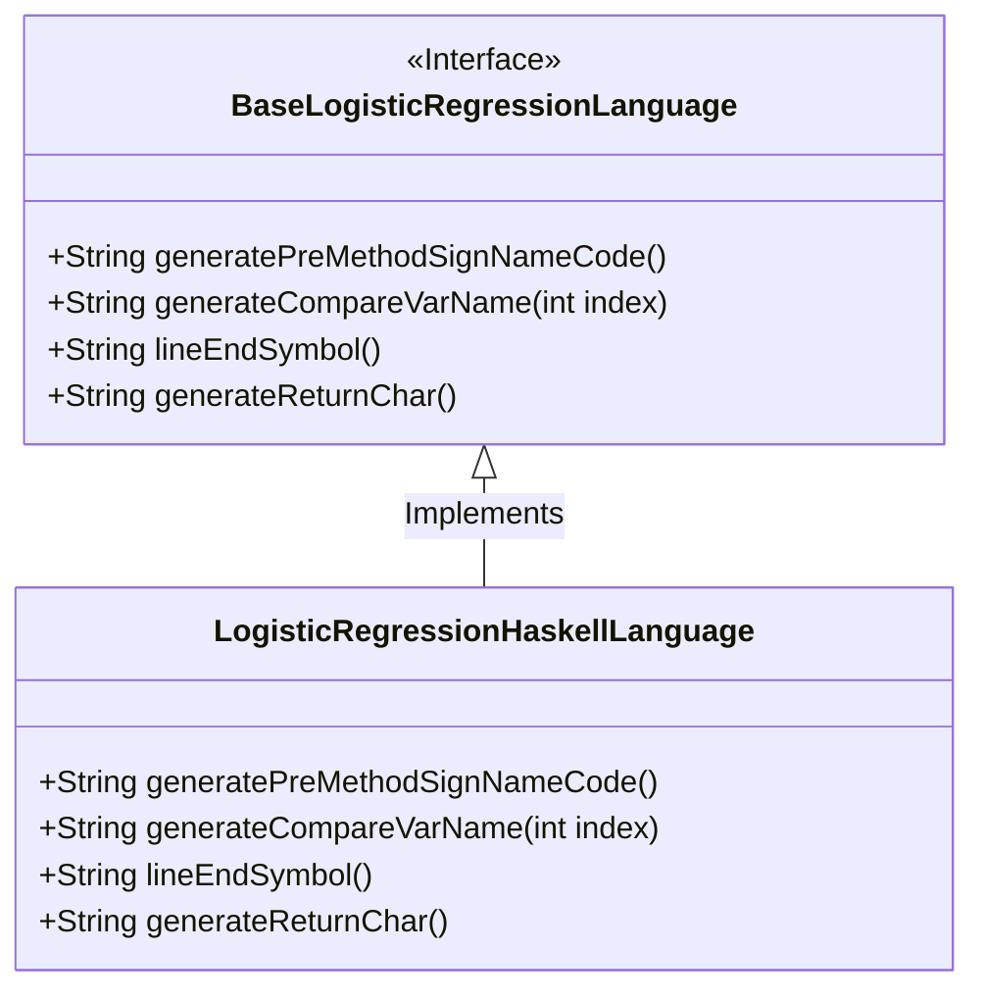
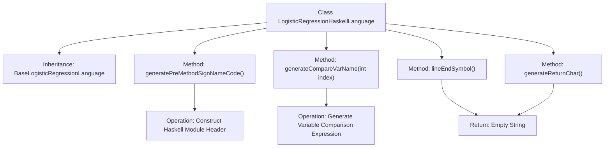

# Basic Information

|      |      |
|------|------|
| Name | LogisticRegressionHaskellLanguage |
| Language | .java |
| Code Path | WeFe/board/board-service/src/main/java/com/welab/wefe/board/service/service/modelexport/LogisticRegressionHaskellLanguage.java |
| Package Name | com.welab.wefe.board.service.service.modelexport |
| Dependencies | [] |
| Brief Description | Haskell logistic regression class, generating module definitions, function signatures, and placeholders, without line-ending symbols or return characters, supporting indexed variable access. |

# Description

The code defines a class named `LogisticRegressionHaskellLanguage`, which inherits from `BaseLogisticRegressionLanguage`. It overrides multiple methods to generate Haskell-specific implementation code for logistic regression. The `generatePreMethodSignNameCode` method constructs Haskell module declarations and function signatures, including placeholders for subsequent method body filling. The `generateCompareVarName` method generates Haskell list indexing syntax. The `lineEndSymbol` and `generateReturnChar` methods return empty strings, aligning with Haskell's syntax that does not require line terminators or explicit return characters. The entire class focuses on adapting the logistic regression algorithm to the Haskell language environment.

# Class Summary

| Name   | Type  | Description |
|-------|------|-------------|
| LogisticRegressionHaskellLanguage | class | The Java class `LogisticRegressionHaskellLanguage` extends `BaseLogisticRegressionLanguage`, overriding methods to generate Haskell code structures including module definitions, function signatures, and placeholders, while handling input indices and return formats. |

## Class LogisticRegressionHaskellLanguage

|      |      |
|------|------|
| Access Modifier | public |
| Type | class |
| Name | LogisticRegressionHaskellLanguage |
| Description | The Java class `LogisticRegressionHaskellLanguage` extends `BaseLogisticRegressionLanguage`, overriding methods to generate Haskell code structures including module definitions, function signatures, and placeholders, while handling input indices and return formats. |

### UML Class Diagram

This code demonstrates an implementation of a Haskell language code generator for logistic regression models. The `LogisticRegressionHaskellLanguage` class inherits from the `BaseLogisticRegressionLanguage` interface and implements four key methods: `generatePreMethodSignNameCode()` for generating Haskell module declarations and function signatures, `generateCompareVarName()` for array indexing syntax, `lineEndSymbol()` and `generateReturnChar()` handling line-ending symbols and return characters respectively (both empty in Haskell). This implementation is specifically tailored to Haskell's syntactic features, such as using the "!!" operator for list indexing and module declaration formats, reflecting adaptations for functional language characteristics.

### Internal Method Call Graph

This flowchart illustrates the core structure of the Haskell logistic regression language generator. The class inherits from a base logistic regression language class and contains four key methods: generatePreMethodSignNameCode() constructs Haskell module definitions and function signature templates; generateCompareVarName() generates Haskell list indexing syntax; both lineEndSymbol() and generateReturnChar() return empty strings to comply with Haskell syntax specifications. These methods work together to ultimately produce machine learning model code that conforms to Haskell syntax.

### Field List

| Name  | Type  | Description |
|-------|-------|------|

### Method List

| Name  | Type  | Description |
|-------|-------|------|
| generateCompareVarName | String | Generate a method to compare variable names, returning the format "(input) !!(index)", where index is the input parameter. |
| generatePreMethodSignNameCode | String | Generate Haskell module code, defining the function signature and placeholder body for the `score` function. |
| lineEndSymbol | String | Method override, returning an empty string as the line terminator. |
| generateReturnChar | String | Generating empty string returns for overriding methods. |

