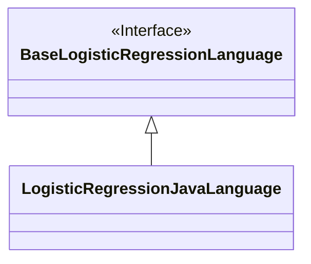
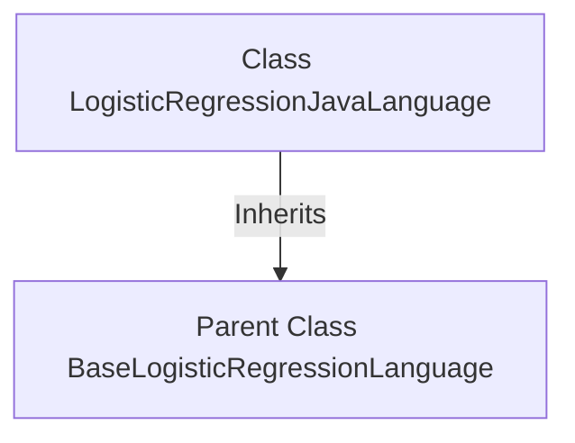

# Basic Information

|      |      |
|------|------|
| Name | LogisticRegressionJavaLanguage |
| Language | .java |
| Code Path | WeFe/board/board-service/src/main/java/com/welab/wefe/board/service/service/modelexport/LogisticRegressionJavaLanguage.java |
| Package Name | com.welab.wefe.board.service.service.modelexport |
| Dependencies | [] |
| Brief Description | A Java-implemented logistic regression language class, inheriting from the base logistic regression language class. |

# Description

The content defines a Java class named `LogisticRegressionJavaLanguage`, which inherits from the base class `BaseLogisticRegressionLanguage`. This is an object-oriented class declaration, indicating that the class is specifically designed to implement the logistic regression algorithm and is implemented in the Java language. Through inheritance, the class will possess the functionalities and properties defined in the base class, while also being able to extend or override related methods to meet specific requirements. The entire declaration is concise and clear, without including any specific implementation details or additional properties or methods.

# Class Summary

| Name   | Type  | Description |
|-------|------|-------------|
| LogisticRegressionJavaLanguage | class | A Java-implemented logistic regression language class that inherits from the base logistic regression language class. |

## Class LogisticRegressionJavaLanguage

|      |      |
|------|------|
| Access Modifier | public |
| Type | class |
| Name | LogisticRegressionJavaLanguage |
| Description | A Java-implemented logistic regression language class that inherits from the base logistic regression language class. |

### UML Class Diagram

This class diagram depicts a simple inheritance relationship where the `LogisticRegressionJavaLanguage` class inherits from the `BaseLogisticRegressionLanguage` interface. The diagram clearly illustrates the hierarchical relationship between the interface and its implementing class, using a hollow triangular arrow to denote inheritance, which adheres to UML conventions. The `BaseLogisticRegressionLanguage` is marked as an interface, while `LogisticRegressionJavaLanguage`, as a concrete implementation class, has no additional members, indicating it likely implements all abstract methods inherited from the interface. This structure is commonly used to achieve polymorphism and code reuse.

### Internal Method Call Graph

This flowchart illustrates the inheritance relationship of the LogisticRegressionJavaLanguage class. It clearly shows that LogisticRegressionJavaLanguage inherits from the parent class BaseLogisticRegressionLanguage, demonstrating the inheritance feature in object-oriented programming. The diagram presents the hierarchical relationship between classes concisely and clearly, aiding in understanding the code structure and design intent. Inheritance is a crucial mechanism in object-oriented programming for achieving code reuse and extensibility.

### Field List

| Name  | Type  | Description |
|-------|-------|------|

### Method List

| Name  | Type  | Description |
|-------|-------|------|

