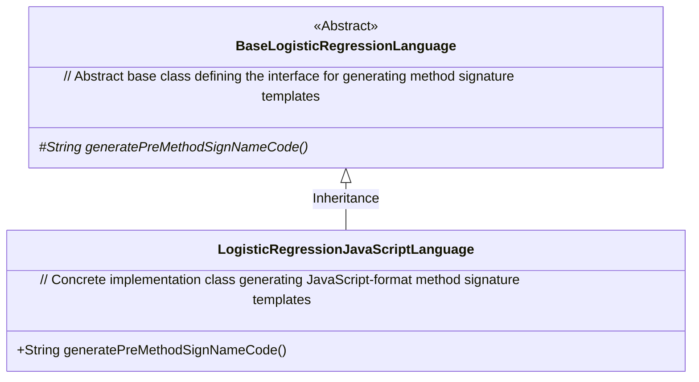
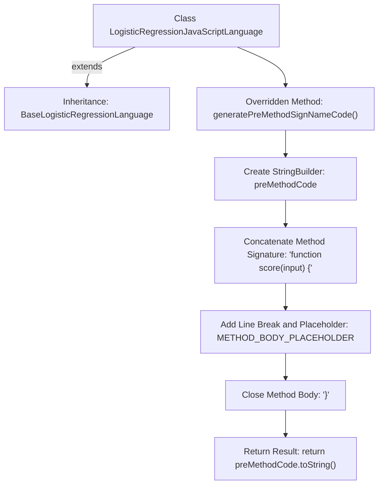

# Basic Information

|      |      |
|------|------|
| Name | LogisticRegressionJavaScriptLanguage |
| Language | .java |
| Code Path | WeFe/board/board-service/src/main/java/com/welab/wefe/board/service/service/modelexport/LogisticRegressionJavaScriptLanguage.java |
| Package Name | com.welab.wefe.board.service.service.modelexport |
| Dependencies | [] |
| Brief Description | The `LogisticRegressionJavaScriptLanguage` class extends `BaseLogisticRegressionLanguage` and overrides the `generatePreMethodSignNameCode` method to generate a JavaScript scoring function template. |

# Description

This code describes a class named `LogisticRegressionJavaScriptLanguage`, which inherits from `BaseLogisticRegressionLanguage`. The class overrides the `generatePreMethodSignNameCode` method to generate the framework of a logistic regression scoring function in JavaScript. Internally, the method uses `StringBuilder` to construct a basic function structure, including the declaration of `function score(input)`, a placeholder for the method body, and a closing curly brace. The generated code string serves as a template for subsequent method body population.

# Class Summary

| Name   | Type  | Description |
|-------|------|-------------|
| LogisticRegressionJavaScriptLanguage | class | The `LogisticRegressionJavaScriptLanguage` class extends `BaseLogisticRegressionLanguage` and overrides the `generatePreMethodSignNameCode` method to generate a JavaScript scoring function template. |

## Class LogisticRegressionJavaScriptLanguage

|      |      |
|------|------|
| Access Modifier | public |
| Type | class |
| Name | LogisticRegressionJavaScriptLanguage |
| Description | The `LogisticRegressionJavaScriptLanguage` class extends `BaseLogisticRegressionLanguage` and overrides the `generatePreMethodSignNameCode` method to generate a JavaScript scoring function template. |

### UML Class Diagram

Class diagram description: This structure illustrates the language adaptation layer in a machine learning code generation framework. BaseLogisticRegressionLanguage serves as an abstract base class defining the interface for generating method signatures, while its subclass LogisticRegressionJavaScriptLanguage specifically implements the generation of JavaScript-format method signature templates. Through method concatenation, it returns a standard JS function structure like "function score(input) {...}".

### Internal Method Call Graph

This flowchart illustrates the core logic of a JavaScript logistic regression code generator. The class inherits from a base class and overrides a method, progressively constructing a function template via StringBuilder: first declaring the method signature, inserting a placeholder, and finally closing the function body. The entire process strictly adheres to code generation specifications, ensuring the output complies with JavaScript syntax requirements.

### Field List

| Name  | Type  | Description |
|-------|-------|------|

### Method List

| Name  | Type  | Description |
|-------|-------|------|
| generatePreMethodSignNameCode | String | Generate predefined method signature code, including function declarations, placeholders, and formatted indentation. |

