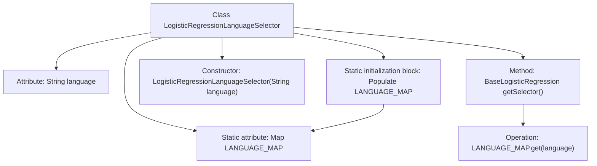

# Basic Information

|      |      |
|------|------|
| Name | LogisticRegressionLanguageSelector |
| Language | .java |
| Code Path | WeFe/board/board-service/src/main/java/com/welab/wefe/board/service/service/modelexport/LogisticRegressionLanguageSelector.java |
| Package Name | com.welab.wefe.board.service.service.modelexport |
| Dependencies | ['com.welab.wefe.common.wefe.enums.ModelExportLanguage', 'java.util.HashMap', 'java.util.Map'] |
| Brief Description | The LogisticRegressionLanguageSelector class stores logistic regression implementations for different languages through a static mapping, returning the corresponding instance based on the input language. |

# Description

The code defines a `LogisticRegressionLanguageSelector` class, which selects the corresponding logistic regression implementation based on the input language. The class contains a static mapping table `LANGUAGE_MAP` that pre-stores logistic regression implementation classes for 14 programming languages (such as C, C#, Python, etc.) and PMML. The constructor receives a language parameter, and the `getSelector` method returns an instance of the matched implementation class. Through a static initialization block, the mapping table is pre-populated, enabling multilingual support functionality.

# Class Summary

| Name   | Type  | Description |
|-------|------|-------------|
| LogisticRegressionLanguageSelector | class | The `LogisticRegressionLanguageSelector` class supports multiple language logistic regression model selections through a static mapping, returning the corresponding implementation based on the input language. |

## Class LogisticRegressionLanguageSelector

|      |      |
|------|------|
| Access Modifier | public |
| Type | class |
| Name | LogisticRegressionLanguageSelector |
| Description | The `LogisticRegressionLanguageSelector` class supports multiple language logistic regression model selections through a static mapping, returning the corresponding implementation based on the input language. |

### UML Class Diagram

```mermaid
classDiagram
    class LogisticRegressionLanguageSelector {
        -String language
        -static Map~String, BaseLogisticRegressionLanguage~ LANGUAGE_MAP
        +LogisticRegressionLanguageSelector(String language)
        +BaseLogisticRegressionLanguage getSelector()
    }

    class BaseLogisticRegressionLanguage {
        <<Interface>>
    }

    class LogisticRegressionCLanguage {
        +implements BaseLogisticRegressionLanguage
    }
    class LogisticRegressionCSharpLanguage {
        +implements BaseLogisticRegressionLanguage
    }
    class LogisticRegressionDartLanguage {
        +implements BaseLogisticRegressionLanguage
    }
    class LogisticRegressionGoLanguage {
        +implements BaseLogisticRegressionLanguage
    }
    class LogisticRegressionHaskellLanguage {
        +implements BaseLogisticRegressionLanguage
    }
    class LogisticRegressionJavaLanguage {
        +implements BaseLogisticRegressionLanguage
    }
    class LogisticRegressionJavaScriptLanguage {
        +implements BaseLogisticRegressionLanguage
    }
    class LogisticRegressionPhpLanguage {
        +implements BaseLogisticRegressionLanguage
    }
    class LogisticRegressionPowerShellLanguage {
        +implements BaseLogisticRegressionLanguage
    }
    class LogisticRegressionPythonLanguage {
        +implements BaseLogisticRegressionLanguage
    }
    class LogisticRegressionRLanguage {
        +implements BaseLogisticRegressionLanguage
    }
    class LogisticRegressionRubyLanguage {
        +implements BaseLogisticRegressionLanguage
    }
    class LogisticRegressionVisualBasicLanguage {
        +implements BaseLogisticRegressionLanguage
    }
    class LogisticRegressionPmmlLanguage {
        +implements BaseLogisticRegressionLanguage
    }

    LogisticRegressionLanguageSelector --> BaseLogisticRegressionLanguage : depends
    LogisticRegressionCLanguage --|> BaseLogisticRegressionLanguage
    LogisticRegressionCSharpLanguage --|> BaseLogisticRegressionLanguage
    LogisticRegressionDartLanguage --|> BaseLogisticRegressionLanguage
    LogisticRegressionGoLanguage --|> BaseLogisticRegressionLanguage
    LogisticRegressionHaskellLanguage --|> BaseLogisticRegressionLanguage
    LogisticRegressionJavaLanguage --|> BaseLogisticRegressionLanguage
    LogisticRegressionJavaScriptLanguage --|> BaseLogisticRegressionLanguage
    LogisticRegressionPhpLanguage --|> BaseLogisticRegressionLanguage
    LogisticRegressionPowerShellLanguage --|> BaseLogisticRegressionLanguage
    LogisticRegressionPythonLanguage --|> BaseLogisticRegressionLanguage
    LogisticRegressionRLanguage --|> BaseLogisticRegressionLanguage
    LogisticRegressionRubyLanguage --|> BaseLogisticRegressionLanguage
    LogisticRegressionVisualBasicLanguage --|> BaseLogisticRegressionLanguage
    LogisticRegressionPmmlLanguage --|> BaseLogisticRegressionLanguage
```

This code implements a logistic regression language selector, which registers different programming language implementations of logistic regression into a mapping table through static initialization. The `LogisticRegressionLanguageSelector` class returns the corresponding implementation class based on the input language name, with all concrete language implementation classes inheriting from the `BaseLogisticRegressionLanguage` interface. This design pattern achieves decoupling and dynamic selection of language implementations, supporting the export functionality of logistic regression models in multiple programming languages.

### Internal Method Call Graph

This code describes a logistic regression language selector class that preloads implementations for 14 programming languages into a hash table via a static initialization block. The class contains a language attribute and static mapping table, with its constructor accepting a language parameter. The getSelector method retrieves the corresponding implementation class from the mapping table using the language key. The flowchart illustrates the class structure, initialization process, and method invocation relationships, highlighting the design pattern of static data preloading and runtime dynamic queries.

### Field List

| Name  | Type  | Description |
|-------|-------|------|
| language | String | Private immutable string variable language. |
| LANGUAGE_MAP = new HashMap<>(16) | Map<String, BaseLogisticRegressionLanguage> | Define a static constant LANGUAGE_MAP, using HashMap to store the mapping from String to BaseLogisticRegressionLanguage, with an initial capacity of 16. |

### Method List

| Name  | Type  | Description |
|-------|-------|------|
| getSelector | BaseLogisticRegressionLanguage | Get the logistic regression language selector for the specified language.Target language code: en |

