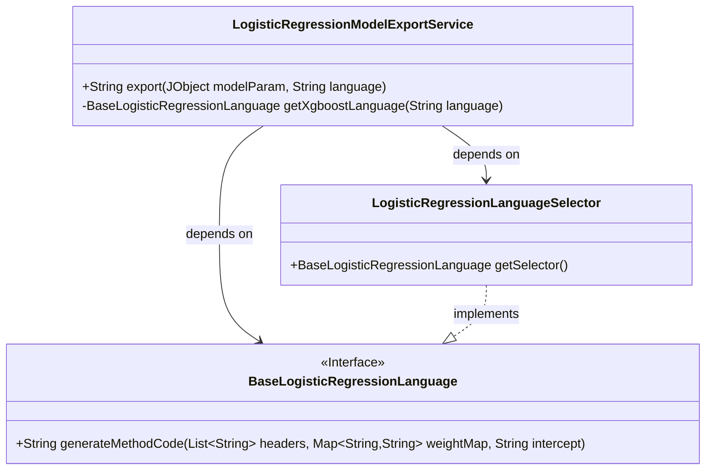
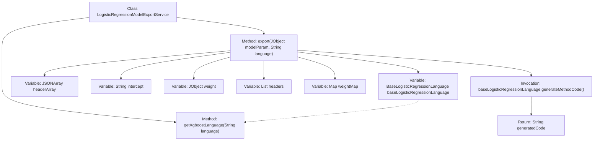

# Basic Information

|      |      |
|------|------|
| Name | LogisticRegressionModelExportService |
| Language | .java |
| Code Path | WeFe/board/board-service/src/main/java/com/welab/wefe/board/service/service/modelexport/LogisticRegressionModelExportService.java |
| Package Name | com.welab.wefe.board.service.service.modelexport |
| Dependencies | ['com.alibaba.fastjson.JSONArray', 'com.welab.wefe.common.util.JObject', 'org.springframework.stereotype.Service', 'java.util.ArrayList', 'java.util.HashMap', 'java.util.List', 'java.util.Map'] |
| Brief Description | The LogisticRegressionModelExportService class provides model export functionality, generating corresponding code based on parameters and language. The export method processes model parameters, extracts header information, intercepts, and weights, then invokes the language interpreter to generate code. The getXgboostLanguage method selects the appropriate language interpreter. |

# Description

The LogisticRegressionModelExportService is a service class that provides model export functionality. It includes an export method which takes model parameters and a language parameter, and retrieves the corresponding language interpreter via the getXgboostLanguage method. The export method parses the header array, intercept value, and weight object from the model parameters, converts the header into a string list and the weight into a key-value pair mapping. Finally, it calls the interpreter's generateMethodCode method to generate and return the code. The getXgboostLanguage method selects the corresponding language interpreter through the LogisticRegressionLanguageSelector.

# Class Summary

| Name   | Type  | Description |
|-------|------|-------------|
| LogisticRegressionModelExportService | class | The LogisticRegressionModelExportService class provides model export functionality, generating corresponding code based on language parameters, processing model parameters, header information, and weights, and returning method code. |

## Class LogisticRegressionModelExportService

|      |      |
|------|------|
| Access Modifier | @Service;public |
| Type | class |
| Name | LogisticRegressionModelExportService |
| Description | The LogisticRegressionModelExportService class provides model export functionality, generating corresponding code based on language parameters, processing model parameters, header information, and weights, and returning method code. |

### UML Class Diagram

This code implements a logistic regression model export service, where the `LogisticRegressionModelExportService` class processes model parameters and invokes language-specific interpreters to generate code. The service relies on the language generation specification defined by the `BaseLogisticRegressionLanguage` interface, with concrete implementations provided by the `LogisticRegressionLanguageSelector` selector. The class diagram clearly illustrates the dependency relationships between the service and language interpreters, as well as the interface implementation hierarchy.

### Internal Method Call Graph

This flowchart illustrates the core logic of the LogisticRegressionModelExportService class. The main process starts with the export method, sequentially parsing model parameters, constructing header information and weight mapping tables, and finally generating target language code through a language selector. The getXgboostLanguage method is responsible for returning the corresponding code generator implementation based on the language type, with the final code generation completed by generateMethodCode and returning the result string. The entire process demonstrates the collaborative mechanism of parameter parsing, data processing, and multilingual support.

### Field List

| Name  | Type  | Description |
|-------|-------|------|

### Method List

| Name  | Type  | Description |
|-------|-------|------|
| getXgboostLanguage | BaseLogisticRegressionLanguage | This method selects and returns the corresponding XGBoost logistic regression language model based on the input language parameter through the LogisticRegressionLanguageSelector. |
| export | String | The method retrieves the corresponding logistic regression language interpreter based on the language parameter, parses the headers, intercept, and weights from the model parameters, then generates and returns the code in the target language. |

