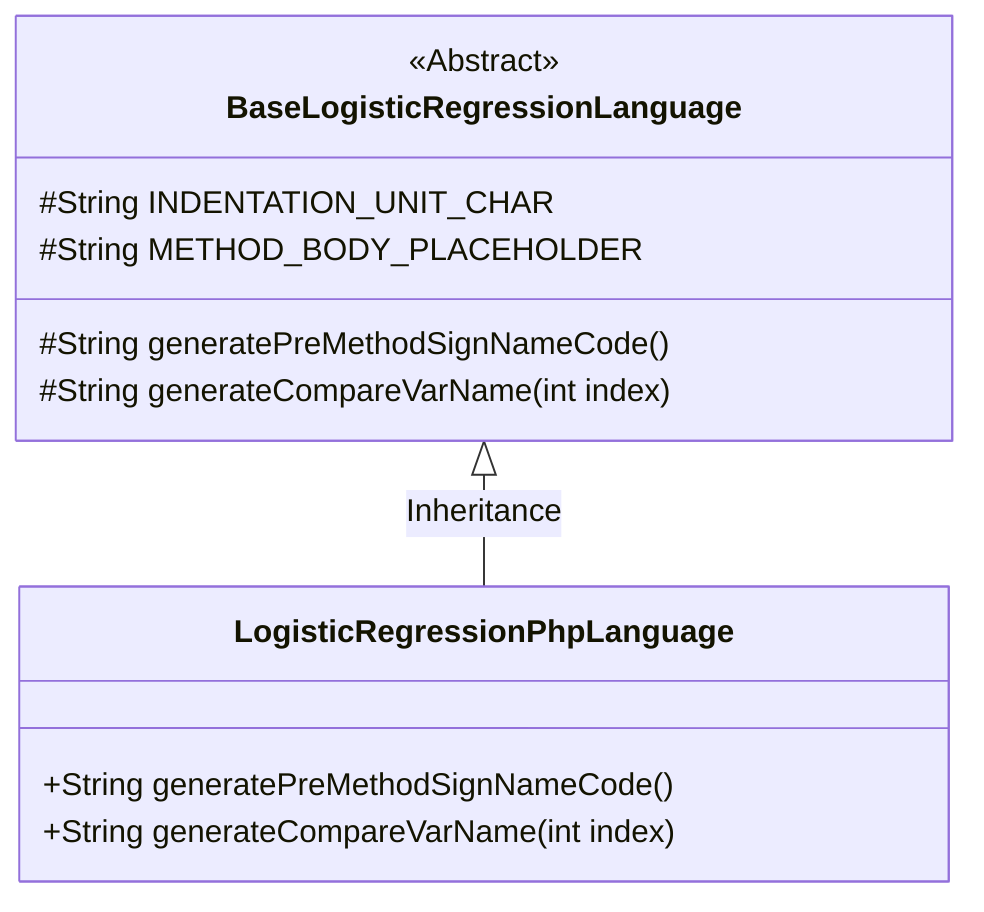
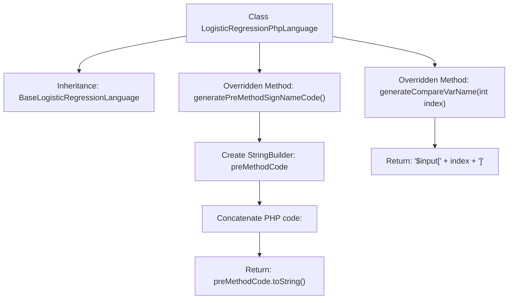

# Basic Information

|      |      |
|------|------|
| Name | LogisticRegressionPhpLanguage |
| Language | .java |
| Code Path | WeFe/board/board-service/src/main/java/com/welab/wefe/board/service/service/modelexport/LogisticRegressionPhpLanguage.java |
| Package Name | com.welab.wefe.board.service.service.modelexport |
| Dependencies | [] |
| Brief Description | PHP Logistic Regression Class, generating scoring function framework and input variable index code. |

# Description

The code defines a class named `LogisticRegressionPhpLanguage`, which inherits from `BaseLogisticRegressionLanguage`. It overrides two methods: `generatePreMethodSignNameCode` generates PHP function signature code, including PHP opening tags and the `score` function framework; `generateCompareVarName` generates variable names for comparison in the format of PHP array access `$input[index]`. The class focuses on generating PHP language-specific code structures for logistic regression models.

# Class Summary

| Name   | Type  | Description |
|-------|------|-------------|
| LogisticRegressionPhpLanguage | class | PHP logistic regression class, generating scoring function framework and input variable index code. |

## Class LogisticRegressionPhpLanguage

|      |      |
|------|------|
| Access Modifier | public |
| Type | class |
| Name | LogisticRegressionPhpLanguage |
| Description | PHP logistic regression class, generating scoring function framework and input variable index code. |

### UML Class Diagram

This code demonstrates the class structure of a PHP language implementation for logistic regression. LogisticRegressionPhpLanguage inherits from the abstract base class BaseLogisticRegressionLanguage and implements two key methods: generatePreMethodSignNameCode() generates a PHP function signature template containing method scaffolding and placeholders, while generateCompareVarName() produces PHP array access syntax for feature comparison. The base class defines common constants and abstract methods, while the subclass provides PHP-specific implementation details, exemplifying the application of the Template Method design pattern.

### Internal Method Call Graph

This flowchart illustrates the class structure of a PHP language logistic regression code generator. LogisticRegressionPhpLanguage inherits from a base class and overrides two key methods: generatePreMethodSignNameCode() for generating PHP function signature templates (including <?php tags and score method framework), while generateCompareVarName() produces variable names in PHP array index format (e.g., $input[0]). The arrows clearly depict method invocation relationships and string concatenation flow.

### Field List

| Name  | Type  | Description |
|-------|-------|------|

### Method List

| Name  | Type  | Description |
|-------|-------|------|
| generatePreMethodSignNameCode | String | Generate PHP function framework code, including opening tags, function definition, and placeholders. |
| generateCompareVarName | String | Java method override, generating comparison variable names in the format "$input[index]". |

