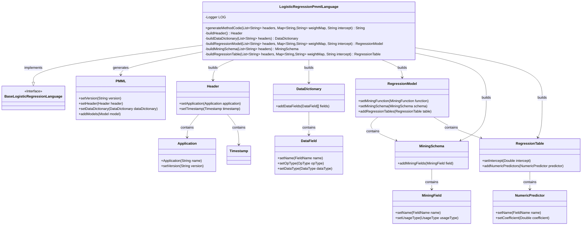
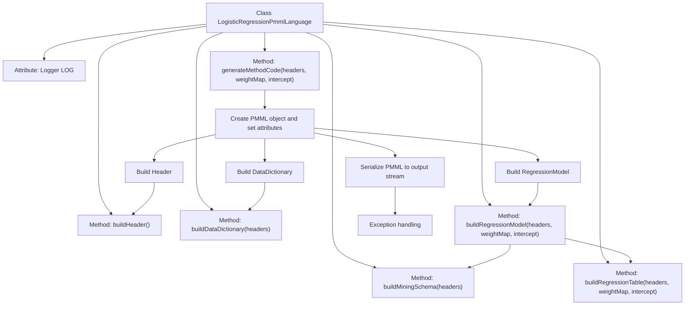
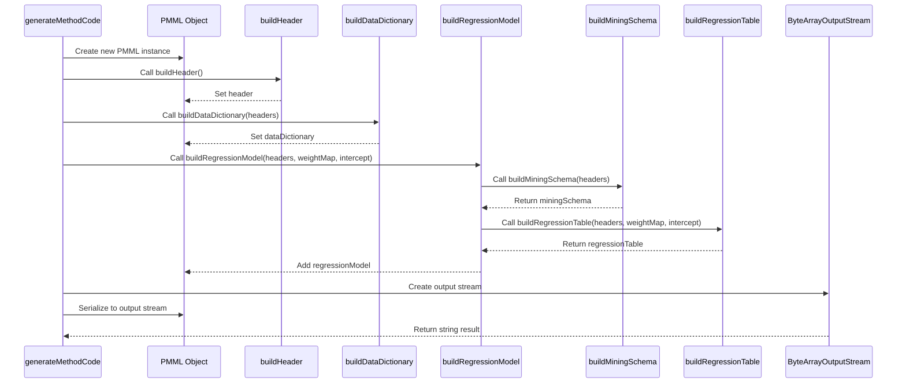

# Basic Information

|      |      |
|------|------|
| Name | LogisticRegressionPmmlLanguage |
| Language | .java |
| Code Path | WeFe/board/board-service/src/main/java/com/welab/wefe/board/service/service/modelexport/LogisticRegressionPmmlLanguage.java |
| Package Name | com.welab.wefe.board.service.service.modelexport |
| Dependencies | ['org.apache.commons.lang3.math.NumberUtils', 'org.dmg.pmml', 'org.dmg.pmml.regression.NumericPredictor', 'org.dmg.pmml.regression.RegressionModel', 'org.dmg.pmml.regression.RegressionTable', 'org.jpmml.model.PMMLUtil', 'org.slf4j.Logger', 'org.slf4j.LoggerFactory', 'java.io.ByteArrayOutputStream', 'java.util.ArrayList', 'java.util.List', 'java.util.Map'] |
| Brief Description | The `LogisticRegressionPmmlLanguage` class inherits from `BaseLogisticRegressionLanguage` and generates logistic regression model code in PMML format, including header information, data dictionary, regression model, mining schema, and regression table. |

# Description

The code defines a class named `LogisticRegressionPmmlLanguage` for generating PMML format output of logistic regression models. The class inherits from `BaseLogisticRegressionLanguage` and includes the core method `generateMethodCode` for producing PMML documents. This method takes a list of headers, a weight mapping, and an intercept value as inputs, then constructs the PMML document structure, including components such as header information, data dictionary, and regression model. The data dictionary defines the data types of input parameters and output variable `y`, while the regression model configures the mining function and mode. The regression table stores coefficients for each parameter and the intercept value. The entire process serializes objects into XML strings via `PMMLUtil` for output, with error logs recorded in case of exceptions.

# Class Summary

| Name   | Type  | Description |
|-------|------|-------------|
| LogisticRegressionPmmlLanguage | class | The `LogisticRegressionPmmlLanguage` class generates logistic regression model code in PMML format, including data dictionary, regression model, mining schema, and regression table construction, with support for exception handling and logging. |

## Class LogisticRegressionPmmlLanguage

|      |      |
|------|------|
| Access Modifier | public |
| Type | class |
| Name | LogisticRegressionPmmlLanguage |
| Description | The `LogisticRegressionPmmlLanguage` class generates logistic regression model code in PMML format, including data dictionary, regression model, mining schema, and regression table construction, with support for exception handling and logging. |

### UML Class Diagram

This code describes a class for generating logistic regression models in PMML format. The LogisticRegressionPmmlLanguage implements the BaseLogisticRegressionLanguage interface and constructs components such as Header, DataDictionary, and RegressionModel to ultimately produce an XML string compliant with PMML 4.3 standards. The class encapsulates the complete logic for building all elements from data headers and dictionaries to regression models, supporting the configuration of feature weights and intercept terms while handling exceptions during model serialization.

### Internal Method Call Graph

This code implements the generation of PMML (Predictive Model Markup Language) format output for logistic regression models. The main workflow includes: creating the base PMML object, constructing the Header information, building the data dictionary, constructing the regression model (containing mining schema and regression table), and finally serializing the entire model into an XML string output. Through multiple builder methods working in coordination, the code ultimately produces a logistic regression model description file compliant with PMML 4.3 standards, suitable for model exchange and deployment. The exception handling mechanism ensures that when issues occur during generation, logs are recorded and an empty string is returned.

### Field List

| Name  | Type  | Description |
|-------|-------|------|
| LOG = LoggerFactory.getLogger(this.getClass()) | Logger | A protected final log object LOG is defined in the class, initialized with the current class. |

### Method List

| Name  | Type  | Description |
|-------|-------|------|
| buildDataDictionary | DataDictionary | Method for constructing a data dictionary: Initialize the y field as a continuous double-precision type, iterate through the headers list to create fields of the same type for each parameter, and finally return a data dictionary containing all fields. |
| buildHeader | Header | Construct a Header object containing the application name "Logistic Regression Model", version "1.0", and timestamp. |
| generateMethodCode | String | This method generates PMML code for a logistic regression model, including version, header information, data dictionary, and regression model, converts it into a string via an output stream, logs errors in case of exceptions, and returns an empty string. |
| buildRegressionModel | RegressionModel | Method for building a regression model: Set the regression function, create a data pattern, and add a regression table, then return the regression model instance. |
| buildMiningSchema | MiningSchema | Method for constructing MiningSchema: Create a MiningSchema object, add the target field "y", iterate through the headers list to add other fields, and finally return the MiningSchema. |
| buildRegressionTable | RegressionTable | Build a regression table, set the intercept term, and iterate through the header list to create a numeric predictor for each parameter. After setting the names and coefficients, return the regression table object. |

