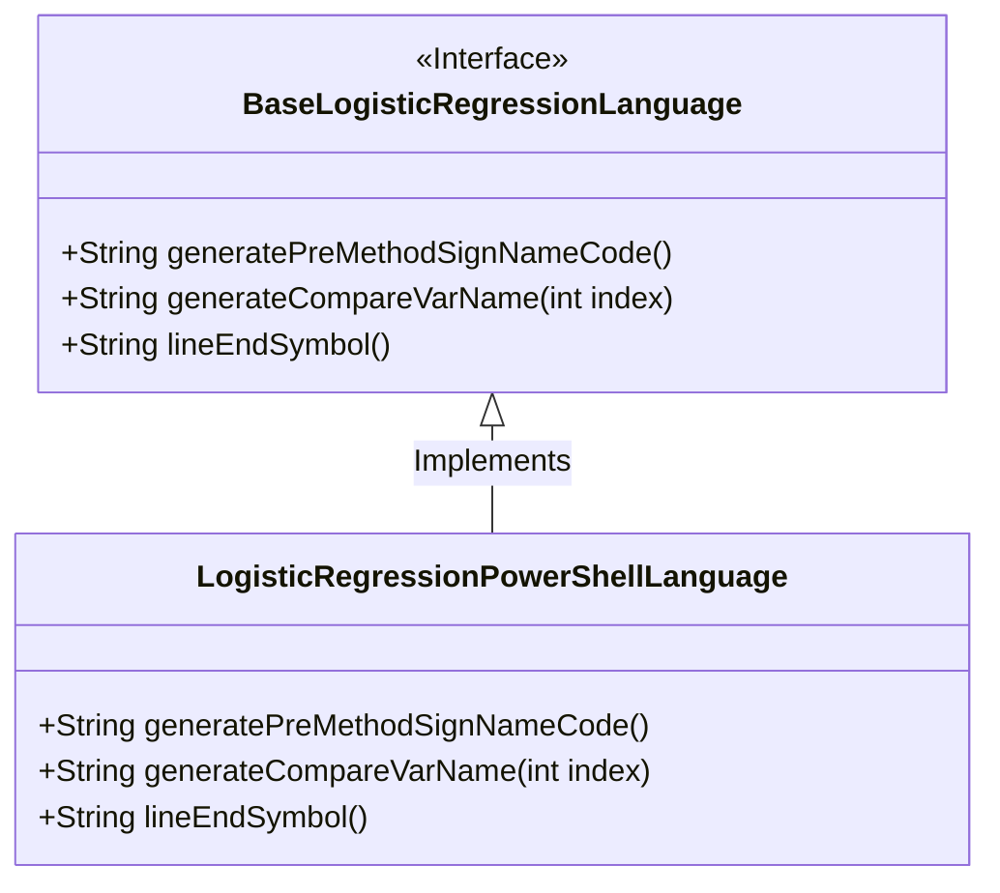
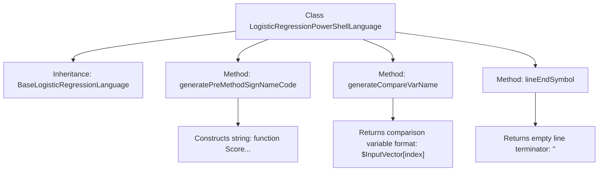

# Basic Information

|      |      |
|------|------|
| Name | LogisticRegressionPowerShellLanguage |
| Language | .java |
| Code Path | WeFe/board/board-service/src/main/java/com/welab/wefe/board/service/service/modelexport/LogisticRegressionPowerShellLanguage.java |
| Package Name | com.welab.wefe.board.service.service.modelexport |
| Dependencies | [] |
| Brief Description | The `LogisticRegressionPowerShellLanguage` class inherits from `BaseLogisticRegressionLanguage`, overriding methods for generating PowerShell function signatures, variable name comparisons, and line-ending symbols. The function is named `Score`, with an `InputVector` array as its parameter, and variable comparisons use index-based access. |

# Description

The content describes a class named LogisticRegressionPowerShellLanguage, which inherits from BaseLogisticRegressionLanguage. This class overrides three methods: generatePreMethodSignNameCode generates PowerShell function signature code, including input parameters and a method body placeholder; generateCompareVarName generates PowerShell variable names for indexing input vectors; lineEndSymbol returns an empty string indicating no line terminator is needed. Overall, it implements PowerShell-specific logic for generating logistic regression code.

# Class Summary

| Name   | Type  | Description |
|-------|------|-------------|
| LogisticRegressionPowerShellLanguage | class | The `LogisticRegressionPowerShellLanguage` class inherits from `BaseLogisticRegressionLanguage` and overrides the method for generating PowerShell scoring functions, including function signatures, input vector comparison variable names, and line-ending symbol handling. |

## Class LogisticRegressionPowerShellLanguage

|      |      |
|------|------|
| Access Modifier | public |
| Type | class |
| Name | LogisticRegressionPowerShellLanguage |
| Description | The `LogisticRegressionPowerShellLanguage` class inherits from `BaseLogisticRegressionLanguage` and overrides the method for generating PowerShell scoring functions, including function signatures, input vector comparison variable names, and line-ending symbol handling. |

### UML Class Diagram

The code demonstrates a PowerShell language implementation of a logistic regression scoring class, which inherits from the base logistic regression language interface. The LogisticRegressionPowerShellLanguage class overrides three key methods: generating method signature code, generating comparison variable names, and line ending symbols. The class diagram clearly illustrates the implementation relationship, where the base class is marked as an interface, and the subclass concretely implements all abstract methods for generating PowerShell-specific code snippets.

### Internal Method Call Graph

This flowchart illustrates the structure of the LogisticRegressionPowerShellLanguage class, which inherits from BaseLogisticRegressionLanguage and contains three core methods: generatePreMethodSignNameCode for generating PowerShell function signature templates, generateCompareVarName for formatting input vector index variable names, and lineEndSymbol which returns an empty string as line terminator. The concrete implementations of each method are shown through child nodes, demonstrating adaptation logic for PowerShell syntax.

### Field List

| Name  | Type  | Description |
|-------|-------|------|

### Method List

| Name  | Type  | Description |
|-------|-------|------|
| generateCompareVarName | String | Generate a method to compare variable names, returning the format as $InputVector[index]. |
| generatePreMethodSignNameCode | String | Generate predefined method signature code, including function name, input parameters, and placeholders. |
| lineEndSymbol | String | Method override, returning an empty string as the line terminator. |

