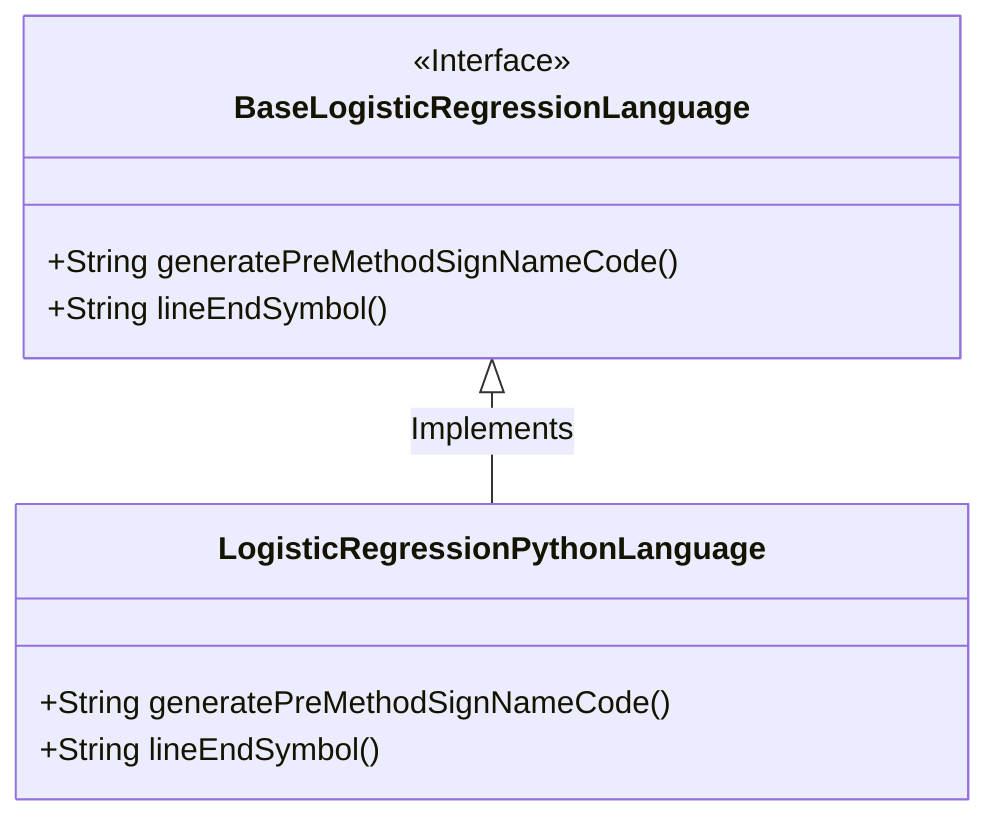
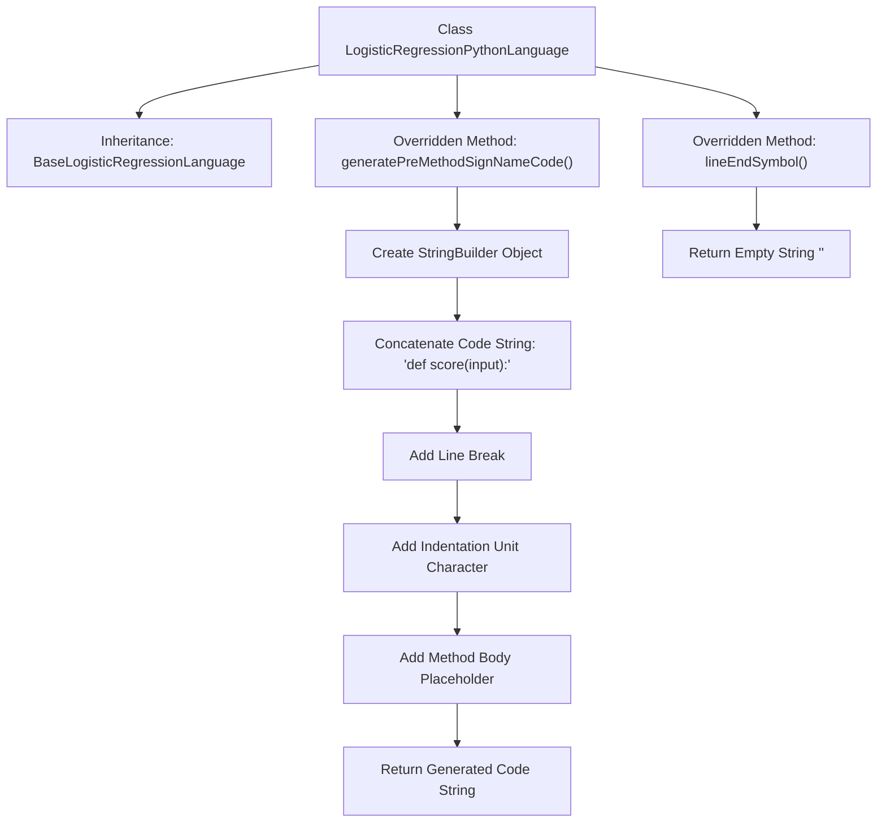

# Basic Information

|      |      |
|------|------|
| Name | LogisticRegressionPythonLanguage |
| Language | .java |
| Code Path | WeFe/board/board-service/src/main/java/com/welab/wefe/board/service/service/modelexport/LogisticRegressionPythonLanguage.java |
| Package Name | com.welab.wefe.board.service.service.modelexport |
| Dependencies | [] |
| Brief Description | The `LogisticRegressionPythonLanguage` class inherits from `BaseLogisticRegressionLanguage`, overrides the methods for generating Python scoring method signatures and line-ending symbols, and returns no line-ending characters. |

# Description

The code defines a class named `LogisticRegressionPythonLanguage`, which inherits from `BaseLogisticRegressionLanguage`. It overrides two methods: the `generatePreMethodSignNameCode` method generates a Python function definition template containing method signatures and placeholders, while the `lineEndSymbol` method returns an empty string indicating Python does not require line terminators. The class focuses on generating Python language-specific code structures for logistic regression.

# Class Summary

| Name   | Type  | Description |
|-------|------|-------------|
| LogisticRegressionPythonLanguage | class | Python logistic regression language class, inherits from the base class, overrides the method signature generation and line ending symbol methods. The method signature returns in Python function definition format, and the line ending symbol returns an empty string. |

## Class LogisticRegressionPythonLanguage

|      |      |
|------|------|
| Access Modifier | public |
| Type | class |
| Name | LogisticRegressionPythonLanguage |
| Description | Python logistic regression language class, inherits from the base class, overrides the method signature generation and line ending symbol methods. The method signature returns in Python function definition format, and the line ending symbol returns an empty string. |

### UML Class Diagram

This class diagram illustrates the structure where the `LogisticRegressionPythonLanguage` class inherits from the `BaseLogisticRegressionLanguage` interface. `BaseLogisticRegressionLanguage` defines two abstract methods: `generatePreMethodSignNameCode()` for generating Python method signature code, and `lineEndSymbol()` which returns the line terminator (an empty string in Python). `LogisticRegressionPythonLanguage` implements these methods, where `generatePreMethodSignNameCode()` constructs a Python function definition template, and `lineEndSymbol()` returns an empty string to comply with Python syntax requirements.

### Internal Method Call Graph

This flowchart illustrates the structure and method invocation relationships of the LogisticRegressionPythonLanguage class. The class inherits from BaseLogisticRegressionLanguage and overrides two methods: generatePreMethodSignNameCode() generates Python method signature code by progressively constructing a string containing method definition, line breaks, indentation, and placeholders using StringBuilder; lineEndSymbol() returns an empty string indicating Python does not require line terminators. The process clearly demonstrates the steps of code generation and string concatenation.

### Field List

| Name  | Type  | Description |
|-------|-------|------|

### Method List

| Name  | Type  | Description |
|-------|-------|------|
| generatePreMethodSignNameCode | String | Generate Python method signature code, including "def score(input):" and a method body placeholder. |
| lineEndSymbol | String | Java method override, returning an empty string as the line terminator. |

