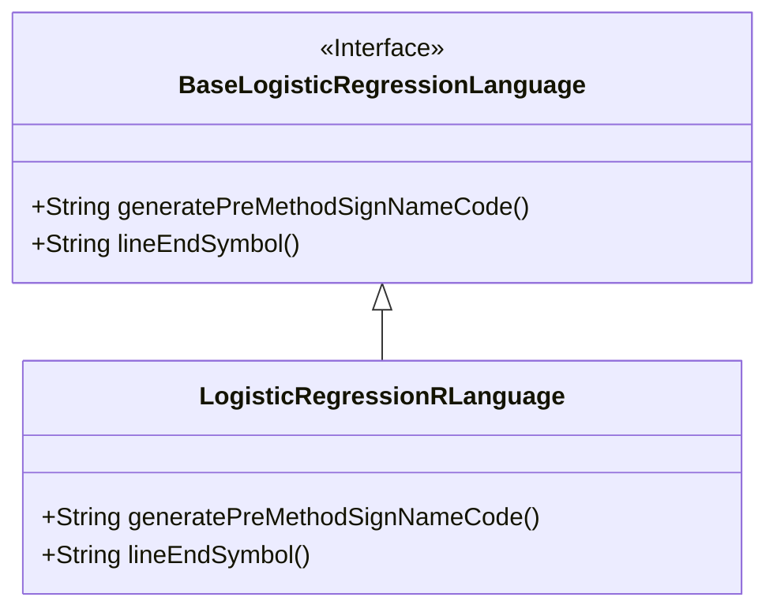
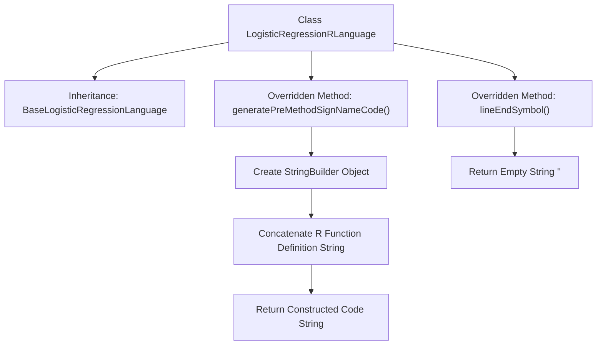

# Basic Information

|      |      |
|------|------|
| Name | LogisticRegressionRLanguage |
| Language | .java |
| Code Path | WeFe/board/board-service/src/main/java/com/welab/wefe/board/service/service/modelexport/LogisticRegressionRLanguage.java |
| Package Name | com.welab.wefe.board.service.service.modelexport |
| Dependencies | [] |
| Brief Description | The `LogisticRegressionRLanguage` class inherits from `BaseLogisticRegressionLanguage` and overrides the method for generating R language scoring function templates, with indented function body placeholders and no line-ending symbols. |

# Description

The code defines a class named `LogisticRegressionRLanguage`, which inherits from `BaseLogisticRegressionLanguage`. It overrides two methods: the `generatePreMethodSignNameCode` method generates the basic structure of an R language scoring function, including function definition and placeholders; the `lineEndSymbol` method returns an empty string indicating that R language does not require line terminators. The class focuses on generating R language code templates for logistic regression models.

# Class Summary

| Name   | Type  | Description |
|-------|------|-------------|
| LogisticRegressionRLanguage | class | The Java class `LogisticRegressionRLanguage` extends `BaseLogisticRegressionLanguage`, overriding the method for generating R language scoring function templates, and returns a code string containing placeholders with no symbols at line endings. |

## Class LogisticRegressionRLanguage

|      |      |
|------|------|
| Access Modifier | public |
| Type | class |
| Name | LogisticRegressionRLanguage |
| Description | The Java class `LogisticRegressionRLanguage` extends `BaseLogisticRegressionLanguage`, overriding the method for generating R language scoring function templates, and returns a code string containing placeholders with no symbols at line endings. |

### UML Class Diagram

This class diagram illustrates the structure where the `LogisticRegressionRLanguage` class inherits from the `BaseLogisticRegressionLanguage` interface. `BaseLogisticRegressionLanguage` is an interface that defines two abstract methods: `generatePreMethodSignNameCode()` for generating method signature code, and `lineEndSymbol()` for returning the line-ending symbol. As an implementation class, `LogisticRegressionRLanguage` overrides these two methods. Specifically, `generatePreMethodSignNameCode()` uses `StringBuilder` to construct an R-language formatted method definition template, while `lineEndSymbol()` returns an empty string, indicating that R language does not require explicit line terminators.

### Internal Method Call Graph

This flowchart illustrates the structure of the LogisticRegressionRLanguage class, highlighting the execution flow of two overridden methods. The generatePreMethodSignNameCode() method constructs an R language function definition template by progressively concatenating code strings via StringBuilder, while the lineEndSymbol() method returns an empty string to indicate that R language does not require line terminators. The entire process demonstrates the core logic of the R code generator, where language-specific syntax rule adaptation is achieved through method overriding.

### Field List

| Name  | Type  | Description |
|-------|-------|------|

### Method List

| Name  | Type  | Description |
|-------|-------|------|
| lineEndSymbol | String | Method override, returning an empty string as the line terminator. |
| generatePreMethodSignNameCode | String | Generate an R language scoring function framework, including placeholders and method structures. |

