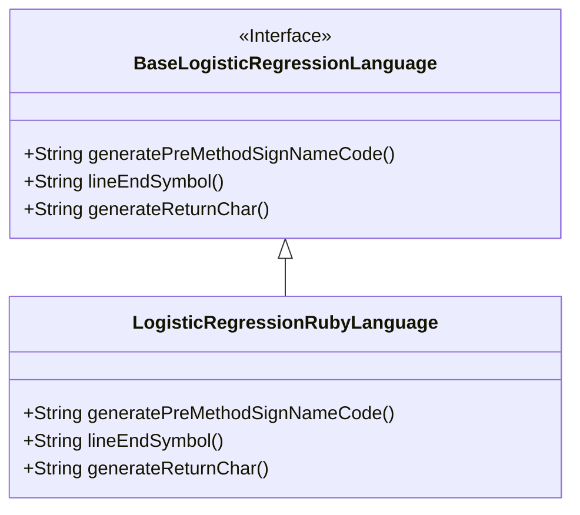
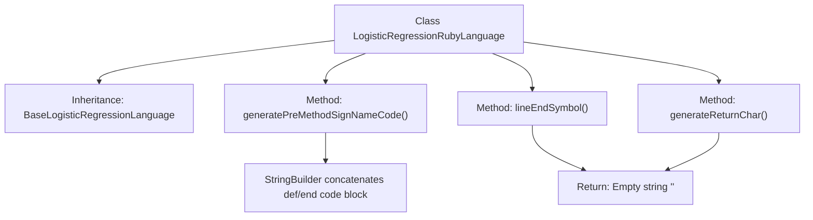

# Basic Information

|      |      |
|------|------|
| Name | LogisticRegressionRubyLanguage |
| Language | .java |
| Code Path | WeFe/board/board-service/src/main/java/com/welab/wefe/board/service/service/modelexport/LogisticRegressionRubyLanguage.java |
| Package Name | com.welab.wefe.board.service.service.modelexport |
| Dependencies | [] |
| Brief Description | The `LogisticRegressionRubyLanguage` class inherits from `BaseLogisticRegressionLanguage`, overriding the generation of Ruby method signature code with no line endings or return symbols. |

# Description

The code defines a class named `LogisticRegressionRubyLanguage`, which inherits from `BaseLogisticRegressionLanguage`. It overrides three methods: `generatePreMethodSignNameCode` generates a Ruby method signature template containing `def score(input)` and `end` structures; `lineEndSymbol` returns an empty string indicating Ruby does not require line terminators; and `generateReturnChar` also returns an empty string, demonstrating that Ruby methods implicitly return the value of the last expression. Overall, it implements customized code generation functionality for logistic regression models in the Ruby language.

# Class Summary

| Name   | Type  | Description |
|-------|------|-------------|
| LogisticRegressionRubyLanguage | class | The `LogisticRegressionRubyLanguage` class inherits from `BaseLogisticRegressionLanguage` and overrides the method for generating Ruby method signature code, without adding line-ending symbols or return characters. |

## Class LogisticRegressionRubyLanguage

|      |      |
|------|------|
| Access Modifier | public |
| Type | class |
| Name | LogisticRegressionRubyLanguage |
| Description | The `LogisticRegressionRubyLanguage` class inherits from `BaseLogisticRegressionLanguage` and overrides the method for generating Ruby method signature code, without adding line-ending symbols or return characters. |

### UML Class Diagram

This code demonstrates an inheritance relationship where the `LogisticRegressionRubyLanguage` class implements the `BaseLogisticRegressionLanguage` interface. The subclass overrides three methods: `generatePreMethodSignNameCode()` generates method signature code in Ruby, `lineEndSymbol()` returns an empty string indicating Ruby does not require line terminators, and `generateReturnChar()` also returns an empty string reflecting Ruby's implicit return feature. The class diagram clearly illustrates this interface implementation relationship.

### Internal Method Call Graph

This flowchart illustrates the inheritance relationship and method structure of the LogisticRegressionRubyLanguage class. The class inherits from BaseLogisticRegressionLanguage and primarily implements three methods: generatePreMethodSignNameCode() for generating Ruby language method signature templates, while both lineEndSymbol() and generateReturnChar() return empty strings. The core method constructs Ruby method definition code blocks with placeholders using StringBuilder, demonstrating adaptation to Ruby syntax features.

### Field List

| Name  | Type  | Description |
|-------|-------|------|

### Method List

| Name  | Type  | Description |
|-------|-------|------|
| lineEndSymbol | String | This method overrides the parent class method, returning an empty string as the line terminator. |
| generatePreMethodSignNameCode | String | Generate Python method framework code, including method definition, placeholder, and method end marker. |
| generateReturnChar | String | Rewrite the method generateReturnChar to return an empty string. |

