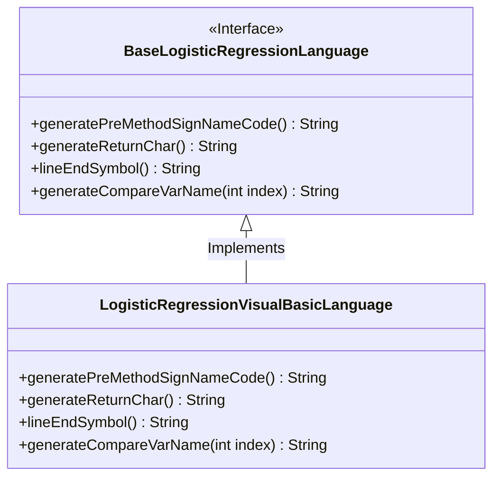
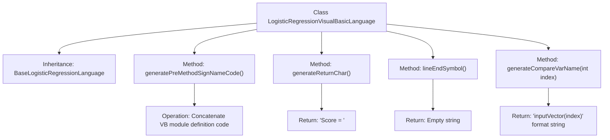

# Basic Information

|      |      |
|------|------|
| Name | LogisticRegressionVisualBasicLanguage |
| Language | .java |
| Code Path | WeFe/board/board-service/src/main/java/com/welab/wefe/board/service/service/modelexport/LogisticRegressionVisualBasicLanguage.java |
| Package Name | com.welab.wefe.board.service.service.modelexport |
| Dependencies | [] |
| Brief Description | The `LogisticRegressionVisualBasicLanguage` class inherits from `BaseLogisticRegressionLanguage`, overriding the method for generating VB code, including the method signature, return statements, and variable comparison formats. |

# Description

The code defines a `LogisticRegressionVisualBasicLanguage` class that inherits from `BaseLogisticRegressionLanguage`, designed to generate logistic regression model code in Visual Basic language format. It overrides several parent class methods: the `generatePreMethodSignNameCode` method constructs the VB module and function signature framework; the `generateReturnChar` method returns the VB-specific assignment statement prefix; the `lineEndSymbol` method returns an empty string indicating VB doesn't require line terminators; and the `generateCompareVarName` method generates VB-style array index access syntax. Together, these methods implement the functionality of converting logistic regression models into VB code.

# Class Summary

| Name   | Type  | Description |
|-------|------|-------------|
| LogisticRegressionVisualBasicLanguage | class | The `LogisticRegressionVisualBasicLanguage` class inherits from `BaseLogisticRegressionLanguage` and is used to generate VB code, including module definitions, function signatures, return statements, and variable comparison formats. |

## Class LogisticRegressionVisualBasicLanguage

|      |      |
|------|------|
| Access Modifier | public |
| Type | class |
| Name | LogisticRegressionVisualBasicLanguage |
| Description | The `LogisticRegressionVisualBasicLanguage` class inherits from `BaseLogisticRegressionLanguage` and is used to generate VB code, including module definitions, function signatures, return statements, and variable comparison formats. |

### UML Class Diagram

This code demonstrates a `LogisticRegressionVisualBasicLanguage` class that inherits from the base class `BaseLogisticRegressionLanguage`, primarily used to generate logistic regression model code in Visual Basic language format. The class diagram clearly illustrates the relationship between the interface and its implementing class. Here, `BaseLogisticRegressionLanguage` serves as an interface defining four abstract methods, while `LogisticRegressionVisualBasicLanguage` concretely implements these methods to handle VB-specific code generation logic, such as method signatures, return value formats, and variable naming.

### Internal Method Call Graph

This flowchart illustrates the core structure of a Visual Basic language logistic regression code generator. The class inherits from BaseLogisticRegressionLanguage and primarily implements four key methods: generatePreMethodSignNameCode() generates VB module definition templates, generateReturnChar() returns VB-specific assignment syntax, lineEndSymbol() returns an empty line terminator, and generateCompareVarName() produces indexed array access syntax. Each method precisely corresponds to specific syntax rules of the VB language, collectively enabling the conversion from a generic logistic regression model to VB code.

### Field List

| Name  | Type  | Description |
|-------|-------|------|

### Method List

| Name  | Type  | Description |
|-------|-------|------|
| generateReturnChar | String | This method overrides the parent class method and returns the string "Score = ". |
| generatePreMethodSignNameCode | String | Generate predefined method signature code, including module declaration, function definition, and placeholders, returning the complete string. |
| lineEndSymbol | String | Method override, returning an empty string as the line terminator. |
| generateCompareVarName | String | Generate a method to compare variable names, returning the format "inputVector(index)". |

