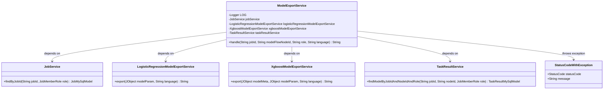

# Basic Information

|      |      |
|------|------|
| Name | ModelExportService |
| Language | .java |
| Code Path | WeFe/board/board-service/src/main/java/com/welab/wefe/board/service/service/modelexport/ModelExportService.java |
| Package Name | com.welab.wefe.board.service.service.modelexport |
| Dependencies | ['com.welab.wefe.board.service.database.entity.job.JobMySqlModel', 'com.welab.wefe.board.service.database.entity.job.TaskResultMySqlModel', 'com.welab.wefe.board.service.service.JobService', 'com.welab.wefe.board.service.service.TaskResultService', 'com.welab.wefe.common.StatusCode', 'com.welab.wefe.common.exception.StatusCodeWithException', 'com.welab.wefe.common.util.JObject', 'com.welab.wefe.common.wefe.enums.ComponentType', 'com.welab.wefe.common.wefe.enums.FederatedLearningType', 'com.welab.wefe.common.wefe.enums.JobMemberRole', 'com.welab.wefe.common.wefe.enums.ModelExportLanguage', 'org.slf4j.Logger', 'org.slf4j.LoggerFactory', 'org.springframework.beans.factory.annotation.Autowired', 'org.springframework.stereotype.Service'] |
| Brief Description | The ModelExportService handles model export, supports horizontal federated learning, invokes different model export services based on task ID, node ID, and language parameters, and logs errors and throws exceptions when anomalies occur. |

# Description

The ModelExportService is a Spring service class responsible for handling model export requests. It depends on JobService, LogisticRegressionModelExportService, XgboostModelExportService, and TaskResultService. The primary method, `handle`, accepts parameters such as task ID, model node ID, role, and language. After validating the parameter legality, it invokes the corresponding model export service based on the task type and component type. During processing, it checks whether the task exists, supports horizontal export, and retrieves model parameters. If an exception occurs, it logs the error and throws a status code exception. Finally, it returns the export result string.

# Class Summary

| Name   | Type  | Description |
|-------|------|-------------|
| ModelExportService | class | The ModelExportService handles model export, supporting horizontal federated learning. It invokes different model export services (logistic regression or XGBoost) based on task ID, node ID, and language parameters, then returns results after validating the parameters. It logs errors and throws exceptions when anomalies occur. |

## Class ModelExportService

|      |      |
|------|------|
| Access Modifier | @Service;public |
| Type | class |
| Name | ModelExportService |
| Description | The ModelExportService handles model export, supporting horizontal federated learning. It invokes different model export services (logistic regression or XGBoost) based on task ID, node ID, and language parameters, then returns results after validating the parameters. It logs errors and throws exceptions when anomalies occur. |

### UML Class Diagram

This code illustrates a model export service `ModelExportService`, which handles various types of model export requests by relying on multiple services (`JobService`, `LogisticRegressionModelExportService`, `XgboostModelExportService`, and `TaskResultService`). The main method `handle` is responsible for validating parameters, checking task status, and invoking the corresponding export service based on the model type. The exception handling mechanism is robust, capable of capturing and logging different types of errors. The class diagram clearly depicts the dependency relationships between services and the exception handling path.

### Internal Method Call Graph

This flowchart depicts the complete model export process handled by ModelExportService. It first validates the language parameter, then retrieves task information and checks whether the federated learning type is horizontal. Subsequently, it queries model result data and routes to different model export services (logistic regression or XGBoost) based on component type. The entire process incorporates multi-layer validation and exception handling to ensure export operation reliability and security. The flowchart clearly illustrates the relationship between main workflow and exception branches, as well as the invocation sequence among services.

### Field List

| Name  | Type  | Description |
|-------|-------|------|
| jobService | JobService | Using @Autowired to automatically inject an instance of JobService. |
| logisticRegressionModelExportService | LogisticRegressionModelExportService | Using @Autowired to automatically inject the logistic regression model export service instance. |
| LOG = LoggerFactory.getLogger(this.getClass()) | Logger | A protected final log object LOG is defined in the class for recording log information of the current class. |
| taskResultService | TaskResultService | Automatically inject the TaskResultService service instance. |
| xgboostModelExportService | XgboostModelExportService | Automatically inject Xgboost model export service instance. |

### Method List

| Name  | Type  | Description |
|-------|-------|------|
| handle | String | This method processes model export requests, validates parameters, tasks, and model information, supports horizontal federated learning, invokes different export services based on component types, and captures exceptions while logging them. |

