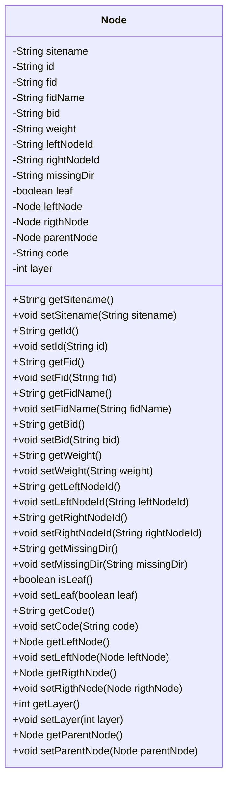

# Basic Information

|      |      |
|------|------|
| Name | Node |
| Language | .java |
| Code Path | WeFe/board/board-service/src/main/java/com/welab/wefe/board/service/service/modelexport/Node.java |
| Package Name | com.welab.wefe.board.service.service.modelexport |
| Dependencies | [] |
| Brief Description | The Node class represents a tree node, containing attributes such as site name, ID, parent/child node IDs, weight, left/right child nodes, parent node, hierarchy level, code, etc., and provides getter and setter methods. |

# Description

The Node class is a data structure representing a tree node, containing multiple attributes to describe node information. Key attributes include the site name `sitename`, node identifier `id`, parent node identifier `fid`, parent node name `fidName`, branch identifier `bid`, weight `weight`, left and right child node identifiers `leftNodeId` and `rightNodeId`, missing direction `missingDir`, and whether it is a leaf node `leaf`. The class also includes references to left and right child nodes `leftNode` and `rightNode`, as well as the parent node `parentNode`. Other attributes include `code` and `layer`. Each attribute has corresponding getter and setter methods for access and modification.

# Class Summary

| Name   | Type  | Description |
|-------|------|-------------|
| Node | class | The Node class represents a tree node, containing attributes such as site name, ID, parent-child node information, weight, hierarchy level, etc., and provides getter and setter methods. |

## Class Node

|      |      |
|------|------|
| Access Modifier | public |
| Type | class |
| Name | Node |
| Description | The Node class represents a tree node, containing attributes such as site name, ID, parent-child node information, weight, hierarchy level, etc., and provides getter and setter methods. |

### UML Class Diagram

This code defines a class named `Node` representing a node in a tree structure. The class contains multiple private attributes such as node ID, parent node ID, left/right child node IDs, weight, layer, etc., along with corresponding getter and setter methods. Notably, the class implements self-referencing through the `leftNode`, `rigthNode`, and `parentNode` attributes, indicating that nodes can form a tree structure. Additionally, the `leaf` attribute identifies whether the current node is a leaf node, while the `code` and `layer` attributes may store the node's encoding and hierarchical information. The overall design is suitable for constructing and managing tree data structures.

### Internal Method Call Graph

```mermaid
graph TD
    A["Class Node"]
    B["Attribute: String sitename"]
    C["Attribute: String id"]
    D["Attribute: String fid"]
    E["Attribute: String fidName"]
    F["Attribute: String bid"]
    G["Attribute: String weight"]
    H["Attribute: String leftNodeId"]
    I["Attribute: String rightNodeId"]
    J["Attribute: String missingDir"]
    K["Attribute: boolean leaf"]
    L["Attribute: Node leftNode"]
    M["Attribute: Node rigthNode"]
    N["Attribute: Node parentNode"]
    O["Attribute: String code"]
    P["Attribute: int layer"]

    Q["Method: getSitename/setSitename"]
    R["Method: getId/setId"]
    S["Method: getFid/setFid"]
    T["Method: getFidName/setFidName"]
    U["Method: getBid/setBid"]
    V["Method: getWeight/setWeight"]
    W["Method: getLeftNodeId/setLeftNodeId"]
    X["Method: getRightNodeId/setRightNodeId"]
    Y["Method: getMissingDir/setMissingDir"]
    Z["Method: isLeaf/setLeaf"]
    AA["Method: getCode/setCode"]
    AB["Method: getLeftNode/setLeftNode"]
    AC["Method: getRigthNode/setRigthNode"]
    AD["Method: getLayer/setLayer"]
    AE["Method: getParentNode/setParentNode"]

    A --> B
    A --> C
    A --> D
    A --> E
    A --> F
    A --> G
    A --> H
    A --> I
    A --> J
    A --> K
    A --> L
    A --> M
    A --> N
    A --> O
    A --> P

    A --> Q
    A --> R
    A --> S
    A --> T
    A --> U
    A --> V
    A --> W
    A --> X
    A --> Y
    A --> Z
    A --> AA
    A --> AB
    A --> AC
    A --> AD
    A --> AE
```

This flowchart illustrates the complete structure of the Node class, containing 15 private attributes and 28 getter/setter methods. The attributes cover node identification information (id/fid/bid), tree structure relationships (leftNode/rightNode/parentNode), and business fields (weight/code/layer). All methods are implemented according to the standard JavaBean specification for encapsulating attribute access and modification. The diagram clearly shows the hierarchical relationship between class members and methods, without including any business logic processing flows.

### Field List

| Name  | Type  | Description |
|-------|-------|------|
| rigthNode | Node | Private node type variable `rightNode`. |
| bid | String | Private string type variable bid. |
| id | String | private string variable id |
| code | String | Private string variable code. |
| missingDir | String | The private string variable missingDir is used to store missing directory information. |
| rightNodeId | String | The private string variable rightNodeId is used to store the right node ID. |
| leftNodeId | String | The private string-type variable leftNodeId is used to store the left node ID. |
| layer | int | Private integer variable layer. |
| sitename | String | The private string variable `sitename` is used to store the site name. |
| weight | String | Declared a private string variable weight. |
| fid | String | Private string type variable fid. |
| leaf | boolean | The boolean variable leaf indicates whether it is a leaf node. |
| fidName | String | Private string type variable named fidName. |
| leftNode | Node | Private left node variable. |
| parentNode | Node | Private parent node variables. |

### Method List

| Name  | Type  | Description |
|-------|-------|------|
| getFidName | String | This is a Java method that returns the value of the member variable fidName of type String. |
| getRigthNode | Node | The method to get the right node, returns the right node object. |
| getMissingDir | String | Method to obtain the missing directory path, returns a string variable `missingDir`. |
| getFid | String | This is a Java method that returns the value of the member variable fid of type String. |
| setSitename | void | The method to set the site name involves assigning the parameter `sitename` to the class member variable `sitename`. |
| getBid | String | Methods to obtain the bid string value. |
| setFid | void | Method to set the fid attribute of an object, with the parameter being a string fid. |
| setLayer | void | The method to set layer hierarchy is to assign the input parameter to the object's layer property. |
| setWeight | void | This is a Java method used to set the weight property of an object. It accepts a string parameter 'weight' and assigns it to the 'weight' field of the current object. |
| getLayer | int | Methods to obtain the current level value, returns an integer-type variable `layer`. |
| setParentNode | void | Set the parent node of the current node to the specified node. |
| setFidName | void | Set the value of the member variable fidName. |
| getLeftNodeId | String | Method to obtain the left node ID, with the return value being leftNodeId. |
| setRigthNode | void | Set the right child node of the current node to the specified node. |
| isLeaf | boolean | This is a method to determine whether a node is a leaf node, returning a boolean value `leaf`. |
| getParentNode | Node | Get the parent node of the current node. |
| getCode | String | This is a Java method that returns the value of the string variable `code`. |
| setBid | void | This is a Java method used to set the bid property value of an object. The method takes a string parameter bid and assigns it to the bid member variable of the object. |
| setCode | void | This is a Java method used to set the value of the code attribute in a class. The method takes a string parameter code and assigns it to the member variable this.code of the class. |
| getLeftNode | Node | Method to obtain the left node, returns a leftNode object. |
| getSitename | String | This is a Java method that returns the string-type sitename property value. |
| setMissingDir | void | The method to set the missing directory path assigns the input parameter to the class variable `missingDir`. |
| setRightNodeId | void | The method to set the right node ID, with the parameter as rightNodeId, assigns it to the class member variable of the same name. |
| setLeftNodeId | void | Method to set the left node ID, with the parameter being a string leftNodeId. |
| setId | void | Methods for setting the object ID, assigning the passed string parameter to the object's id property. |
| setLeaf | void | Method to set whether a node is a leaf node. |
| getWeight | String | Public method to obtain the weight value. |
| setLeftNode | void | Method for setting the left node, which assigns the parameter leftNode to the leftNode property of the current object. |
| getRightNodeId | String | Method to obtain the right node ID, returns the rightNodeId string. |
| getId | String | The method getId returns a string-type id value. |

