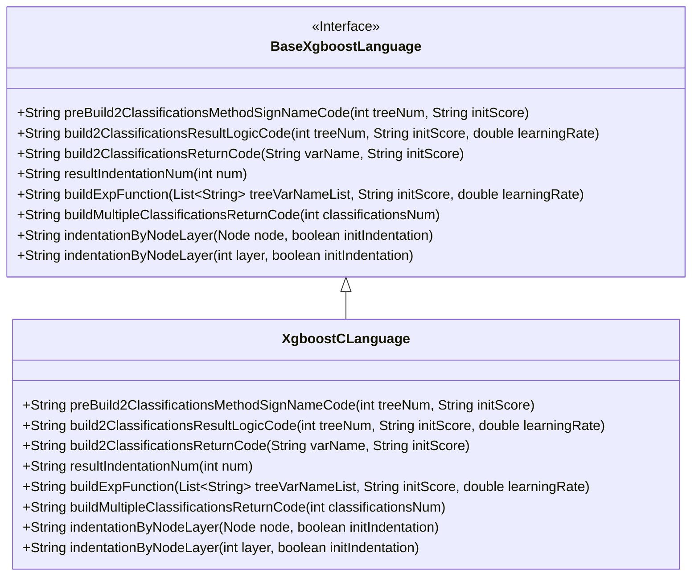
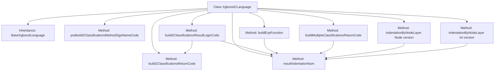

# Basic Information

|      |      |
|------|------|
| Name | XgboostCLanguage |
| Language | .java |
| Code Path | WeFe/board/board-service/src/main/java/com/welab/wefe/board/service/service/modelexport/XgboostCLanguage.java |
| Package Name | com.welab.wefe.board.service.service.modelexport |
| Dependencies | ['java.util.List'] |
| Brief Description | The XgboostCLanguage class inherits from BaseXgboostLanguage and implements C language code generation, including classification method signatures, result logic, and return codes, supporting both binary classification and multi-class classification. |

# Description

The code defines a class named `XgboostCLanguage`, which inherits from `BaseXgboostLanguage`. Its primary function is to generate C language code for XGBoost model prediction. The class contains multiple methods for constructing different parts of the C code: `preBuild2ClassificationsMethodSignNameCode` generates method signatures and header file inclusions; `build2ClassificationsResultLogicCode` constructs binary classification logic computation code; `build2ClassificationsReturnCode` generates binary classification result return code; `buildExpFunction` creates an exponential calculation expression; and `buildMultipleClassificationsReturnCode` handles multi-classification result returns. All methods generate C language syntax-compliant code snippets through string concatenation and address formatting issues such as code indentation.

# Class Summary

| Name   | Type  | Description |
|-------|------|-------------|
| XgboostCLanguage | class | The XgboostCLanguage class inherits from BaseXgboostLanguage and implements C language code generation, including binary classification and multi-class logic, involving preprocessing, result computation, and return code construction. |

## Class XgboostCLanguage

|      |      |
|------|------|
| Access Modifier | public |
| Type | class |
| Name | XgboostCLanguage |
| Description | The XgboostCLanguage class inherits from BaseXgboostLanguage and implements C language code generation, including binary classification and multi-class logic, involving preprocessing, result computation, and return code construction. |

### UML Class Diagram

This code demonstrates an XgboostCLanguage class inheriting from the BaseXgboostLanguage interface, primarily used for generating C language prediction code for XGBoost models. XgboostCLanguage implements several key methods, including constructing classification method signatures, result logic codes, return codes, etc., with a particular focus on binary classification scenarios. It generates C language code fragments through string concatenation, involving mathematical calculations, memory copying operations, and ultimately outputs probability prediction results. The class diagram clearly illustrates this inheritance relationship and interface implementation.

### Internal Method Call Graph

This code represents the implementation class of the XGBoost model in a C language environment, primarily handling code generation logic for binary and multi-class classification problems. The class inherits from BaseXgboostLanguage, with core functionalities including generating C language method signatures, constructing classification result computation logic, and returning result code. There are multi-layer calling relationships between methods, such as build2ClassificationsResultLogicCode calling build2ClassificationsReturnCode and resultIndentationNum, reflecting the modular design philosophy of the code generator.

### Field List

| Name  | Type  | Description |
|-------|-------|------|

### Method List

| Name  | Type  | Description |
|-------|-------|------|
| buildMultipleClassificationsReturnCode | String | Generate Java method for multi-class classification return code, using memcpy to copy double array to output, with array size determined by classificationsNum. |
| build2ClassificationsResultLogicCode | String | Generate binary classification logic code, calculate variable s1 as the result of the sigmoid function, including tree model summation and return logic. |
| build2ClassificationsReturnCode | String | Generate a code snippet that copies the variable varName and 1-varName into the output array, with a length of 2 double-type sizes. |
| preBuild2ClassificationsMethodSignNameCode | String | This method generates a C language function framework, including header files for math and string libraries. It defines a function named `score` that takes input and output arrays, with the function body represented by the placeholder `METHOD_BODY_PLACEHOLDER`. |
| buildExpFunction | String | This method generates an exponential function expression, calculating the negative exponential value of zero minus the sum of the tree variable list, incorporating initial score and learning rate parameters. |
| resultIndentationNum | String | Rewrite the method, fix the indentation level to 1, and call the parent class implementation. |
| indentationByNodeLayer | String | Rewrite the method, calling the parent class method to handle node hierarchy indentation, ignoring the initial indentation parameter. |
| indentationByNodeLayer | String | Rewrite the method to call the parent class method for generating the indentation string, ignoring the `initIndentation` parameter and always passing `false`. |

