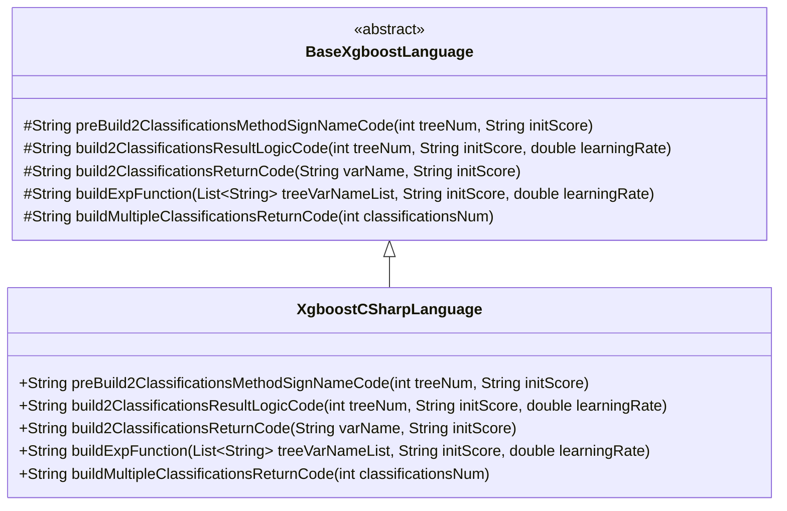
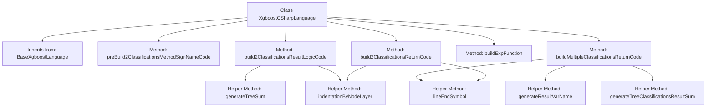

# Basic Information

|      |      |
|------|------|
| Name | XgboostCSharpLanguage |
| Language | .java |
| Code Path | WeFe/board/board-service/src/main/java/com/welab/wefe/board/service/service/modelexport/XgboostCSharpLanguage.java |
| Package Name | com.welab.wefe.board.service.service.modelexport |
| Dependencies | ['java.util.List'] |
| Brief Description | The XgboostCSharpLanguage class inherits from BaseXgboostLanguage and implements C# code generation logic, including the construction of scoring methods for binary classification and multi-class classification, as well as the computation and return logic of results. |

# Description

The content describes a class named XgboostCSharpLanguage, which inherits from BaseXgboostLanguage and is primarily used to generate C# code for implementing classification functionality with XGBoost models. The class contains multiple methods for constructing classification method signatures, result logic, return code, and exponential functions. These methods generate C# code by concatenating strings, including namespace definitions, class definitions, method implementations, and mathematical computation logic. It specifically addresses binary and multiclass classification scenarios, covering variable definitions, tree summation, probability calculation, and result return details. All methods return concatenated code strings and do not include actual execution logic.

# Class Summary

| Name   | Type  | Description |
|-------|------|-------------|
| XgboostCSharpLanguage | class | The XgboostCSharpLanguage class inherits from BaseXgboostLanguage and implements C# code generation logic, including constructing classification method signatures, result calculation logic, and return code, supporting both binary and multiclass classification scenarios. |

## Class XgboostCSharpLanguage

|      |      |
|------|------|
| Access Modifier | public |
| Type | class |
| Name | XgboostCSharpLanguage |
| Description | The XgboostCSharpLanguage class inherits from BaseXgboostLanguage and implements C# code generation logic, including constructing classification method signatures, result calculation logic, and return code, supporting both binary and multiclass classification scenarios. |

### UML Class Diagram

Class Diagram Description:
This diagram illustrates the hierarchical relationship where the XgboostCSharpLanguage class inherits from the abstract base class BaseXgboostLanguage. The base class defines five protected abstract methods related to code generation logic for XGBoost models in binary and multiclass classification scenarios. The derived class XgboostCSharpLanguage concretely implements these methods, specifically designed for generating XGBoost prediction code in C# language, including method signature construction, classification result calculation logic, return statement generation, and exponential function construction. The arrow direction indicates the inheritance relationship from the child class to the parent class.

### Internal Method Call Graph

This flowchart illustrates the structure of the XgboostCSharpLanguage class and its method invocation relationships. The class inherits from BaseXgboostLanguage and primarily includes 5 core methods: preBuild2ClassificationsMethodSignNameCode for generating method signature templates, build2ClassificationsResultLogicCode for constructing binary classification logic, build2ClassificationsReturnCode for generating return code, buildExpFunction for building exponential calculation expressions, and buildMultipleClassificationsReturnCode for handling multi-classification return results. The methods achieve code reuse through helper functions such as generateTreeSum and indentationByNodeLayer, collectively forming a complete XGBoost model code generator.

### Field List

| Name  | Type  | Description |
|-------|-------|------|

### Method List

| Name  | Type  | Description |
|-------|-------|------|
| preBuild2ClassificationsMethodSignNameCode | String | Generate a C# code template containing the namespace ML, static class Model, and the Score method framework, with placeholder for the method body. |
| buildMultipleClassificationsReturnCode | String | This method generates a code string that returns multi-classification results, including the number of classifications, variable names, and normalization calculations, with each result separated by commas. |
| build2ClassificationsReturnCode | String | This method generates a code string that returns a double-precision array containing the value of one minus the variable and the variable value itself, used for binary classification results. |
| build2ClassificationsResultLogicCode | String | This method generates binary logistic regression code, calculates probability values, and returns the results. It uses the variable s1 to store the output of the sigmoid function and computes the input value through summation in a tree model. |
| buildExpFunction | String | This method generates an exponential function expression for calculating the weighted sum of tree variables and taking the negative exponent. The inputs are a list of variable names, initial scores, and learning rates, and the output is a string in the form of "Exp(0 - (summation result))". |

