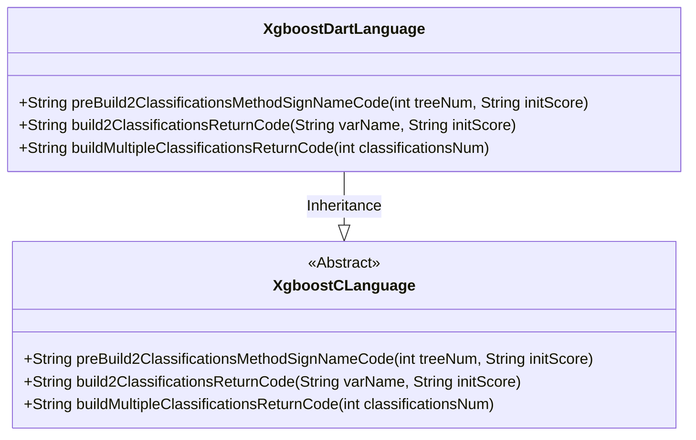
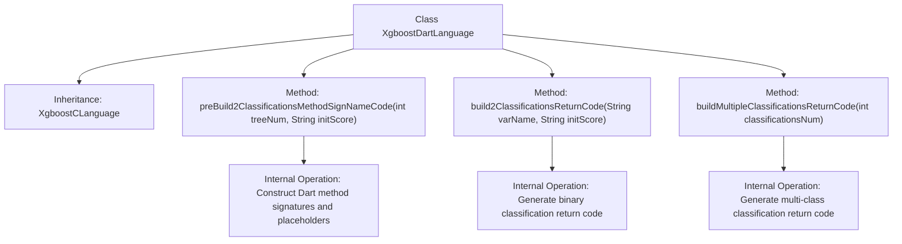

# Basic Information

|      |      |
|------|------|
| Name | XgboostDartLanguage |
| Language | .java |
| Code Path | WeFe/board/board-service/src/main/java/com/welab/wefe/board/service/service/modelexport/XgboostDartLanguage.java |
| Package Name | com.welab.wefe.board.service.service.modelexport |
| Dependencies | [] |
| Brief Description | XgboostDartLanguage inherits from XgboostCLanguage and overrides three methods: generating the Dart scoring method signature, binary classification return code, and multiclass classification return code. |

# Description

The code defines a class named XgboostDartLanguage, which inherits from XgboostCLanguage. It overrides three methods for generating Dart language code: the preBuild2ClassificationsMethodSignNameCode method constructs the scoring function framework, including import statements and method signatures; the build2ClassificationsReturnCode method generates return code for binary classification results; and the buildMultipleClassificationsReturnCode method builds return code for multi-classification results. These methods generate Dart code in specific formats through string concatenation, used for output processing of machine learning model prediction results.

# Class Summary

| Name   | Type  | Description |
|-------|------|-------------|
| XgboostDartLanguage | class | XgboostDartLanguage inherits from XgboostCLanguage and overrides three methods: generating the Dart classification scoring method signature, binary classification return code, and multiclass classification return code. |

## Class XgboostDartLanguage

|      |      |
|------|------|
| Access Modifier | public |
| Type | class |
| Name | XgboostDartLanguage |
| Description | XgboostDartLanguage inherits from XgboostCLanguage and overrides three methods: generating the Dart classification scoring method signature, binary classification return code, and multiclass classification return code. |

### UML Class Diagram

This class diagram illustrates the inheritance relationship where XgboostDartLanguage extends the abstract class XgboostCLanguage. XgboostDartLanguage implements three core methods: preBuild2ClassificationsMethodSignNameCode for generating Dart language method signatures and initialization code, build2ClassificationsReturnCode for constructing binary classification return statements, and buildMultipleClassificationsReturnCode for handling multi-classification outputs. All methods involve string concatenation and formatting, specifically designed for generating XGBoost prediction code in Dart language.

### Internal Method Call Graph

This flowchart illustrates the inheritance relationship and method structure of the XgboostDartLanguage class. The class inherits from XgboostCLanguage and contains three core methods: preBuild2ClassificationsMethodSignNameCode for constructing Dart method signatures and placeholders, build2ClassificationsReturnCode for generating binary classification probability return code, and buildMultipleClassificationsReturnCode for handling multi-class scenarios. Each method has specific string construction logic internally, ultimately generating XGBoost model inference code compliant with Dart language specifications.

### Field List

| Name  | Type  | Description |
|-------|-------|------|

### Method List

| Name  | Type  | Description |
|-------|-------|------|
| preBuild2ClassificationsMethodSignNameCode | String | Generate Dart method code skeleton, including importing the math library and defining the score method, with placeholder for the method body. |
| build2ClassificationsReturnCode | String | The method generates code that returns two categories, formatted as "[1 - variable name, variable name]". |
| buildMultipleClassificationsReturnCode | String | This method generates multi-class return code, specifying the number of categories via parameters, and concatenates the returned array-formatted string, including indentation and line breaks. |

