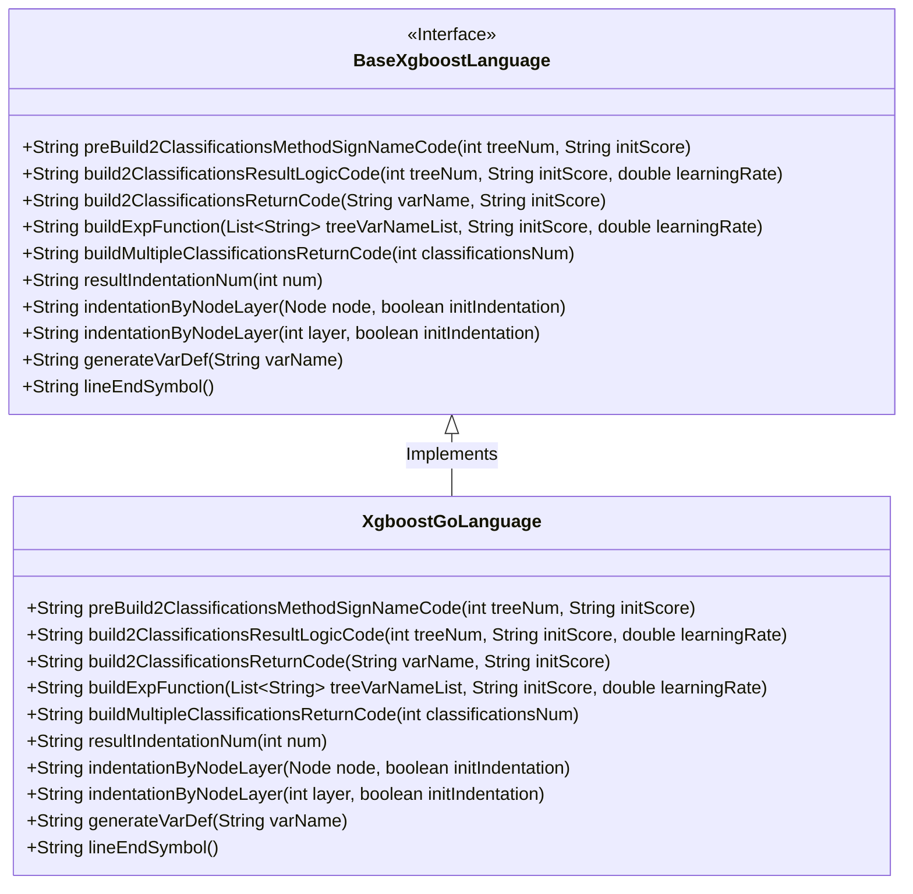
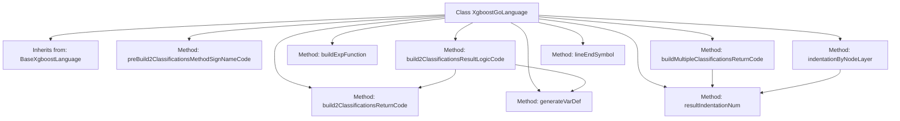

# Basic Information

|      |      |
|------|------|
| Name | XgboostGoLanguage |
| Language | .java |
| Code Path | WeFe/board/board-service/src/main/java/com/welab/wefe/board/service/service/modelexport/XgboostGoLanguage.java |
| Package Name | com.welab.wefe.board.service.service.modelexport |
| Dependencies | ['java.util.List'] |
| Brief Description | The XgboostGoLanguage class inherits from BaseXgboostLanguage and implements XGBoost model code generation for the Go language, including binary and multiclass classification logic, mathematical computations, variable definitions, and formatted output. |

# Description

The code defines a class named `XgboostGoLanguage`, which inherits from `BaseXgboostLanguage` and is primarily used to generate XGBoost model scoring code in the Go language. It includes multiple methods for constructing classification logic, such as preprocessing method signatures, binary classification result calculation logic, return code generation, exponential function construction, and multi-class return code generation. Additionally, it provides helper methods for variable definition, line-ending symbols, and indentation control. All methods focus on generating code strings in Go language format and do not contain actual computation logic.

# Class Summary

| Name   | Type  | Description |
|-------|------|-------------|
| XgboostGoLanguage | class | The XgboostGoLanguage class inherits from BaseXgboostLanguage and implements XGBoost model code generation in the Go language, including classification method signatures, result logic, return code, and mathematical function construction. |

## Class XgboostGoLanguage

|      |      |
|------|------|
| Access Modifier | public |
| Type | class |
| Name | XgboostGoLanguage |
| Description | The XgboostGoLanguage class inherits from BaseXgboostLanguage and implements XGBoost model code generation in the Go language, including classification method signatures, result logic, return code, and mathematical function construction. |

### UML Class Diagram

This code describes an XgboostGoLanguage class that inherits from the BaseXgboostLanguage interface, primarily used for generating prediction code of XGBoost models in the Go language. The class implements multiple methods including building binary and multi-class prediction logic, generating variable definitions, handling code indentation, etc. It specifically focuses on generating Go-specific syntax structures such as math function calls, slice returns, while providing Go-specific implementation details through method overrides.

### Internal Method Call Graph

This code demonstrates an XgboostGoLanguage class that inherits from BaseXgboostLanguage, primarily used for generating XGBoost classification model code implemented in Go. The class contains multiple methods, such as preBuild2ClassificationsMethodSignNameCode for generating method signatures, build2ClassificationsResultLogicCode for constructing classification logic code, and buildExpFunction for generating mathematical expressions. There are invocation relationships between methods, for example, build2ClassificationsResultLogicCode calls build2ClassificationsReturnCode and generateVarDef. The overall structure is clear, focusing on code generation specific to Go language implementation.

### Field List

| Name  | Type  | Description |
|-------|-------|------|

### Method List

| Name  | Type  | Description |
|-------|-------|------|
| build2ClassificationsReturnCode | String | This method generates a code string that returns two classifications, converting the input variable into an array consisting of 1 minus the variable and the variable itself. |
| lineEndSymbol | String | Java method override, returning an empty string as the line terminator. |
| buildMultipleClassificationsReturnCode | String | This method generates multi-class return codes, concatenates the return array format, and includes a specified number of classification results. |
| resultIndentationNum | String | Rewrite the method, fix the indentation level to 1, and call the parent class implementation. |
| buildExpFunction | String | The method generates a mathematical expression string that calculates the value of the exponential function with base e, where the parameter is the negative sum of the tree variable list. |
| build2ClassificationsResultLogicCode | String | This method generates binary classification result logic code, calculates the s1 variable as 1/(1+e^(-(tree summation result))), and returns the classification result. |
| preBuild2ClassificationsMethodSignNameCode | String | This method generates a Go function framework, including the import of the math library and function definition, with a placeholder reserved for the method body, intended for constructing a scoring function for classification models. |
| indentationByNodeLayer | String | Rewrite the method, calling the parent class method to handle node hierarchy indentation while ignoring the initial indentation parameter. |
| indentationByNodeLayer | String | Rewrite the method, call the parent class method to generate the indentation string, ignore the initIndentation parameter, and always pass false. |
| generateVarDef | String | This is a Java method override used to generate Go language variable definition strings in the format "var variableName float64". |

