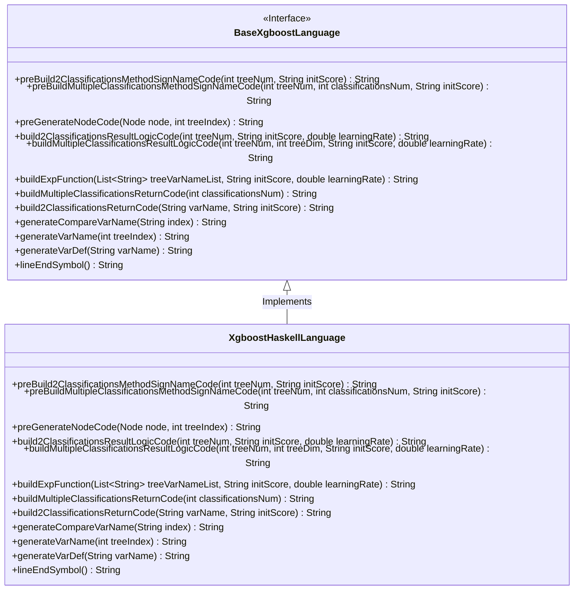

# Basic Information

|      |      |
|------|------|
| Name | XgboostHaskellLanguage |
| Language | .java |
| Code Path | WeFe/board/board-service/src/main/java/com/welab/wefe/board/service/service/modelexport/XgboostHaskellLanguage.java |
| Package Name | com.welab.wefe.board.service.service.modelexport |
| Dependencies | ['java.util.List', 'java.util.Map'] |
| Brief Description | The `XgboostHaskellLanguage` class inherits from `BaseXgboostLanguage` and implements Haskell code generation logic, including classification method signatures, node code generation, and result computation logic. |

# Description

The code defines a class named `XgboostHaskellLanguage`, which inherits from `BaseXgboostLanguage`, and is used to generate XGBoost model code in the Haskell language. Its primary functionalities include method signatures for building binary and multi-class classification models, node code generation, and result logic computation. The code constructs a Haskell module through string concatenation, containing definitions of the `score` function, conditional logic, variable calculations, and result handling. It supports recursive generation of tree structures, variable naming, indentation control, and the construction of mathematical expressions such as the sigmoid function and exponential operations. Overall, it implements the conversion logic from an XGBoost model to Haskell code.

# Class Summary

| Name   | Type  | Description |
|-------|------|-------------|
| XgboostHaskellLanguage | class | The `XgboostHaskellLanguage` class inherits from `BaseXgboostLanguage` and implements Haskell code generation logic, including binary and multiclass method signatures, node code generation, result computation logic, and helper functions. |

## Class XgboostHaskellLanguage

|      |      |
|------|------|
| Access Modifier | public |
| Type | class |
| Name | XgboostHaskellLanguage |
| Description | The `XgboostHaskellLanguage` class inherits from `BaseXgboostLanguage` and implements Haskell code generation logic, including binary and multiclass method signatures, node code generation, result computation logic, and helper functions. |

### UML Class Diagram

This code demonstrates an XgboostHaskellLanguage class that inherits from the BaseXgboostLanguage interface, primarily used for generating XGBoost model code in Haskell. The class implements multiple methods including constructing method signatures for binary and multi-class classification models, node code generation, result logic computation, and return code generation. These methods build Haskell code through string concatenation, supporting the generation of tree models and the implementation of prediction logic. The class diagram clearly shows the inheritance relationship and all public methods, reflecting the core functionality of this class is to generate Haskell language implementations for XGBoost models.

### Internal Method Call Graph

```mermaid
graph TD
    A["Class XgboostHaskellLanguage"]
    B["Inherits from: BaseXgboostLanguage"]
    C["Method: preBuild2ClassificationsMethodSignNameCode"]
    D["Method: preBuildMultipleClassificationsMethodSignNameCode"]
    E["Method: preGenerateNodeCode"]
    F["Method: build2ClassificationsResultLogicCode"]
    G["Method: buildMultipleClassificationsResultLogicCode"]
    H["Method: buildExpFunction"]
    I["Method: buildMultipleClassificationsReturnCode"]
    J["Method: build2ClassificationsReturnCode"]
    K["Method: generateCompareVarName"]
    L["Method: generateVarName"]
    M["Method: generateVarDef"]
    N["Method: lineEndSymbol"]

    A --> B
    A --> C
    A --> D
    A --> E
    A --> F
    A --> G
    A --> H
    A --> I
    A --> J
    A --> K
    A --> L
    A --> M
    A --> N
```

This code represents the implementation class of XGBoost model in Haskell language, inheriting from the base XGBoost language class. Its main functionalities include building method signature codes for binary and multi-class classification models, generating node codes, constructing result logic codes, and various helper methods. The class implements multiple string concatenation and formatting methods to generate model codes compliant with Haskell syntax, covering core features such as conditional judgments, variable definitions, and mathematical operations. All methods revolve around the central goal of XGBoost model transformation, constructing complete Haskell model codes through string concatenation.

### Field List

| Name  | Type  | Description |
|-------|-------|------|

### Method List

| Name  | Type  | Description |
|-------|-------|------|
| preGenerateNodeCode | String | The method generates code based on node types: leaf nodes return weights, while non-leaf nodes produce conditional judgment code, including comparison variables, thresholds, and branch placeholders, while handling indentation formatting. |
| buildExpFunction | String | Java Method: Generates an exponential function expression, with parameters including a variable list, initial fraction, and learning rate, returning a string in the form of "exp(0 - (calculation expression))". |
| build2ClassificationsReturnCode | String | The method `build2ClassificationsReturnCode` overrides the parent class logic, accepts the variable name and initial score parameters, and returns an empty string. |
| build2ClassificationsResultLogicCode | String | Generate binary classification logistic regression prediction code, including variable definition, sigmoid function calculation, and result return logic. |
| preBuild2ClassificationsMethodSignNameCode | String | This method generates Haskell module code, defining a `score` function that takes a list of `Double` and returns a list of `Double`. The function body includes placeholders and a default computation formula `[(1)-(s1), s1]`. |
| buildMultipleClassificationsResultLogicCode | String | This method constructs code for multi-class logic, traverses the classification tree to generate variable definitions and computation logic, processes the results using the Sigmoid function, and finally returns the classification results. |
| buildMultipleClassificationsReturnCode | String | This method generates multi-class return code, iteratively adding classification result variables and calculation expressions, and formats them into a string for return. |
| preBuildMultipleClassificationsMethodSignNameCode | String | Generate a Haskell model code framework, define a score function with input and output as Double lists, and reserve method body placeholders. |
| generateCompareVarName | String | Generate a method to compare variable names, with the return format being "(input) !! (index)". |
| generateVarName | String | This method generates variable names for the specified tree index in the format of "func" followed by the index value. |
| generateVarDef | String | This method rewrites the variable definition generation, returning the variable name followed by an equals sign. |
| lineEndSymbol | String | Method override, returning an empty string as the line terminator. |

