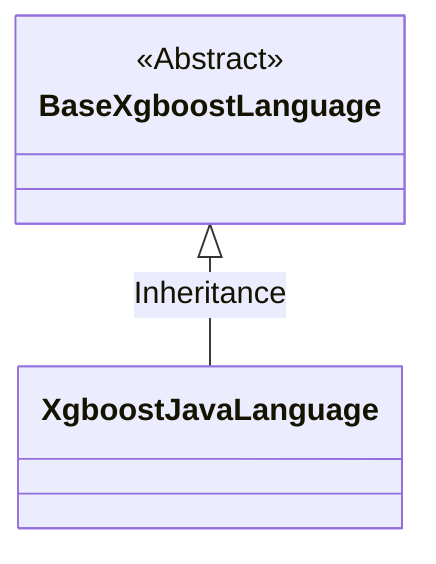
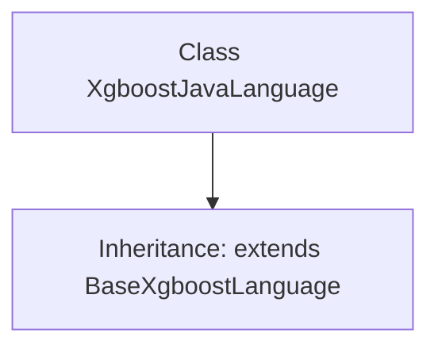

# Basic Information

|      |      |
|------|------|
| Name | XgboostJavaLanguage |
| Language | .java |
| Code Path | WeFe/board/board-service/src/main/java/com/welab/wefe/board/service/service/modelexport/XgboostJavaLanguage.java |
| Package Name | com.welab.wefe.board.service.service.modelexport |
| Dependencies | [] |
| Brief Description | The XgboostJavaLanguage class inherits from BaseXgboostLanguage and is used to implement XGBoost functionality in the Java language. |

# Description

XgboostJavaLanguage is a Java class that inherits from BaseXgboostLanguage, designed to extend the functionality of the XGBoost algorithm in the Java programming language. This class does not include specific implementation details and serves solely as an extension point for the foundational framework.

# Class Summary

| Name   | Type  | Description |
|-------|------|-------------|
| XgboostJavaLanguage | class | The XgboostJavaLanguage class inherits from BaseXgboostLanguage and is used to implement XGBoost functionality in the Java language. |

## Class XgboostJavaLanguage

|      |      |
|------|------|
| Access Modifier | public |
| Type | class |
| Name | XgboostJavaLanguage |
| Description | The XgboostJavaLanguage class inherits from BaseXgboostLanguage and is used to implement XGBoost functionality in the Java language. |

### UML Class Diagram

This class diagram illustrates a simple hierarchical relationship where XgboostJavaLanguage inherits from the abstract base class BaseXgboostLanguage. BaseXgboostLanguage is marked as an abstract class (<<Abstract>>), indicating it contains abstract methods requiring subclass implementation or serves as a generic base class. XgboostJavaLanguage, as a concrete implementation class, inherits all attributes and methods from the base class, though no specific members are currently added in the code. Such structure is commonly used to implement unified frameworks for XGBoost interfaces across different programming languages.

### Internal Method Call Graph

This flowchart illustrates the structure of the XgboostJavaLanguage class, which is an empty class inheriting from BaseXgboostLanguage. The diagram clearly depicts the inheritance relationship, where XgboostJavaLanguage as a subclass inherits all properties and methods from the parent class BaseXgboostLanguage through the 'extends' keyword. Since the current class body is empty, no additional methods or attributes are shown, preserving only the core information of the inheritance relationship. This concise representation highlights the fundamental characteristics of inheritance in object-oriented programming.

### Field List

| Name  | Type  | Description |
|-------|-------|------|

### Method List

| Name  | Type  | Description |
|-------|-------|------|

